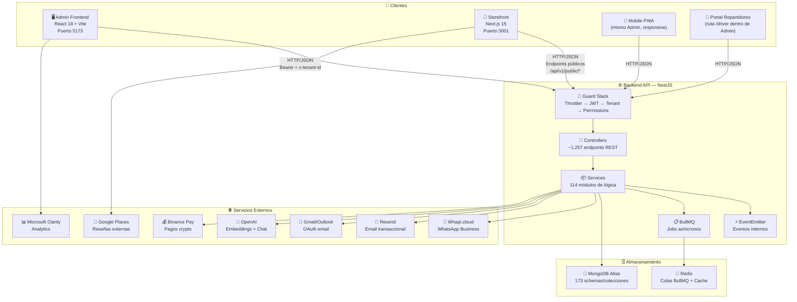
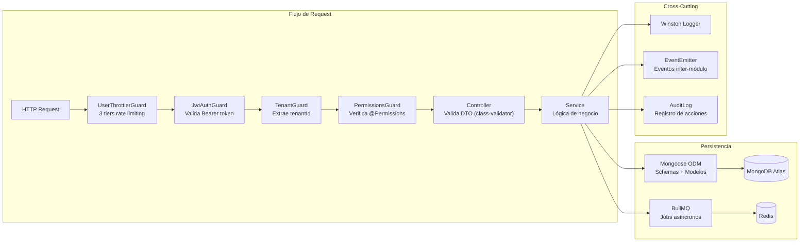
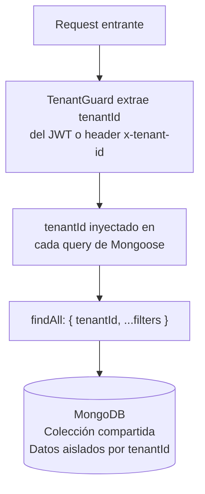
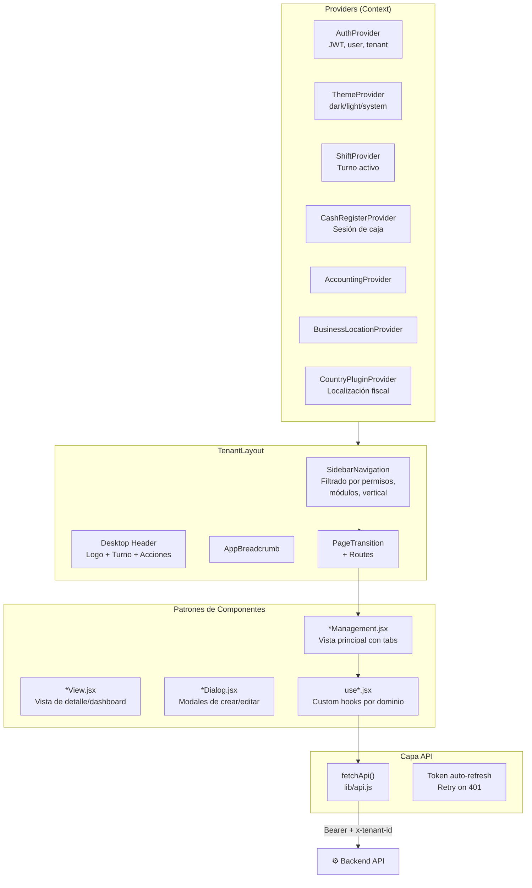
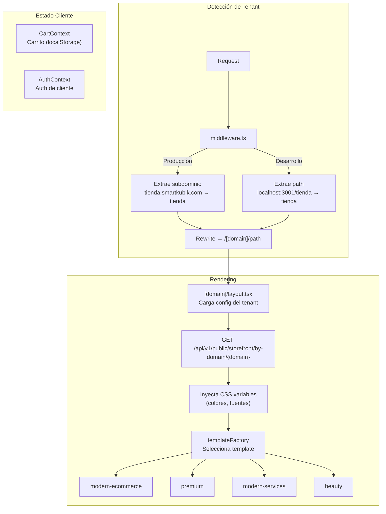

# SmartKubik — Arquitectura Técnica

> Diagrama de arquitectura general del sistema SmartKubik.
> Última actualización: 2026-04-28

---

## Diagrama General del Sistema



---

## Arquitectura del Backend



---

## Multi-Tenancy

SmartKubik implementa **multi-tenancy a nivel de datos** — todos los tenants comparten la misma base de datos, pero cada documento tiene un campo `tenantId` que lo aísla.



**Patrón común en todos los servicios:**
- Cada `create()` agrega `tenantId` al documento
- Cada `findAll()` filtra por `tenantId`
- Cada `findOne()` valida que el documento pertenezca al tenant
- Soft delete vía `isActive: false` (no se borra físicamente)

---

## Arquitectura del Frontend Admin



---

## Arquitectura del Storefront



---

## Infraestructura de Producción

| Componente | Ubicación | Gestión |
|---|---|---|
| Backend API | VPS 178.156.182.177 | PM2 (`smartkubik-api`) desde `/home/deployer/smartkubik/api/dist/main.js` |
| Admin Frontend | VPS 178.156.182.177 | Archivos estáticos en `~/smartkubik/food-inventory-admin/dist/` |
| Storefront | Vercel (probable) | Deploy automático |
| MongoDB | MongoDB Atlas | Cluster cloud, DB: `test` |
| Redis | Redis Cloud | Colas BullMQ |
| CDN / WAF | Cloudflare | DNS + protección |

**Deploy Backend:**
```bash
npx nest build
rsync dist/ deployer@178.156.182.177:/home/deployer/smartkubik/api/dist/
pm2 reload smartkubik-api
```

**Deploy Frontend:**
```bash
npm run build  # en food-inventory-admin/
rsync dist/ deployer@178.156.182.177:~/smartkubik/food-inventory-admin/dist/
```

---

*Última actualización: 2026-04-28*
*Archivos fuente: `app.module.ts`, `App.jsx`, `middleware.ts`*
