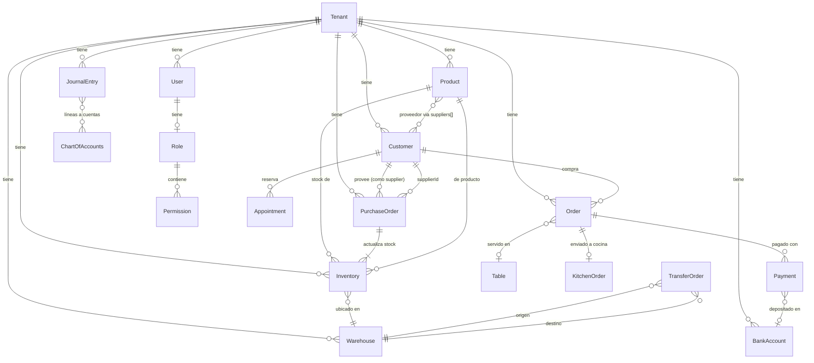
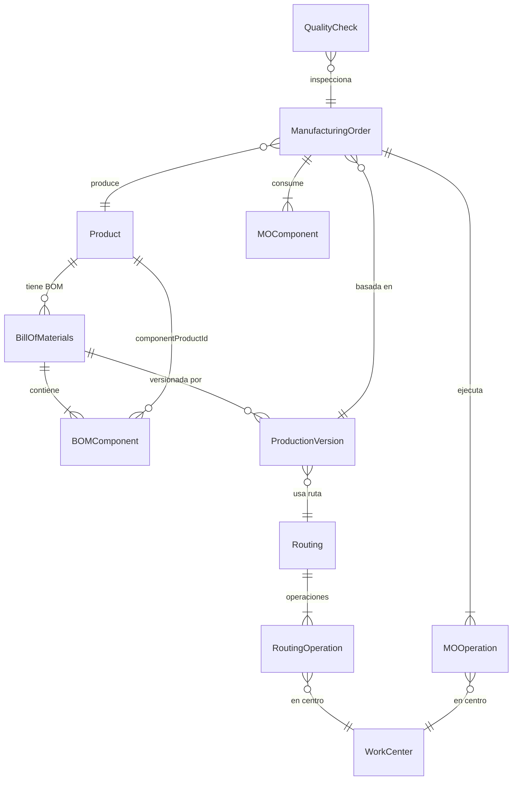

# SmartKubik — Modelo de Datos Global

> Mapa completo de entidades, sus campos clave y relaciones.
> 173 schemas/colecciones identificados en MongoDB.
> Última actualización: 2026-04-28

---

## Diagrama de Relaciones Principal (Entidades Core)

---

## Entidades por Dominio

### 1. Multi-Tenancy y Usuarios

#### Tenant
- **Colección**: `tenants`
- Entidad raíz. Todos los demás documentos referencian `tenantId`.
- Campos clave: `name`, `email`, `status` (active/suspended/cancelled), `enabledModules`, `vertical`, `verticalProfile`

#### User
- **Colección**: `users`
- `email` (único por tenant), `firstName`, `lastName`, `password` (bcrypt)
- `role` → **Role** (ObjectId)
- `tenantId` → **Tenant**
- Soporta 2FA (`twoFactorEnabled`), push notifications (`pushSubscriptions[]`)

#### Role (GLOBAL)
- **Colección**: `roles`
- `name`, `permissions[]` → **Permission** (array de ObjectId)
- `tenantId` → **Tenant**

#### Permission
- **Colección**: `permissions`
- `name` (único global), `module`, `action`
- Patrón: `{modulo}_{accion}` (ej: `inventory_create`, `orders_read`)

#### Organization
- **Colección**: `organizations`
- `owner` → **User**, `parentOrganization` → **Organization** (auto-referencia para subsidiarias)
- `vertical` (FOOD_SERVICE, RETAIL, SERVICES, LOGISTICS, HYBRID)
- `members[]` con `userId` → **User** y `role` (admin/member)

---

### 2. Productos e Inventario

#### Product
- **Colección**: `products`
- Entidad central del sistema. Referenciada por ~20 otros schemas.
- `sku` (único por tenant), `name`, `productType` (simple, consumable, supply, raw_material)
- **Variantes** (embedded): `variants[]` con `sku`, `barcode`, `basePrice`, `costPrice`, `wholesalePrice`, `images[]`, `dimensions`, `locationPricing[]`, `volumeDiscounts[]`
- **Proveedores** (embedded): `suppliers[]` con `supplierId` → **Customer**, `costPrice`, `leadTimeDays`, `paymentCurrency`, `usesParallelRate`
- **Unidades de venta** (embedded): `sellingUnits[]` con `conversionFactor`
- Campos fiscales: `ivaApplicable`, `ivaRate` (0/8/16), `igtfExempt`, `taxCategory`
- `sendToKitchen` (para restaurantes)
- `mergedIntoProductId` → **Product** (auto-referencia para deduplicación)

#### Inventory
- **Colección**: `inventories`
- `productId` → **Product**, `warehouseId` → **Warehouse**
- `quantity`, `reservedQuantity`, `availableQuantity`
- `costPrice`, `averageCost`
- `lotNumber`, `expirationDate`
- `isDeleted` (soft delete — ⚠️ puede ser `undefined` en registros antiguos)

#### InventoryMovement
- **Colección**: `inventorymovements`
- `productId` → **Product**, `warehouseId` → **Warehouse**
- `type` (purchase, sale, adjustment, transfer_in, transfer_out, waste, production)
- `quantity`, `previousStock`, `newStock`
- `reference` (ej: PO number, order number)

#### Warehouse
- **Colección**: `warehouses`
- `name`, `code`, `address`, `organizationId` → **Organization**
- `binLocations[]` (ubicaciones dentro del almacén)
- `isDefault`, `isActive`

#### TransferOrder
- **Colección**: `transferorders`
- `transferNumber`, `type` (PUSH/PULL)
- `sourceWarehouseId`, `destinationWarehouseId` → **Warehouse**
- `items[]` con `productId` → **Product**, `quantity`, `selectedUnit`, `conversionFactor`
- `status` (draft, pending, approved, dispatched, in_transit, received, cancelled)
- ⚠️ `conversionFactor` puede ser `undefined` en órdenes antiguas — tratado como 1

---

### 3. Ventas y Órdenes

#### Order
- **Colección**: `orders`
- `orderNumber` (único por tenant), `orderDate`, `orderType` (dine-in, takeout, delivery)
- `customerId` → **Customer**
- `items[]` con `productId` → **Product**, `quantity`, `unitPrice`, `modifiers[]`
- `subtotal`, `total`, `discount`, `tax`, `currency`
- `status` (pending, confirmed, preparing, ready, delivered, cancelled)
- `tableId` → **Table**, `kitchenOrderId` → **KitchenOrder**, `billSplitId` → **BillSplit**

#### KitchenOrder
- **Colección**: `kitchenorders`
- `orderId` → **Order**
- `items[]` con estado individual por ítem (pending, preparing, ready, served)
- `station`, `priority` (normal, urgent, asap), `assignedTo` → **User**

#### BillSplit
- **Colección**: `billsplits`
- `orderId` → **Order**, `splitType` (by_person, by_items, custom)
- `parts[]` con `amount`, `paymentId` → **Payment**, `paymentStatus`

#### Payment
- **Colección**: `payments`
- `paymentType` (sale, payable), `method` (efectivo, tarjeta, transferencia, etc.)
- `orderId` → **Order** o `payableId` → **Payable**
- `amount`, `amountVes`, `currency`, `bankAccountId` → **BankAccount**
- `tipAmount`, `tipPercentage`, `splitId` → **BillSplit**
- `reconciliationStatus` (pending, matched, manual, rejected)
- `idempotencyKey` (previene pagos duplicados)

---

### 4. Compras y Proveedores

#### Customer (Customers + Suppliers)
- **Colección**: `customers`
- ⚠️ **Dual-purpose**: Sirve como Customer Y como Supplier según `customerType` (supplier, customer, both)
- `name`, `email`, `phone`, `tags[]`, `loyaltyPoints`
- `taxInfo.taxId` (RIF/NIT), `customerNumber`

#### PurchaseOrder
- **Colección**: `purchaseorders`
- `poNumber`, `supplierId` → **Customer** (tipo supplier)
- `items[]` con `productId` → **Product**, `quantity`, `costPrice`, `lotNumber`, `expirationDate`
- `subtotal`, `ivaTotal`, `igtfTotal`, `totalAmount`
- `status` (pending, approved, received, partial, cancelled)
- `exchangeRateSnapshot`, `eurExchangeRateSnapshot` (captura tasa al momento)
- `paymentTerms` (embedded): `dueDate`, `paymentMethod`

#### Payable (Cuentas por Pagar)
- **Colección**: `payables`
- `description`, `amount`, `currency`, `dueDate`
- `supplierId` → **Customer**, `purchaseOrderId` → **PurchaseOrder**
- `status` (pending, partial, paid, overdue)

---

### 5. Contabilidad y Finanzas

#### ChartOfAccounts
- **Colección**: `chartofaccounts`
- `code` (único por tenant), `name`, `type` (Activo, Pasivo, Patrimonio, Ingreso, Gasto)
- `parent` → **ChartOfAccounts** (auto-referencia para jerarquía)
- `isSystemAccount`, `costBehavior`, `liquidityClass`

#### JournalEntry
- **Colección**: `journalentries`
- `date`, `description`, `isAutomatic`
- `lines[]` con `account` → **ChartOfAccounts**, `debit`, `credit`
- Generados automáticamente por: recepción de compras, pagos, nómina

#### BankAccount
- **Colección**: `bankaccounts`
- `bankName`, `accountNumber`, `accountType`, `currency`
- `initialBalance`, `currentBalance`
- `acceptedPaymentMethods[]`

#### BankReconciliation
- **Colección**: `bankreconciliations`
- `bankAccountId` → **BankAccount**, `statementId` → **BankStatement**
- `matchedPayments[]` → **Payment**

#### Schemas Fiscales (Venezuela)
- **IVAPurchaseBook**: Libro de compras IVA
- **IVASalesBook**: Libro de ventas IVA
- **IVADeclaration**: Declaración de IVA
- **IVAWithholding**: Retenciones de IVA
- **ISLRWithholding**: Retenciones de ISLR
- **TaxSettings**: Configuración fiscal del tenant

---

### 6. RRHH y Nómina

#### EmployeeProfile
- **Colección**: `employeeprofiles`
- `customerId` → **Customer** (empleado como contacto), `userId` → **User**
- `employeeNumber`, `position`, `department`, `hireDate`
- `status` (draft, active, onboarding, suspended, terminated)
- `currentContractId` → **EmployeeContract**

#### EmployeeContract
- **Colección**: `employeecontracts`
- `employeeId` → **EmployeeProfile**
- `contractType`, `salary`, `currency`, `paymentFrequency`
- `payrollStructureId` → **PayrollStructure**

#### PayrollRun
- **Colección**: `payrollruns`
- `periodType` (monthly, biweekly, custom), `periodStart`, `periodEnd`
- `status` (draft, calculating, calculated, approved, posted, paid)
- `entries[]` con `employeeId` → **EmployeeProfile**, `conceptCode`, `conceptType`, `amount`
- `grossPay`, `deductions`, `employerCosts`, `netPay`

#### PayrollStructure
- **Colección**: `payrollstructures`
- `concepts[]` → conceptos de nómina (devengos, deducciones, aportes)

---

### 7. Citas y Servicios

#### Appointment
- **Colección**: `appointments`
- `customerId` → **Customer**, `serviceId` → **Service**, `resourceId` → **Resource**
- `startTime`, `endTime`, `status`
- `depositRecords[]` con `bankAccountId` → **BankAccount**, `journalEntryId` → **JournalEntry**
- `recurringParentId` → **Appointment** (auto-referencia para citas recurrentes)
- `orderId` → **Order** (si genera venta)

#### Service
- **Colección**: `services`
- `name`, `duration` (minutos), `price`, `cost`
- `serviceType` (room, spa, experience, concierge, general)
- `addons[]`, `requiresDeposit`, `depositAmount`

#### Reservation (Restaurante)
- **Colección**: `reservations`
- `customerId` → **Customer**, `tableId` → **Table**
- `date`, `time`, `partySize`, `duration`
- `status`, `confirmationMethod`

---

### 8. Marketing y Fidelización

#### MarketingCampaign
- **Colección**: `marketingcampaigns`
- `channel` (email, sms, whatsapp, push), `type` (manual, automated)
- `recipients[]` → **Customer**, `targetSegment`
- `trigger`, `triggerConfig` (para campañas automatizadas)
- Métricas: `totalSent`, `totalDelivered`, `totalOpened`, `totalClicked`, `totalConverted`

#### Promotion
- **Colección**: `promotions`
- `type` (percentage_discount, fixed_amount, buy_x_get_y, tiered_pricing, bundle_discount)
- `applicableProducts[]` → **Product**, `excludedProducts[]` → **Product**
- `applicableDays[]`, `applicableStartTime`, `applicableEndTime`

#### Coupon
- **Colección**: `coupons`
- `code` (único por tenant), `discountType`, `discountValue`
- `maxUsageCount`, `currentUsageCount`, `maxUsagePerCustomer`

#### LoyaltyTransaction
- **Colección**: `loyaltytransactions`
- `customerId` → **Customer**, `orderId` → **Order**
- `transactionType`, `pointsChange`

---

### 9. Producción / Manufactura

---

### 10. Operaciones (Caja, Auditoría, Chat)

#### CashRegisterSession
- **Colección**: `cashregistersessions`
- `cashierId` → **User**, `status` (open, closing, closed, suspended)
- `openingFunds[]`, `closingFunds[]` (denominaciones)
- `cashMovements[]` (entradas/salidas de caja con razón y autorización)

#### AuditLog
- **Colección**: `auditlogs`
- `action`, `performedBy` → **User**, `targetId`, `details` (mixed)
- `ipAddress`, `tenantId`

#### Conversation / Message (Chat/WhatsApp)
- **Colección**: `conversations`, `messages`
- `customerId` → **Customer**, `customerPhoneNumber`
- `messages[]` → **Message** con `sender` (user, customer, assistant)

---

## Patrones Transversales

| Patrón | Campos | Presente en |
|---|---|---|
| **Multi-tenant** | `tenantId` → Tenant | Todas las colecciones |
| **Auditoría** | `createdBy`, `updatedBy` → User | ~80% de colecciones |
| **Soft delete** | `isActive: boolean` | ~70% de colecciones |
| **Timestamps** | `createdAt`, `updatedAt` | Todas (Mongoose timestamps) |

### ⚠️ Gotchas del Modelo de Datos

1. **`productId` tipo inconsistente**: Puede ser String u ObjectId dependiendo de cuándo se creó el registro. Queries deben usar `$in: [id, new ObjectId(id), id.toString()]`
2. **`isDeleted` vs `isActive`**: Algunos módulos usan `isDeleted`, otros `isActive`. En inventory, `isDeleted` puede ser `undefined` (no `false`), requiere filtro `{ $ne: true }` en vez de `{ isActive: true }`
3. **Customer como Supplier**: La colección `customers` almacena tanto clientes como proveedores. El campo `customerType` distingue entre ellos.
4. **`supplierId` tipo mixto**: En `Product.suppliers[]`, el `supplierId` puede estar guardado como String o ObjectId. Backend hace query con ambos tipos.
5. **DB de producción es `test`**: La base de datos por defecto en el connection string de Atlas es `test`, no `food-inventory-saas`.

---

*Última actualización: 2026-04-28*
*173 schemas identificados en `food-inventory-saas/src/`*
