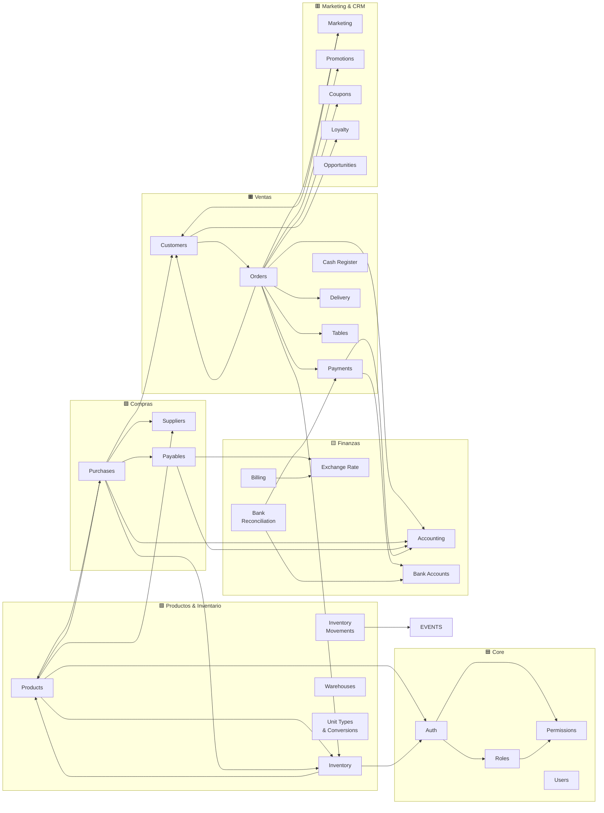
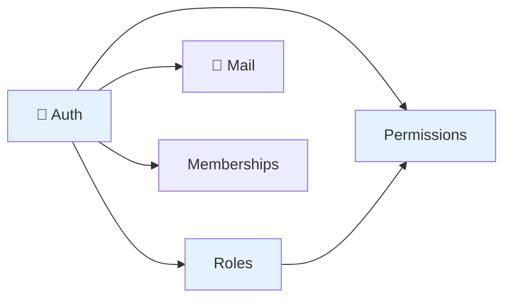
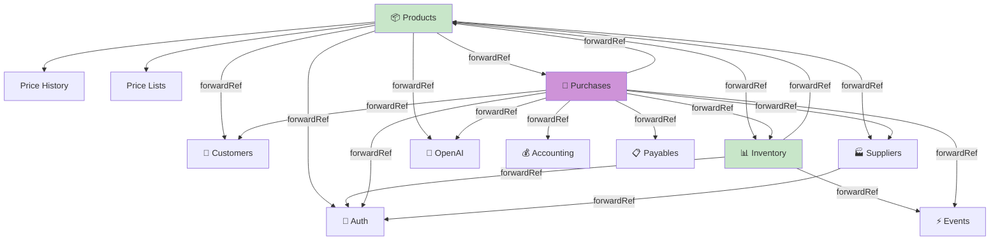
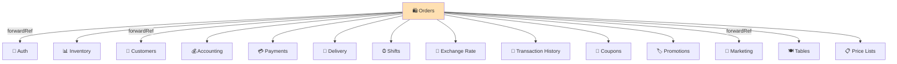
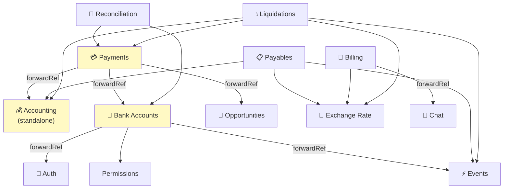
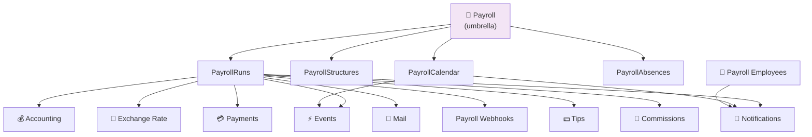
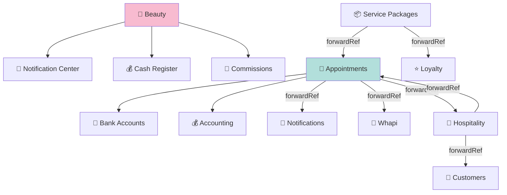
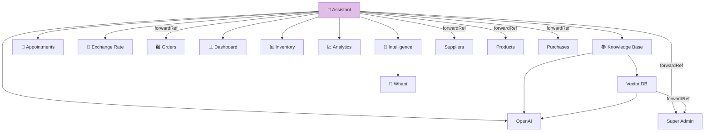

# SmartKubik — Grafo de Dependencias entre Módulos

> Mapa de quién importa a quién. ~180 dependencias inter-módulo identificadas.
> Última actualización: 2026-04-28

---

## Vista General de Dependencias (Simplificada)

---

## Dependencias Detalladas por Dominio

### Core & Seguridad

**Nota**: AuthModule es importado por ~30 módulos vía `forwardRef()`.

---

### Productos, Inventario y Compras

**Circular dependencies (forwardRef)**: Products ↔ Inventory ↔ Purchases ↔ Customers forman un ciclo de dependencias resuelto con `forwardRef()`.

---

### Ventas y Órdenes

**Orders es el módulo con más dependencias directas** (15 imports).

---

### Finanzas

**Accounting** no importa otros módulos — es un módulo base que muchos otros consumen.

---

### Nómina

---

### Servicios, Beauty y Hospitality

---

### IA y Asistente

**Assistant** es el módulo con más imports (14) — necesita acceder a casi todo el sistema para responder preguntas.

---

## Resumen de forwardRef (Dependencias Circulares)

| Par Circular | Razón |
|---|---|
| Auth ↔ ~30 módulos | Todos necesitan auth, auth necesita validar contra otros |
| Products ↔ Inventory | Productos consultan stock, inventario necesita datos de producto |
| Products ↔ Purchases | Productos muestran historial de compra, compras referencian productos |
| Products ↔ Customers | Productos muestran proveedores, clientes son proveedores |
| Orders ↔ Customers | Órdenes referencian clientes, clientes muestran historial de órdenes |
| Orders ↔ Marketing | Órdenes disparan campañas, marketing consulta órdenes |
| Notifications ↔ Mail | Notificaciones envían mail, mail depende de notificaciones |
| Notifications ↔ Customers | Notificaciones van a clientes, clientes tienen preferencias de notif |
| SuperAdmin ↔ ~25 módulos | Super admin accede a todo, algunos módulos consultan config global |
| Appointments ↔ Hospitality | Citas y hospitality se referencian mutuamente |

---

## Módulos Sin Dependencias (Hojas)

Estos módulos no importan otros módulos de negocio (solo infraestructura):

- Permissions, Users, Shifts, Tables, Delivery, ExchangeRate, CashRegister, UnitTypes
- KitchenDisplay, WaitList, BinancePay, DataImport, Reviews, AuditLog
- SecurityMonitoring, ServerPerformance, BusinessLocations, Drivers
- OpportunityStages, Activities, PayrollAbsences, PayrollStructures
- PayrollReports, PayrollLocalizations, PayrollWebhooks, ProductDedup
- ModifierGroups, BillSplits, SocialLinks, RestaurantStorefront

---

*Última actualización: 2026-04-28*
*Fuente: Análisis de todos los archivos `*.module.ts` en `food-inventory-saas/src/`*
