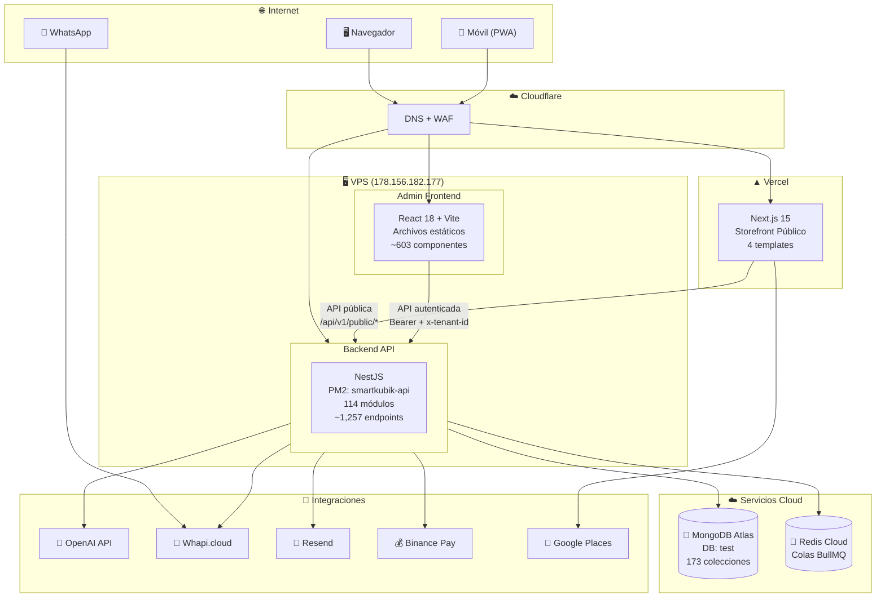
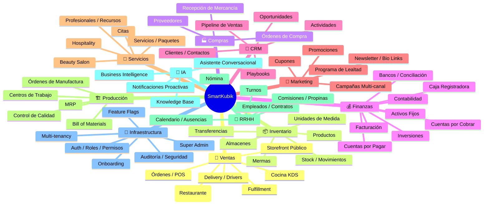
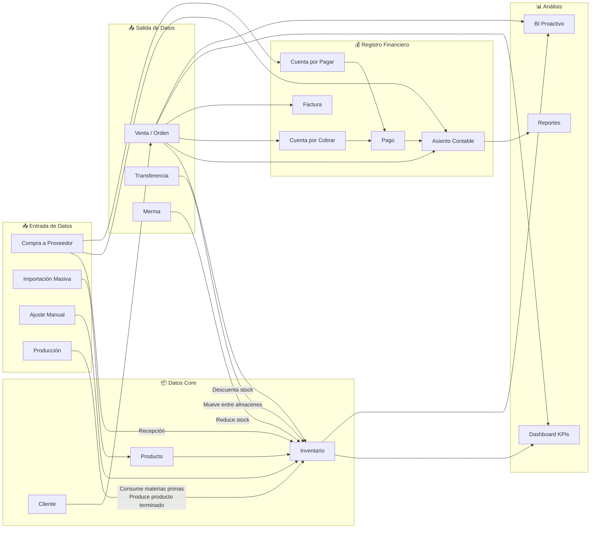
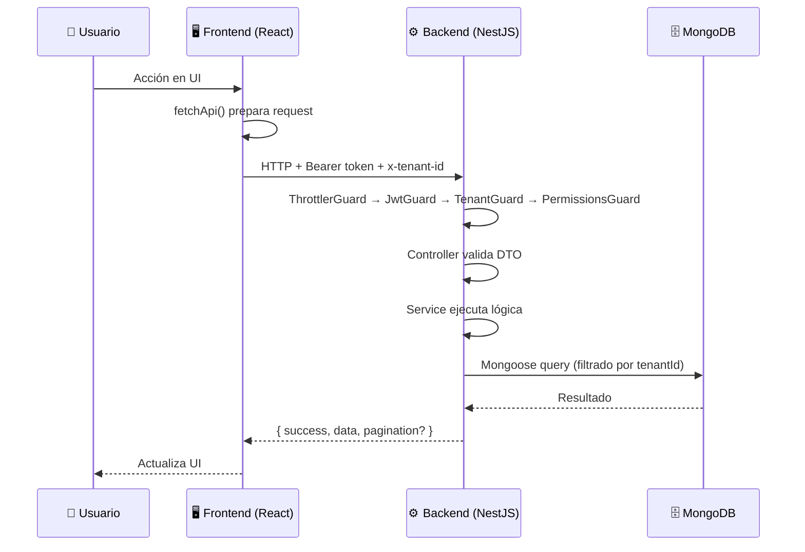
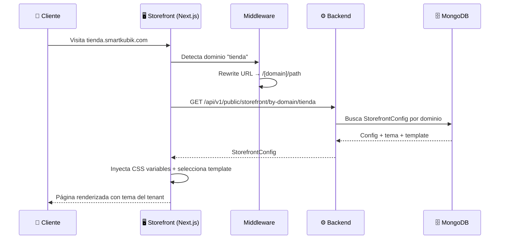

# SmartKubik — Vista General del Sistema

> Diagramas panorámicos de la plataforma SmartKubik.
> Última actualización: 2026-04-28

---

## Diagrama de Componentes

---

## Mapa de Dominios Funcionales

---

## Flujo de Datos Principal

---

## Patrones de Comunicación

### Frontend → Backend

### Storefront → Backend

---

## Verticales y Módulos Habilitados

```mermaid
flowchart TD
    subgraph VERTICALS["Verticales"]
        FOOD["🍔 Food/Retail"]
        REST["🍽️ Restaurant"]
        BEAUTY_V["💅 Beauty"]
        HOSP["🏨 Hospitality"]
        MFG["🏭 Manufacturing"]
        SVC["🔧 Services"]
    end

    subgraph MODULES["Módulos"]
        INV["Inventario"]
        ORD["Órdenes"]
        POS["POS"]
        TABLES_M["Mesas"]
        KDS["Cocina KDS"]
        RECIPES["Recetas"]
        MENU_ENG["Ing. de Menú"]
        APPT["Citas"]
        BEAUTY_M["Beauty"]
        ROOMS["Habitaciones"]
        BOM["BOM"]
        MRP_M["MRP"]
        QC["Control Calidad"]
        PAYROLL_M["Nómina"]
        MKT_M["Marketing"]
        ECOMM["Storefront"]
    end

    FOOD --> INV
    FOOD --> ORD
    FOOD --> POS
    FOOD --> ECOMM

    REST --> INV
    REST --> ORD
    REST --> TABLES_M
    REST --> KDS
    REST --> RECIPES
    REST --> MENU_ENG

    BEAUTY_V --> APPT
    BEAUTY_V --> BEAUTY_M

    HOSP --> APPT
    HOSP --> ROOMS

    MFG --> INV
    MFG --> BOM
    MFG --> MRP_M
    MFG --> QC

    SVC --> APPT
    SVC --> ECOMM
```

---

*Última actualización: 2026-04-28*
