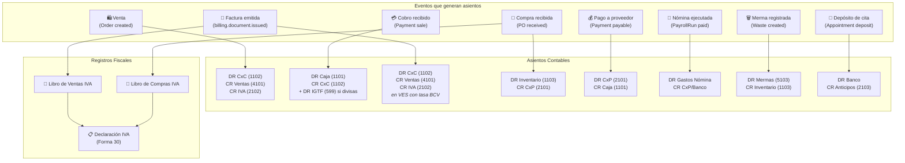

# Guía Cross-Módulo: Flujo Contable Completo

> Cómo se generan los asientos automáticos y cómo fluye la información hacia libros fiscales, declaraciones, y reportes.
> Módulos: Accounting, Billing, Orders, Purchases, Payables, Payments, Payroll, Waste.
> Última actualización: 2026-04-28

---

## Mapa de Asientos Automáticos

## Flujo Fiscal Mensual

### 1. Durante el Mes (Automático)
- Cada **venta** genera asiento de venta
- Cada **factura emitida** registra línea en el Libro de Ventas IVA (con montos en VES)
- Cada **compra recibida** registra línea en el Libro de Compras IVA
- Cada **pago** genera asiento de cobro/pago
- Las **retenciones de IVA** se registran como certificados (draft → posted)

### 2. Cierre de Mes
1. **Validar libros**: El sistema verifica RIF, números de control, cálculos de IVA
2. **Calcular declaración**: Débito fiscal (ventas) - Crédito fiscal (compras + retenciones + saldo anterior) = IVA a pagar
3. **Presentar**: Genera XML para el SENIAT
4. **Pagar**: Registra referencia de pago
5. **Exportar ARC**: Retenciones IVA e ISLR en formato SENIAT

### 3. Cierre de Período Contable
1. **Cerrar período**: Calcula revenue, expenses, net income
2. **Asiento de cierre**: DR Ingresos (4xx) → CR Gastos (5xx) → diferencia a Resultado (399)
3. **Bloquear**: Período inmutable

## Plan de Cuentas Estándar

| Código | Cuenta | Tipo | Generado por |
|--------|--------|------|--------------|
| 1101 | Caja/Banco | Activo | Pagos recibidos/emitidos |
| 1102 | Cuentas por Cobrar | Activo | Ventas a crédito |
| 1103 | Inventario | Activo | Compras, mermas, producción |
| 2101 | Cuentas por Pagar | Pasivo | Compras a crédito |
| 2102 | IVA por Pagar | Pasivo | IVA cobrado en ventas |
| 2103 | Anticipos de Clientes | Pasivo | Depósitos de citas |
| 2104 | IVA Retenido por Pagar | Pasivo | Retenciones de IVA |
| 4101 | Ingresos por Ventas | Ingreso | Ventas |
| 4103 | Descuentos en Ventas | Ingreso (contra) | Descuentos aplicados |
| 5101 | Costo de Ventas | Gasto | Backflush de BOM |
| 5103 | Mermas y Desperdicios | Gasto | Waste management |
| 599 | Gasto IGTF | Gasto | IGTF en pagos en divisas |

## Reportes que Consume Todo

| Reporte | Fuente de Datos | Período |
|---------|----------------|---------|
| Estado de Resultados (P&L) | Cuentas 4xx - 5xx | Configurable |
| Balance General | Cuentas 1xx, 2xx, 3xx | A una fecha |
| Balance de Comprobación | Todas las cuentas | Configurable |
| Libro Mayor | Una cuenta específica | Configurable |
| Flujo de Caja | Pagos por método | Configurable |
| CxC Aging | Órdenes con saldo | Actual |
| CxP Aging | Payables con saldo | Actual |

---

*Última actualización: 2026-04-28*
