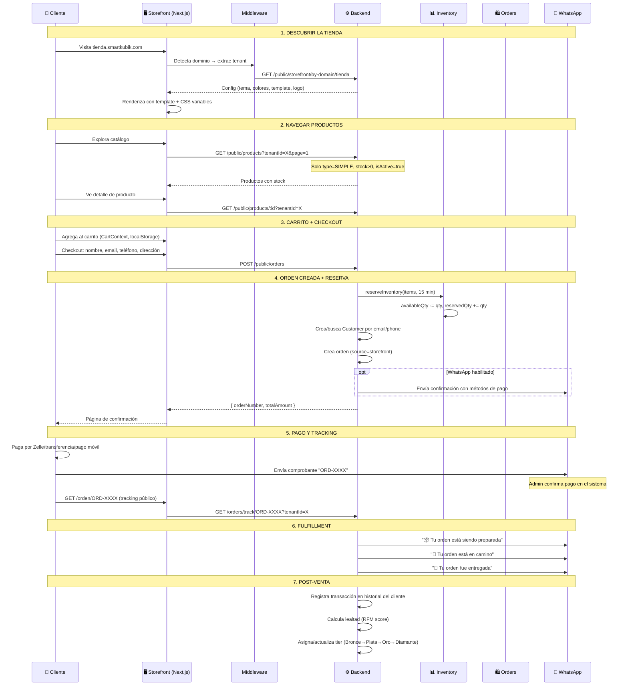

# Guía Cross-Módulo: Journey del Cliente (Storefront)

> Flujo: Descubrir tienda → Navegar productos → Carrito → Checkout → Pago → Tracking → Lealtad.
> Módulos: Storefront, StorefrontConfig, Products, Orders, Payments, Inventory, Customers, Loyalty, WhatsApp.
> Última actualización: 2026-04-28

---

## Diagrama del Journey

## Detección de Tenant (Multi-tenancy)

| Entorno | Método | Ejemplo |
|---------|--------|---------|
| Producción | Subdominio | `tienda.smartkubik.com` → tenant "tienda" |
| Desarrollo | Path | `localhost:3001/tienda` → tenant "tienda" |

El middleware reescribe la URL a `/[domain]/path` para que el App Router de Next.js resuelva la ruta.

## Templates Disponibles

| Template | Uso | Características |
|----------|-----|-----------------|
| `modern-ecommerce` | Retail general | Grid de productos, carrito, checkout |
| `premium` | Retail premium | Diseño más elaborado |
| `modern-services` | Servicios/Booking | Orientado a reservas |
| `beauty` | Salones de belleza | Profesionales, galería, reviews, booking wizard |

## Lealtad Post-Venta

Después de cada compra completada:
1. Se registra en `CustomerTransactionHistory`
2. Se recalcula el **RFM score**: Recencia (50%) + Frecuencia (30%) + Monto (20%)
3. Se asigna tier: Top 5% → Diamante, 5-20% → Oro, 20-50% → Plata, resto → Bronce
4. El tier determina el descuento automático en futuras compras (3%-18%)

---

*Última actualización: 2026-04-28*
