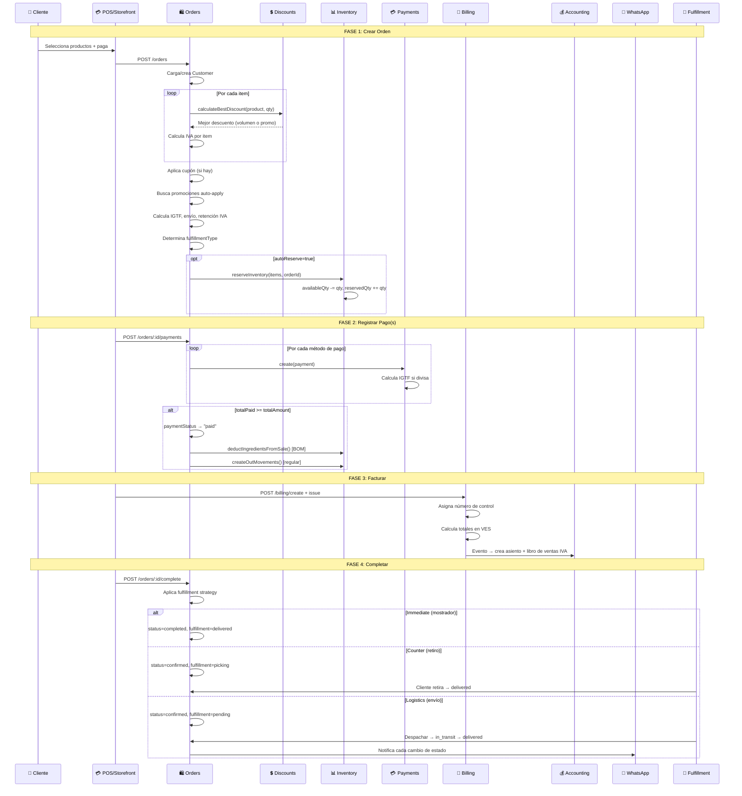
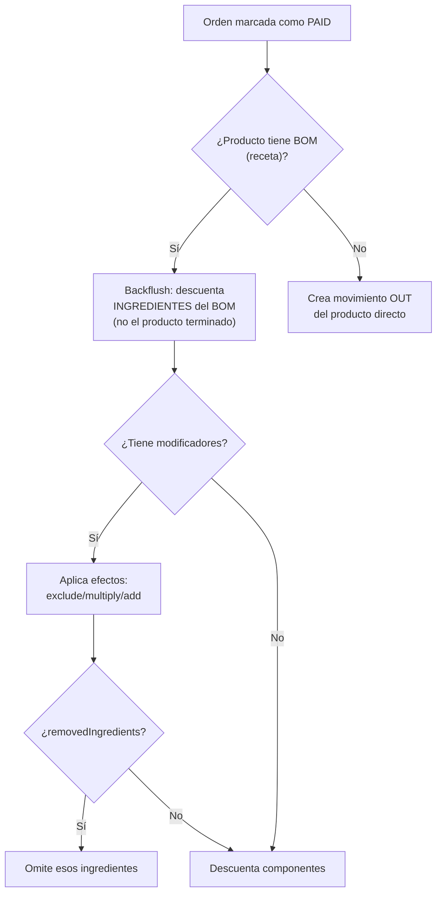

# Guía Cross-Módulo: Ciclo de Vida de una Orden

> Flujo completo: Cliente elige → Orden creada → Inventario reservado → Pago → Factura → Fulfillment → Inventario descontado.
> Módulos: Orders, Inventory, Payments, Billing, Accounting, Delivery, Tables, WhatsApp.
> Última actualización: 2026-04-28

---

## Diagrama del Flujo Completo

## Detalle paso a paso

### 1. Crear Orden
- **Fuentes**: POS presencial, Storefront online, WhatsApp, API
- **Calculo de precios**: Price List > Variante > Producto (en ese orden de prioridad)
- **Descuentos**: Sistema evalúa descuento por volumen Y promoción, aplica el mejor
- **Impuestos**: IVA (16%) por producto, IGTF (3%) solo en pagos en divisas

### 2. Registrar Pagos
- **Multi-pago**: Soporta N métodos en la misma orden
- **IGTF**: Solo sobre la porción en USD (no sobre VES)
- **Al quedar paid**: Dispara backflush de BOM + movimientos OUT de inventario (async)

### 3. Facturar
- **Tipos**: Factura fiscal (con IVA/IGTF) o Nota de Entrega (sin impuestos)
- **Control**: Número de control asignado por Imprenta Digital
- **Contabilidad**: Asiento automático (DR CxC, CR Ventas, CR IVA) + registro en Libro de Ventas

### 4. Completar y Fulfillment
- **4 estrategias**: immediate (POS), counter (retiro), logistics (envío), hybrid (decide por método)
- **Inventario**: Al pagar, se crean movimientos OUT. Para productos con receta (BOM), se descuentan los ingredientes
- **WhatsApp**: Si está configurado, envía notificaciones en cada cambio de estado

## Inventario: ¿Cuándo se descuenta?

## ⚠️ Puntos de Fallo

| Problema | Causa | Solución |
|----------|-------|----------|
| No se puede completar | Falta pago completo O factura | Pagar primero, luego facturar |
| IGTF incorrecto | Aplica solo a porción USD, no al total | Verificar método de pago |
| Inventario no baja al pagar | Backflush es async, puede tardar | Verificar movimientos después |
| Orden queda "confirmed" no "completed" | Fulfillment strategy ≠ immediate | Es correcto según config |

---

*Última actualización: 2026-04-28*
