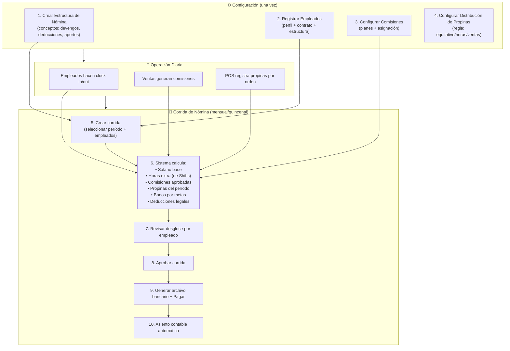

# Guía Cross-Módulo: Ciclo de Nómina

> Flujo: Configurar estructura → Registrar empleados → Ejecutar corrida → Aprobar → Pagar → Asiento contable.
> Módulos: PayrollStructures, PayrollEmployees, PayrollRuns, Commissions, Tips, Shifts, Accounting, Payments.
> Última actualización: 2026-04-28

---

## Diagrama del Ciclo

## Detalle por Fase

### Configuración Inicial

**Estructura de Nómina**: Define qué conceptos aplican a cada tipo de empleado
- **Devengos**: Salario base, bonificación de alimentación, horas extra, bono de transporte
- **Deducciones**: IVSS (empleado), paro forzoso, ISLR, anticipos
- **Aportes patronales**: IVSS (patronal), FAOV, INCE, LOTTT
- Las estructuras se asignan por rol/departamento/tipo de contrato

**Empleados**: Cada empleado necesita perfil + contrato activo
- El perfil se crea desde un contacto del CRM (tipo "empleado")
- El contrato define: salario, tipo (fijo/temporal), frecuencia de pago, estructura asignada

### Operación Diaria (datos que alimentan la nómina)

| Fuente | Dato | Cómo se registra |
|--------|------|-------------------|
| **Shifts** | Horas trabajadas | Clock in/out diario |
| **Orders** | Comisiones por venta | Auto-calculadas por orden → aprobación manual |
| **POS** | Propinas | Registradas en cada orden al cobrar |
| **Goals** | Bonos por meta | Auto-detectados al cerrar período de meta |
| **Absences** | Ausencias/permisos | Solicitud → aprobación por supervisor |

### Ejecución de Corrida

1. **Crear**: Selecciona período y empleados. El sistema matchea la estructura de nómina correcta para cada empleado.
2. **Calcular**: Suma devengos (salario + comisiones + tips + bonos) - deducciones (legales + anticipos)
3. **Revisar**: Desglose por empleado con cada concepto detallado
4. **Aprobar**: Manager revisa y confirma
5. **Pagar**: Genera archivo bancario (TXT/CSV) + marca comisiones y bonos como pagados
6. **Contabilizar**: Asiento automático (DR Gastos Nómina, CR CxP/Banco)

### Corridas Especiales
- **Aguinaldo**: Bono anual basado en salario y tiempo de servicio
- **Liquidación**: Cálculo de prestaciones al terminar relación laboral
- **Bono extra**: Pago único fuera del ciclo regular

---

*Última actualización: 2026-04-28*
