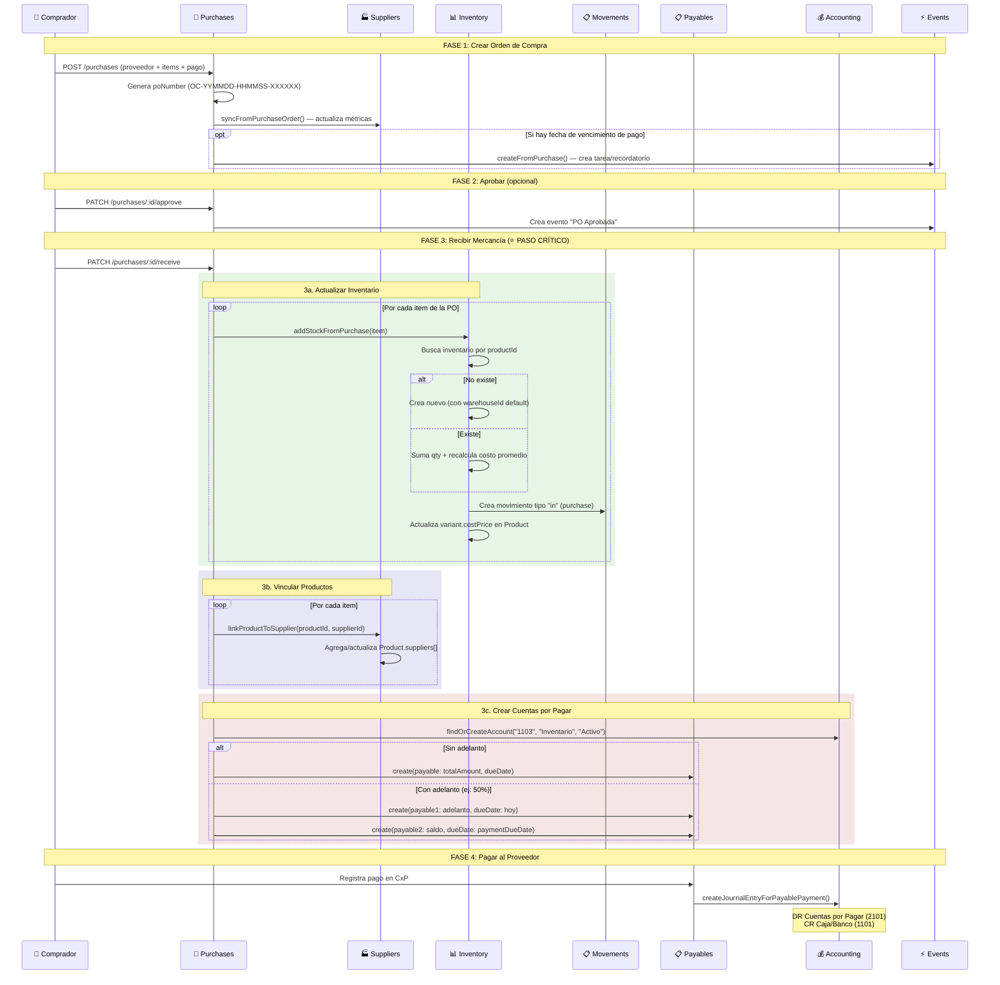

# Guía Cross-Módulo: De Compra a Stock

> Flujo completo: Crear PO → Aprobar → Recibir → Inventario actualizado → Cuenta por pagar → Asiento contable.
> Módulos involucrados: Purchases, Suppliers, Inventory, Payables, Accounting, Events.
> Última actualización: 2026-04-28

---

## Diagrama del Flujo Completo

## Detalle paso a paso

### 1. Crear la Orden de Compra
- **Quién**: Encargado de compras
- **Dónde**: `/purchases` o `/inventory-management?tab=purchases`
- **Datos**: Proveedor (existente o nuevo), productos con cantidades/costos, condiciones de pago (contado/crédito/adelanto), moneda, tipo de documento
- **Resultado**: PO creada con status `pending`, número auto-generado, métricas del proveedor actualizadas

### 2. Aprobar (opcional)
- **Quién**: Admin/supervisor
- **Dónde**: Historial de compras → cambiar status a "Aprobado"
- **Resultado**: PO en status `approved`, evento de notificación creado

### 3. Recibir Mercancía (el paso que dispara todo)
- **Quién**: Almacenero
- **Dónde**: Historial de compras → cambiar status a "Recibido"
- **Input adicional**: Fecha de factura, nombre de quién recibió, calificación del proveedor
- **Lo que pasa automáticamente**:

| Acción | Módulo | Método | Resultado |
|--------|--------|--------|-----------|
| Stock incrementado | Inventory | `addStockFromPurchase()` | Cantidad sumada, costo promedio recalculado |
| Movimiento registrado | InventoryMovements | `create(type: "in")` | Historial de entrada con referencia a la PO |
| Costo de variante actualizado | Products | `update()` | `variant.costPrice` sincronizado |
| Producto vinculado a proveedor | Suppliers | `linkProductToSupplier()` | `Product.suppliers[]` actualizado con costo y SKU |
| Cuenta por pagar creada | Payables | `create()` | 1 o 2 payables según condiciones de pago |
| Historial registrado | TransactionHistory | `recordSupplierTransaction()` | Transacción del proveedor registrada |

### 4. Pagar al Proveedor
- **Quién**: Tesorero/Admin
- **Dónde**: `/accounts-payable`
- **Resultado**: Payable marcada como `paid`, asiento contable automático (DR CxP, CR Caja)

## ⚠️ Puntos de Fallo Conocidos

| Problema | Causa | Solución |
|----------|-------|----------|
| Stock no se actualiza al recibir | PO no cambió a status "received" | Verificar status en historial |
| Stock se duplicó | Bug histórico (ya corregido) | Ajuste manual de inventario |
| Productos con SKU de variante incorrecto | Variante generada como `-VAR1` | Editar SKU de la variante |
| Inventario sin warehouseId | Registros antiguos sin almacén | Asignar almacén manualmente |
| 2 payables en vez de 1 | Compra tiene adelanto configurado | Es correcto — 1 por adelanto, 1 por saldo |

---

*Última actualización: 2026-04-28*
