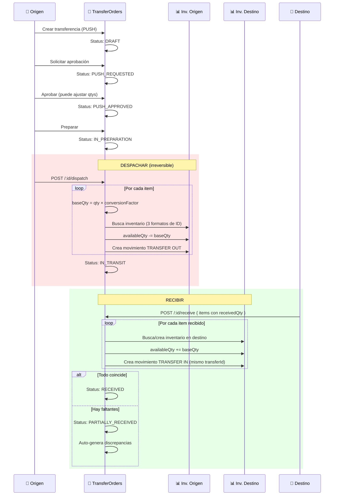

# Guía Cross-Módulo: Transferencia entre Ubicaciones

> Flujo: Solicitar → Aprobar → Preparar → Despachar (descuenta origen) → Recibir (suma destino).
> Módulos: TransferOrders, Inventory, InventoryMovements, Warehouses, Organizations.
> Última actualización: 2026-04-28

---

## Diagrama Completo

## Variantes del Flujo

### PUSH vs PULL
| Modo | Quién inicia | Flujo |
|------|-------------|-------|
| **PUSH** | Origen | Draft → Requested → Approved → Prepared → Dispatched → Received |
| **PULL** | Destino | Draft → Pull_Requested → Pull_Approved (por origen) → Prepared → Dispatched → Received |

### Express (Enviar Ahora)
Encadena automáticamente: Create → Request → Approve → Prepare → Dispatch en un solo clic. Si algún paso falla, la orden queda en el último estado exitoso.

### Cross-Tenant
Si origen y destino son tenants diferentes (subsidiarias de la misma organización):
- Se valida que ambos pertenezcan a la misma "familia" de organizaciones
- Al recibir, el destino busca el producto **por SKU** (los ObjectIds son diferentes entre tenants)
- El `transferId` (UUID) vincula los movimientos OUT e IN aunque sean de tenants distintos

## Multi-Unidad
Si transfieres 10 kg pero el inventario está en sacos (factor 0.04):
- `baseQty = 10 × 0.04 = 0.4 sacos`
- Se descuentan 0.4 sacos del origen y se suman 0.4 al destino
- El movimiento muestra "Transfer 10 kg" en la razón

## ⚠️ Puntos de Fallo

| Problema | Causa | Solución |
|----------|-------|----------|
| "No existe inventario en almacén origen" | productId tipo mixto (String vs ObjectId) | El sistema intenta 3 formatos; si falla, contactar admin |
| Stock insuficiente | Reservas activas reducen disponible | Verificar availableQty (no totalQty) |
| Cantidades "raras" al despachar | Conversión multi-unidad | Es correcto: revisa el conversionFactor |
| Stock no llega al destino | Falta hacer "Recibir" | El stock se agrega solo al recibir |
| conversionFactor undefined | Orden antigua (pre-fix) | Se trata como 1 (sin conversión) |

---

*Última actualización: 2026-04-28*
