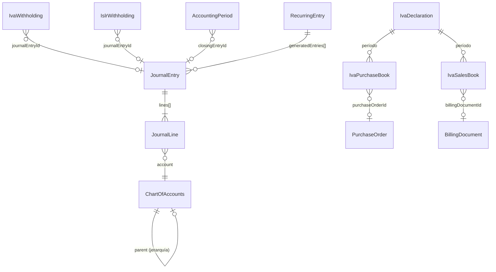

# Contabilidad — Modelo de Datos

> 14 schemas: ChartOfAccounts, JournalEntry, TaxSettings, IvaWithholding, IvaPurchaseBook, IvaSalesBook, IvaDeclaration, IslrWithholding, AccountingPeriod, RecurringEntry + schemas de billing/payments.
> Última actualización: 2026-04-28

---

## Diagrama de Entidades Principal



---

## ChartOfAccounts (Plan de Cuentas)

| Campo | Tipo | Descripción |
|---|---|---|
| `code` | String | Auto-generado: 1xx-5xx. Único por tenant |
| `name` | String | Nombre de la cuenta |
| `type` | Enum | `Activo`, `Pasivo`, `Patrimonio`, `Ingreso`, `Gasto` |
| `parent` | ObjectId | → ChartOfAccounts (jerarquía, auto-referencia) |
| `isSystemAccount` | Boolean | Si es cuenta del sistema (no editable) |
| `costBehavior` | Enum | `fixed`, `variable`, `mixed` |
| `liquidityClass` | Enum | `current`, `non_current` |

**Cuentas estándar auto-creadas:**
- 1101: Caja/Banco | 1102: Cuentas por Cobrar | 1103: Inventario
- 2101: Cuentas por Pagar | 2102: IVA por Pagar | 2104: IVA Retenido
- 4101: Ingresos por Ventas | 4103: Descuentos (contra-ingreso)
- 5101: Costo de Ventas (COGS) | 5103: Mermas | 599: Gasto IGTF

---

## JournalEntry (Asientos Contables)

| Campo | Tipo | Descripción |
|---|---|---|
| `date` | Date | Fecha del asiento |
| `description` | String | Descripción |
| `lines[]` | Array | `[{ account: ObjectId→COA, description, debit, credit }]` |
| `isAutomatic` | Boolean | Si fue generado automáticamente |
| `metadata` | Object | `{ createdFrom, module, documentId }` — trazabilidad |
| `tenantId` | String | → Tenant |

**Validación**: `Σ(debits) = Σ(credits)` (siempre balanceado)

---

## IvaWithholding (Retenciones de IVA)

| Campo | Tipo | Descripción |
|---|---|---|
| `certificateNumber` | String | `RET-IVA-YYYY-XXXXXX` |
| `withholdingPercentage` | Number | 75 o 100 |
| `withholdingAmount` | Number | Monto retenido |
| `supplierId`, `supplierRif`, `supplierName` | — | Proveedor |
| `invoiceNumber`, `invoiceControlNumber` | String | Factura afectada |
| `baseAmount`, `ivaAmount` | Number | Base imponible e IVA |
| `operationType` | Enum | compra_bienes, compra_servicios, importacion, etc. |
| `status` | Enum | `draft`, `posted`, `annulled` |
| `journalEntryId` | ObjectId | → JournalEntry (al postear) |
| `exportedToARC` | Boolean | Si fue exportado a formato SENIAT |

---

## IvaPurchaseBook / IvaSalesBook (Libros de IVA)

| Campo | Tipo | Descripción |
|---|---|---|
| `month`, `year` | Number | Período fiscal |
| `supplierRif` / `customerRif` | String | RIF del tercero |
| `invoiceNumber`, `invoiceControlNumber` | String | Factura |
| `baseAmount` | Number | Base imponible |
| `ivaRate` | Number | 0, 8, o 16 (%) |
| `ivaAmount` | Number | Monto de IVA |
| `withheldIvaAmount` | Number | IVA retenido (si aplica) |
| `totalAmount` | Number | Total |
| `status` | Enum | `confirmed`, `exported`, `annulled` |
| `exportedToSENIAT` | Boolean | Si fue exportado |

**Sales Book adicional (dual-moneda):**
- `originalCurrency`, `exchangeRate`
- `originalBaseAmount`, `originalIvaAmount`, `originalTotalAmount`
- `isForeignCurrency` | Boolean

---

## IvaDeclaration (Declaración de IVA — Forma 30)

| Campo | Tipo | Descripción |
|---|---|---|
| `month`, `year` | Number | Período |
| `declarationNumber` | String | `DEC-IVA-MMYYYY-XXXXXX` |
| **Débito Fiscal** | — | salesBaseAmount, salesIvaAmount, totalDebitFiscal |
| **Crédito Fiscal** | — | purchasesBaseAmount, purchasesIvaAmount, totalCreditFiscal |
| **Retenciones** | — | ivaWithheldOnSales, ivaWithheldOnPurchases |
| **Cálculo** | — | previousCreditBalance, totalCreditToApply, **ivaToPay**, **creditBalance** |
| `rateBreakdown[]` | Array | Desglose por alícuota (0%, 8%, 16%) |
| `status` | Enum | `draft`, `calculated`, `filed`, `paid`, `rectified` |
| `xmlContent` | String | XML para SENIAT |

**Fórmula central:**
```
ivaToPay = max(0, totalDebitFiscal - totalCreditToApply)
creditBalance = max(0, totalCreditToApply - totalDebitFiscal)
totalCreditToApply = purchasesIvaAmount + ivaWithheldOnSales + previousCreditBalance
```

---

## IslrWithholding (Retenciones de ISLR)

| Campo | Tipo | Descripción |
|---|---|---|
| `certificateNumber` | String | `RET-ISLR-YYYY-XXXXXX` |
| `beneficiaryType` | Enum | `supplier`, `employee` |
| `operationType` | Enum | salarios, honorarios_profesionales, comisiones, intereses, dividendos, arrendamiento, regalias, etc. |
| `baseAmount` | Number | Base imponible |
| `withholdingPercentage` | Number | 0-34% (según tabla SENIAT) |
| `withholdingAmount` | Number | Monto retenido |
| `status` | Enum | `draft`, `posted`, `annulled` |

---

## AccountingPeriod

| Campo | Tipo | Descripción |
|---|---|---|
| `name`, `description` | String | Identificación |
| `startDate`, `endDate` | Date | Rango del período |
| `fiscalYear` | Number | Año fiscal |
| `status` | Enum | `open`, `closed`, `locked` |
| `totalRevenue`, `totalExpenses`, `netIncome` | Number | Calculados al cerrar |
| `closingEntryId` | ObjectId | → JournalEntry de cierre |

---

## RecurringEntry

| Campo | Tipo | Descripción |
|---|---|---|
| `name` | String | Nombre de la plantilla |
| `frequency` | Enum | daily, weekly, biweekly, monthly, quarterly, semiannual, annual |
| `lines[]` | Array | `[{ accountId, debit, credit, description }]` |
| `nextExecutionDate` | Date | Próxima ejecución |
| `isActive` | Boolean | Activa/inactiva |
| `executionCount` | Number | Veces ejecutada |
| `generatedEntries[]` | ObjectId[] | → JournalEntry[] generados |

---

## TaxSettings

| Campo | Tipo | Descripción |
|---|---|---|
| `taxType` | Enum | `IVA`, `ISLR`, `IGTF`, `CUSTOMS`, `OTHER` |
| `name` | String | Ej: "IVA General", "ISLR Honorarios" |
| `code` | String | Ej: "IVA-16", "ISLR-HP-5" |
| `rate` | Number | 0-100 |
| `isWithholding` | Boolean | Si es retención |
| `withholdingRate` | Number | 75 o 100 (IVA) |
| `accountCode` | String | Cuenta contable asociada |
| `isDefault` | Boolean | Default por tipo |

---

*Última actualización: 2026-04-28*
