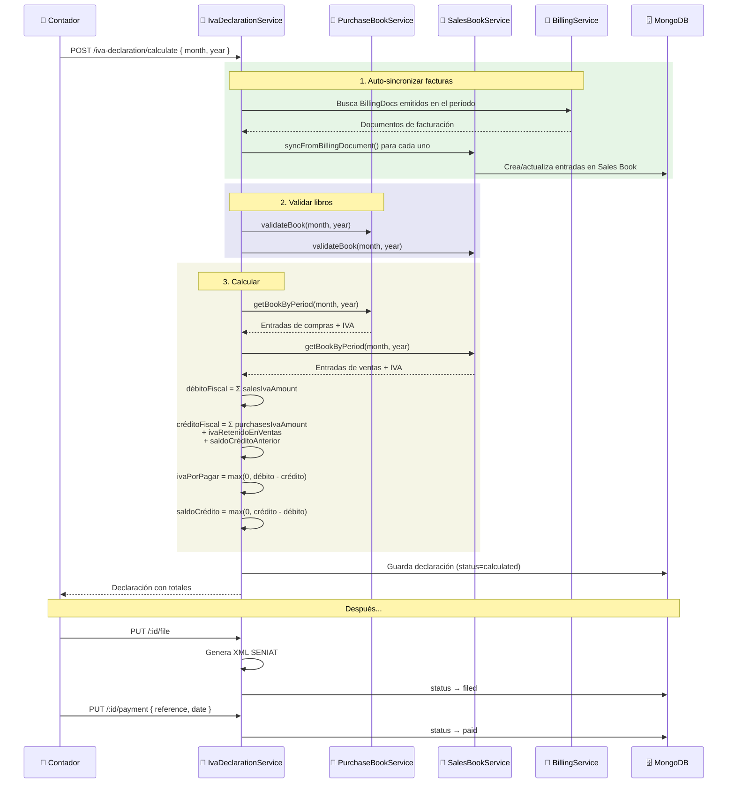
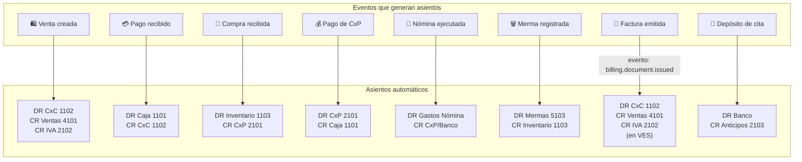
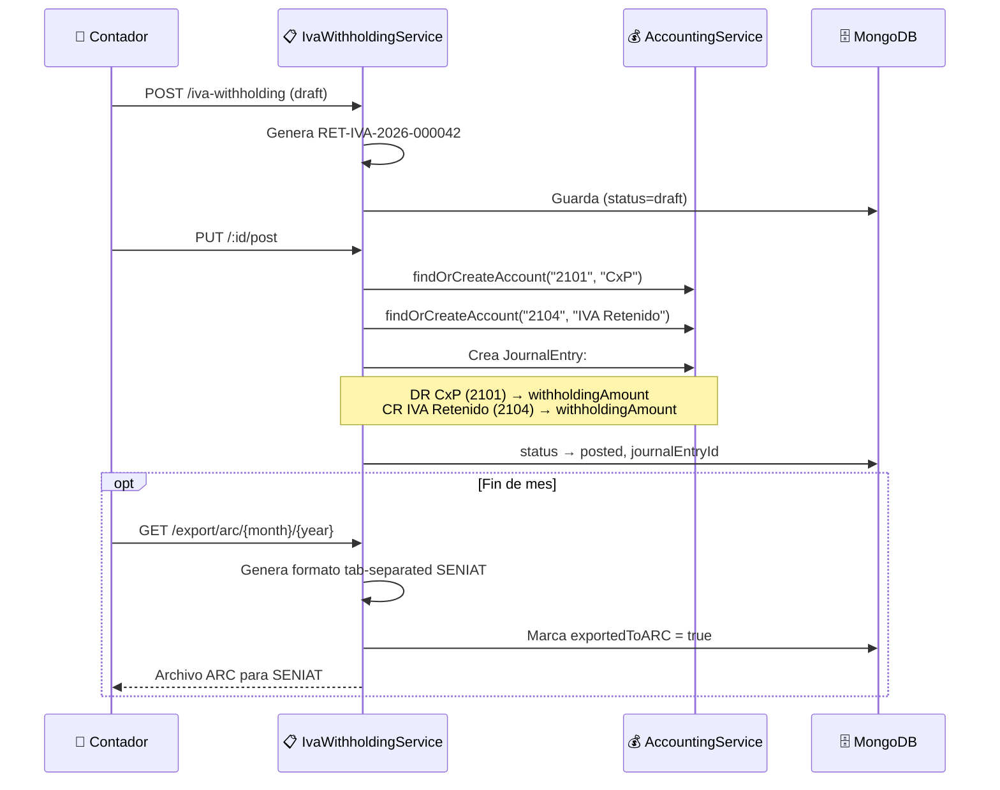
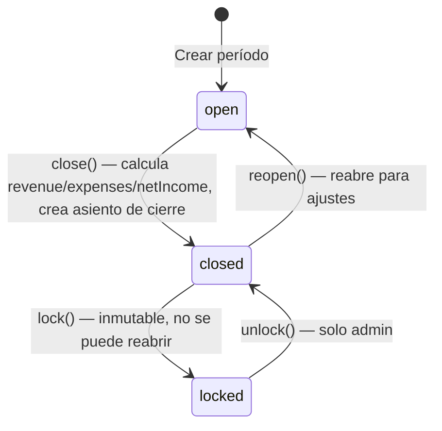
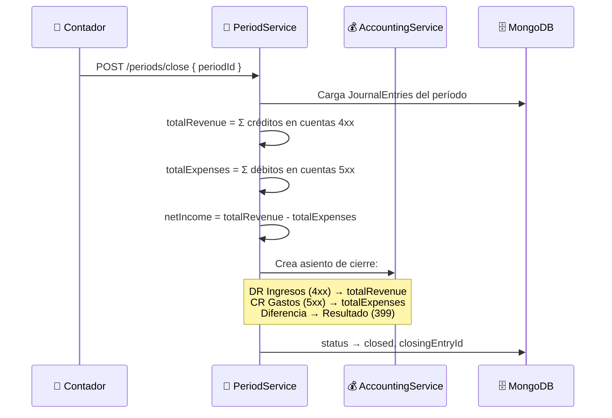
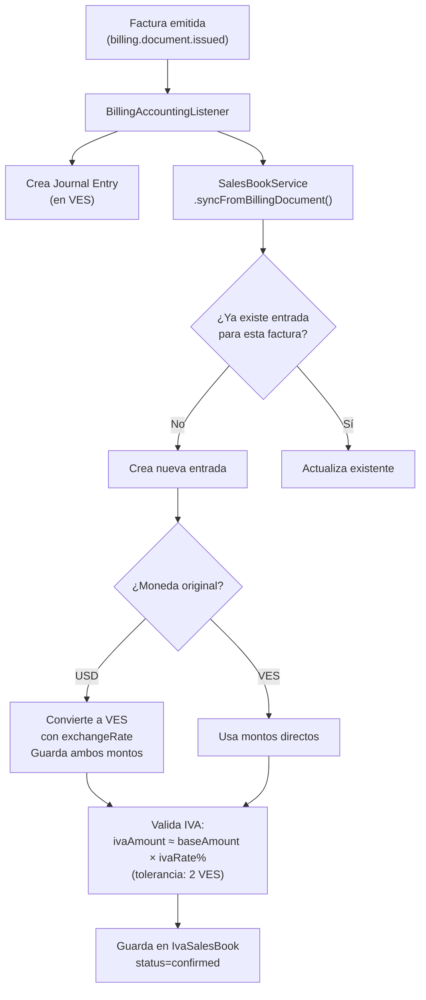

# Contabilidad — Flujos de Operación

> Última actualización: 2026-04-28

---

## Flujo 1: Declaración de IVA (Forma 30)

---

## Flujo 2: Asientos Automáticos (desde otros módulos)

---

## Flujo 3: Retención de IVA

---

## Flujo 4: Cierre de Período Contable

---

## Flujo 5: Sync Facturación → Libro de Ventas IVA

---

*Última actualización: 2026-04-28*
