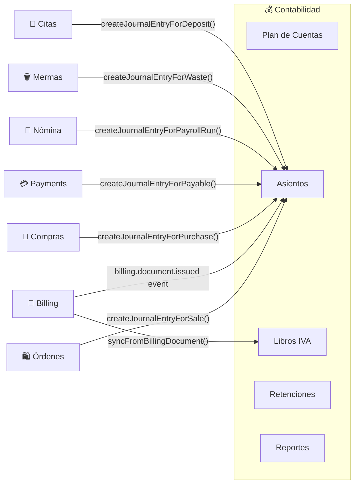

# Contabilidad

## ¿Qué es?

El módulo de Contabilidad es como la **oficina del contador del negocio** — el lugar donde se registra cada movimiento financiero del negocio en formato de partida doble (debe y haber). Además, maneja toda la compliance fiscal venezolana: libros de IVA, retenciones de IVA e ISLR, declaraciones para el SENIAT, y períodos contables.

Es el módulo más grande del sistema (~91 endpoints) e incluye 9 sub-servicios especializados.

## ¿Para quién es?

- **Contador**: Gestiona plan de cuentas, asientos manuales, cierra períodos, genera reportes financieros
- **Administrador fiscal**: Maneja retenciones de IVA e ISLR, prepara declaraciones, exporta para SENIAT
- **Administrador**: Revisa estados financieros (P&L, balance, trial balance)
- **Sistema**: Genera asientos automáticos desde ventas, compras, pagos, nómina, mermas

## ¿Qué problema resuelve?

- **Sin contabilidad automatizada**, cada venta, compra, y pago requeriría un asiento manual
- **Sin libros de IVA**, habría que preparar manualmente el libro de compras y ventas para el SENIAT
- **Sin retenciones**, el negocio incumpliría sus obligaciones como agente de retención
- **Sin reportes**, no habría P&L, balance general, ni trial balance para tomar decisiones

## Funcionalidades principales

### Contabilidad General
- **Plan de Cuentas jerárquico**: 5 tipos (Activo 1xx, Pasivo 2xx, Patrimonio 3xx, Ingreso 4xx, Gasto 5xx) con cuentas hijas
- **Asientos contables**: Partida doble (debe=haber), manuales y automáticos
- **Asientos automáticos**: Se generan desde ventas, compras, pagos, nómina, mermas, depósitos de citas
- **Asientos recurrentes**: Plantillas programables (diario, semanal, mensual, trimestral, anual)
- **Períodos contables**: Abrir, cerrar (con asiento de cierre), bloquear, reabrir

### Fiscal (Venezuela)
- **Libro de Compras IVA**: Registro de todas las compras con IVA desglosado, exportable a formato SENIAT TXT
- **Libro de Ventas IVA**: Registro de ventas con soporte dual-moneda (USD original + VES convertido)
- **Declaración de IVA (Forma 30)**: Cálculo automático de débito fiscal - crédito fiscal, generación de XML
- **Retenciones de IVA**: Certificados de retención (75% o 100%), exportable a formato ARC
- **Retenciones de ISLR**: Por tipo de operación (salarios, honorarios, comisiones, etc.), validación de RIF con dígito verificador
- **Configuración fiscal**: Tasas de IVA, ISLR, IGTF configurables por tenant

### Reportes Financieros
- **Estado de Resultados (P&L)**: Ingresos - Gastos por período
- **Balance General**: Activos | Pasivos + Patrimonio a una fecha
- **Balance de Comprobación**: Todas las cuentas con sus saldos (debe=haber)
- **Libro Mayor**: Transacciones por cuenta con saldo acumulado
- **Flujo de Caja**: Entradas/salidas por método de pago
- **Cuentas por Cobrar / Pagar**: Aging (envejecimiento) por rangos

## Cómo se conecta con otros módulos

## Ubicación en el sistema

- **En el menú**: Finanzas → Contabilidad General
- **URL**: `/accounting` (tabs: journal, chart-of-accounts, general-ledger, sales-book, iva-declaration, trial-balance, profit-loss, balance-sheet, reports, periods, recurring-entries)
- **Retenciones**: `/billing/retenciones`
- **Permisos**: `accounting_read`, `accounting_create`, `accounting_update`, `accounting_delete`

---

*Última actualización: 2026-04-28*
*Archivos fuente: `food-inventory-saas/src/modules/accounting/` (8 controllers, 9 services, 14 schemas)*
