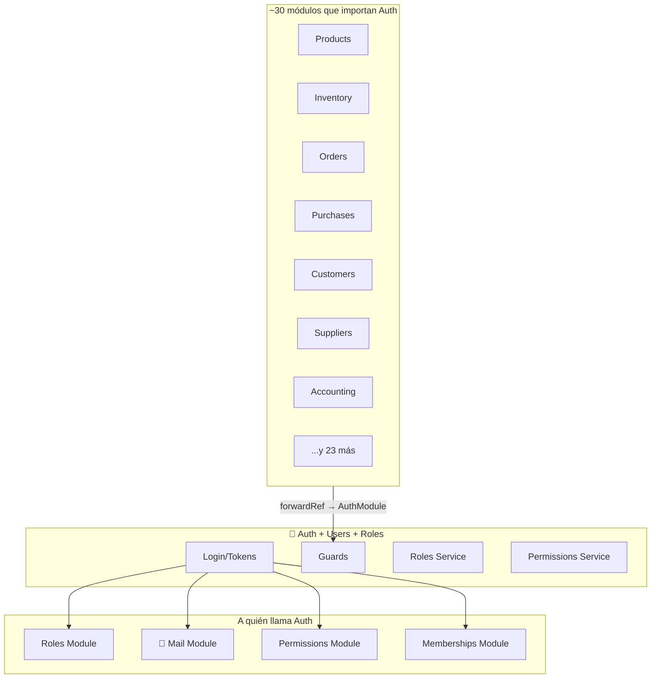

# Auth, Users, Roles — Mapa de Conexiones

> Auth es importado por ~30 módulos vía forwardRef.
> Última actualización: 2026-04-28

---

## Diagrama

---

## Conexiones de Entrada

| Quién importa Auth | Propósito |
|---|---|
| **~30 módulos** (Products, Inventory, Orders, Purchases, Suppliers, Accounting, BankAccounts, Appointments, BOM, etc.) | Todos usan `JwtAuthGuard`, `TenantGuard`, `PermissionsGuard` via `AuthModule` forwardRef |
| **Onboarding** | Crea usuario inicial + rol admin + membership |
| **SuperAdmin** | Impersonación, gestión global de usuarios |

---

## Conexiones de Salida

| Auth llama a | Propósito |
|---|---|
| **RolesModule** | Carga role con permissions para token |
| **PermissionsModule** | Lista permisos disponibles para defaults |
| **MailModule** | Envía emails de invitación/verificación |
| **MembershipsModule** | Busca memberships activas para multi-tenant |

---

*Última actualización: 2026-04-28*
