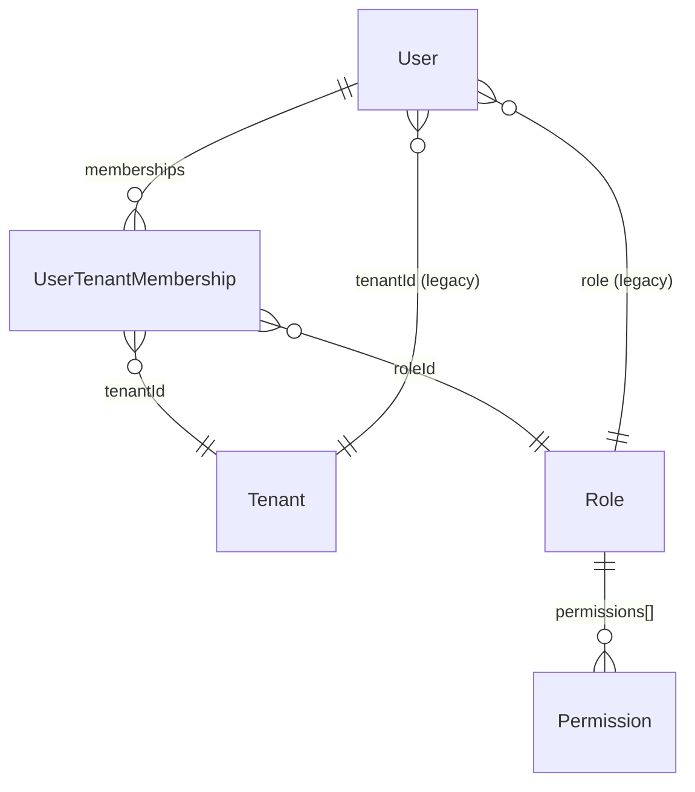
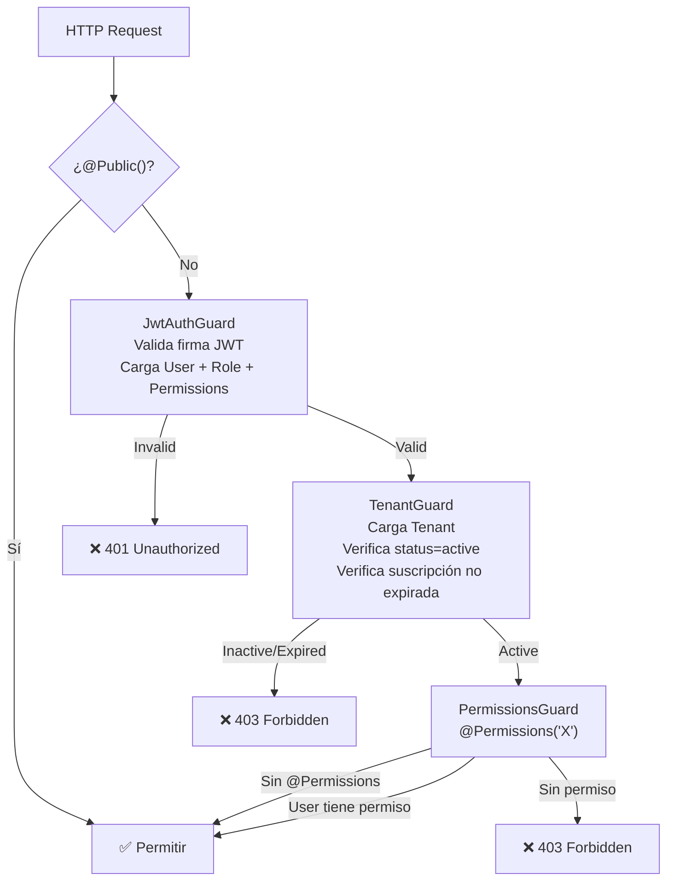

# Auth, Users, Roles — Modelo de Datos

> User, Role, Permission, UserTenantMembership, Tenant (parcial).
> Última actualización: 2026-04-28

---

## Diagrama de Entidades



---

## Colección: `users`

| Campo | Tipo | Requerido | Descripción |
|---|---|---|---|
| `email` | String | Sí | Único por tenant. Lowercase |
| `firstName` | String | Sí | Nombre |
| `lastName` | String | Sí | Apellido |
| `password` | String | Sí | Hash bcrypt (select: false) |
| `phone` | String | No | Teléfono |
| `avatar` | String | No | URL de avatar |
| `role` | ObjectId | No | → Role (legacy, para backward compat) |
| `tenantId` | ObjectId | No | → Tenant (legacy, para backward compat) |
| `isActive` | Boolean | — | Default: true |
| `isEmailVerified` | Boolean | — | Default: false |
| `twoFactorEnabled` | Boolean | — | 2FA activo |
| `twoFactorSecret` | String | No | Secreto TOTP (Base32, select: false) |
| `twoFactorBackupCodes` | String[] | No | Códigos de respaldo (single-use, select: false) |
| `twoFactorLastVerifiedAt` | Date | No | Última verificación 2FA |
| `loginAttempts` | Number | — | Default: 0. Reset después de login exitoso |
| `lockUntil` | Date | No | Bloqueado hasta (5 intentos → 30 min) |
| `notificationPreferences` | Object | No | Preferencias de notificación |
| `pushSubscriptions` | Array | No | Suscripciones web push |
| `createdBy` | ObjectId | No | → User (auto-referencia) |

---

## Colección: `roles`

| Campo | Tipo | Requerido | Descripción |
|---|---|---|---|
| `name` | String | Sí | Nombre del rol. Único por tenant |
| `description` | String | No | Descripción |
| `permissions` | ObjectId[] | Sí | → Permission[]. Array de permisos asignados |
| `tenantId` | ObjectId | Sí | → Tenant |

**Índice**: `{ name, tenantId }` unique

---

## Colección: `permissions`

| Campo | Tipo | Requerido | Descripción |
|---|---|---|---|
| `name` | String | Sí | Único global. Ej: `orders_read`, `inventory_create` |
| `description` | String | Sí | Descripción legible |
| `module` | String | Sí | Módulo al que pertenece (orders, inventory, etc.) |
| `action` | String | Sí | Acción (create, read, update, delete) |

**104 permisos definidos** en `constants.ts`, organizados por módulo:
- Core: `users_*`, `roles_*`, `dashboard_read`, `tenant_settings_*`
- Negocio: `orders_*`, `inventory_*`, `products_*`, `customers_*`, `accounting_*`, `purchases_*`
- Servicios: `appointments_*`, `services_*`, `resources_*`
- Finanzas: `billing_*`, `cash_register_*`, `payroll_employees_*`
- Marketing: `marketing_*`, `opportunities_*`, `tips_*`, `commissions_*`, `goals_*`, `bonuses_*`
- Sistema: `events_*`, `chat_*`, `data_import_*`, `reports_*`

---

## Colección: `usertenantmemberships`

Relación many-to-many entre Users y Tenants.

| Campo | Tipo | Requerido | Descripción |
|---|---|---|---|
| `userId` | ObjectId | Sí | → User |
| `tenantId` | ObjectId | Sí | → Tenant |
| `roleId` | ObjectId | Sí | → Role (rol en este tenant) |
| `status` | Enum | Sí | `active`, `inactive`, `invited` |
| `isDefault` | Boolean | — | Si es el tenant por defecto al login |
| `permissionsCache` | String[] | — | Permisos desnormalizados (performance) |
| `allowedLocationIds` | ObjectId[] | — | Business locations permitidas |

**Índice**: `{ userId, tenantId }` unique

---

## JWT Token Payload

### Access Token (15 min)
```typescript
{
  sub: string,           // User ID
  email: string,
  role: {
    name: string,
    permissions: string[]  // ["orders_read", "inventory_create", ...]
  },
  tenantId: string,
  membershipId: string,
  impersonation?: {
    isImpersonated: boolean,
    originalUserId: string,
    reason: string
  }
}
```

### Refresh Token (7 días)
```typescript
{
  sub: string  // Solo User ID
}
```

### Customer Token (storefront, separado)
```typescript
{
  sub: string,     // Customer ID
  email: string,
  tenantId: string,
  type: "customer"  // Diferencia del token admin
}
```

---

## Guard Stack



---

## ⚠️ Gotchas

1. **Legacy vs Memberships**: El User tiene `role` y `tenantId` como campos legacy. El sistema moderno usa `UserTenantMembership`. El JWT strategy usa membership primero, fallback a legacy.
2. **PermissionsGuard fallback**: Si `user.permissions` no existe como array, el guard **permite todo** (fallback de compatibilidad). Esto significa que usuarios sin permisos explícitos pueden pasar.
3. **Refresh tokens no se invalidan**: Son stateless — no hay blacklist. Un refresh token robado es válido hasta que expire (7 días).
4. **Google OAuth no auto-crea**: Si el email no existe en el sistema, OAuth falla. El usuario debe existir previamente.
5. **Super admin bypasses TenantGuard**: El rol `super_admin` no necesita tenant válido.
6. **Tokens en URL**: El callback de Google OAuth pone tokens en query params de la URL de redirect (visible en logs).

---

*Última actualización: 2026-04-28*
*Archivos fuente: `user.schema.ts`, `role.schema.ts`, `permission.schema.ts`, `user-tenant-membership.schema.ts`, `jwt.strategy.ts`, guards/*
