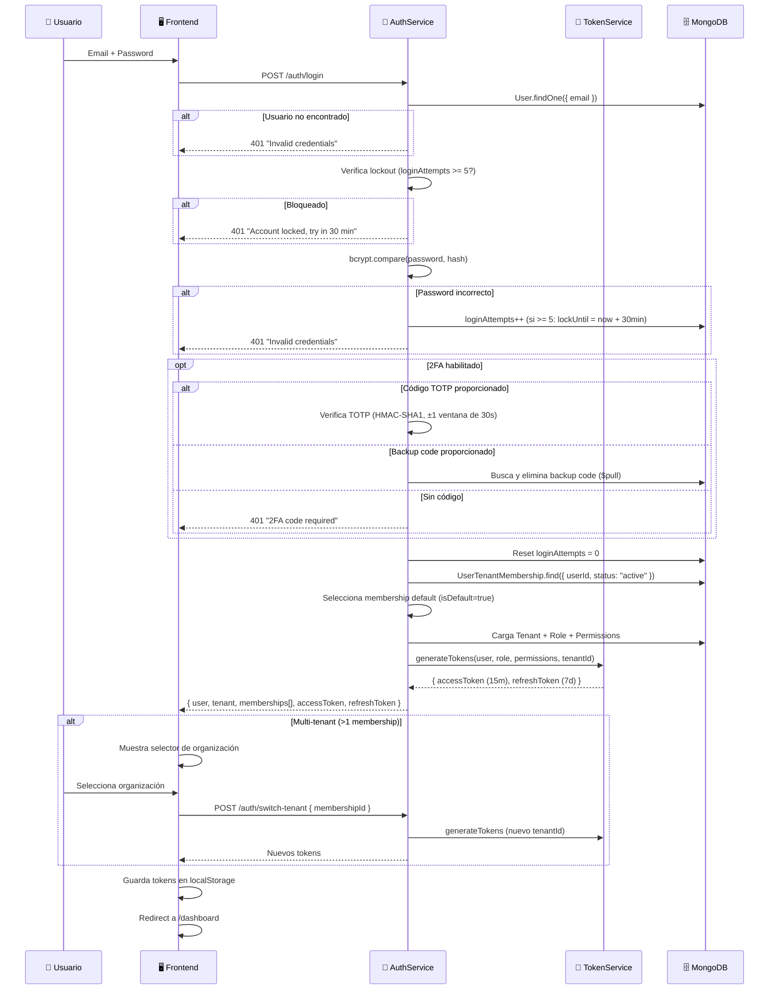
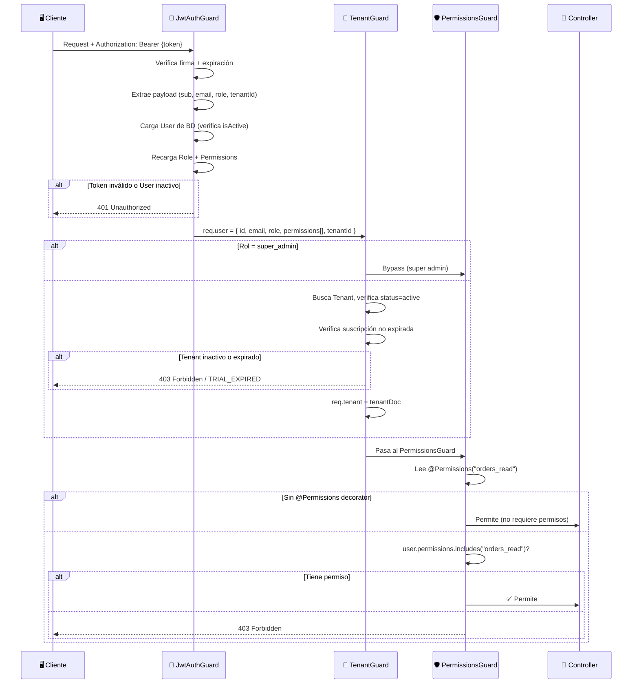
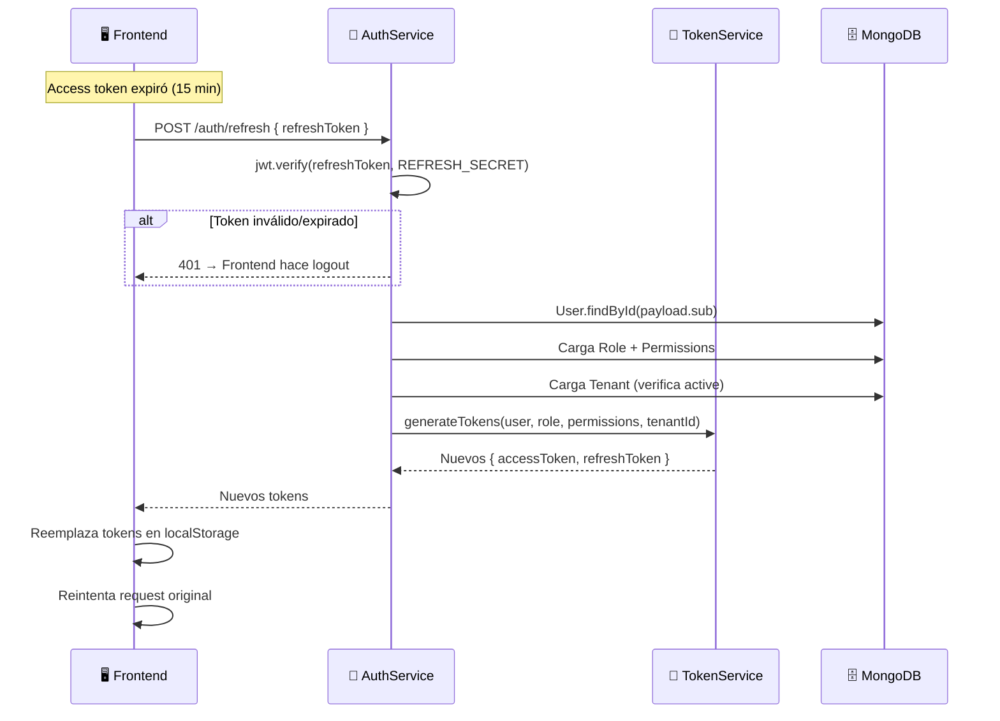
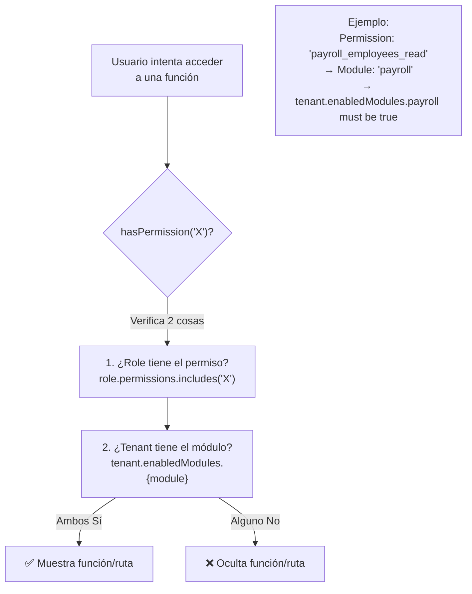
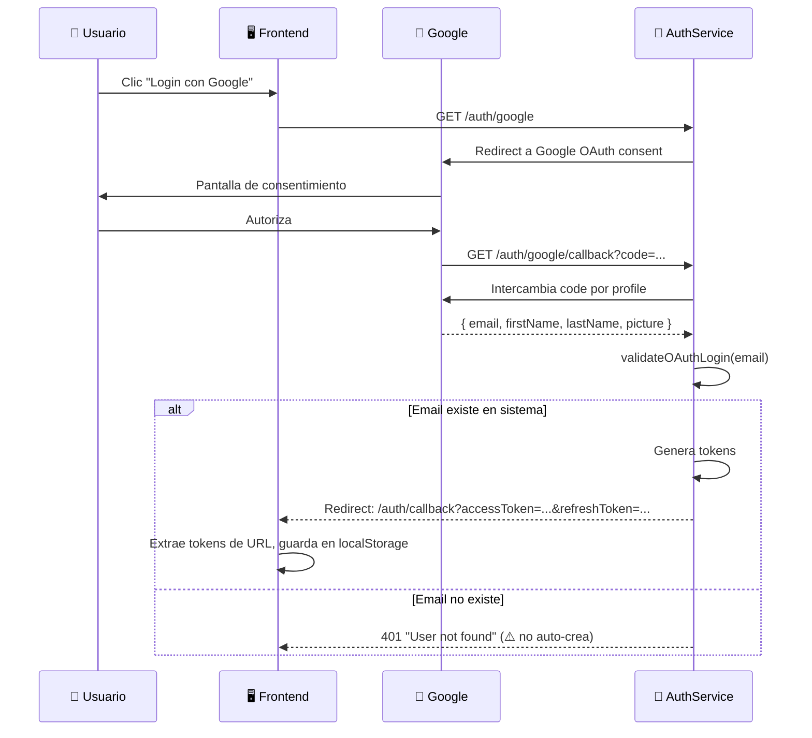

# Auth, Users, Roles — Flujos de Operación

> Última actualización: 2026-04-28

---

## Flujo 1: Login Completo (con 2FA y Multi-Tenant)

---

## Flujo 2: Guard Stack en cada Request

---

## Flujo 3: Refresh Token

---

## Flujo 4: Control de Acceso Frontend (Permisos + Módulos)

---

## Flujo 5: Google OAuth

---

*Última actualización: 2026-04-28*
*Archivos fuente: `auth.controller.ts`, `auth.service.ts`, `token.service.ts`, `jwt.strategy.ts`, `google.strategy.ts`, guards/*
