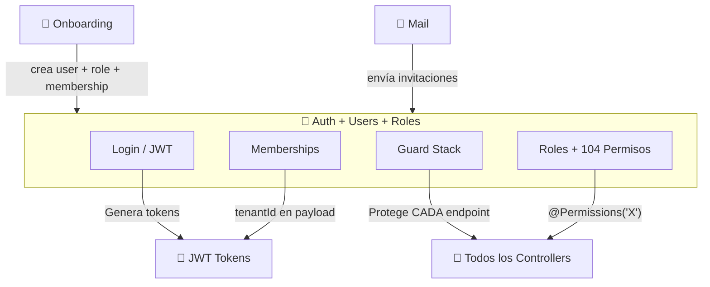

# Autenticación, Usuarios y Roles

## ¿Qué es?

Este módulo es el **sistema de seguridad y control de acceso** de SmartKubik — la puerta de entrada que decide quién puede entrar, qué puede ver, y qué puede hacer. Maneja el login (con opción de 2FA y Google), la gestión de usuarios por tenant, los roles con permisos granulares, y el sistema multi-tenant que permite a un usuario pertenecer a varias organizaciones.

Es el backbone de seguridad: cada request al sistema pasa por su cadena de guards (JWT → Tenant → Permisos) antes de llegar a cualquier endpoint.

## ¿Para quién es?

- **Administrador**: Crea usuarios, asigna roles, configura permisos
- **Todos los usuarios**: Login, cambio de contraseña, selección de organización
- **Sistema**: Valida JWT en cada request, verifica permisos, aísla datos por tenant

## ¿Qué problema resuelve?

- **Sin autenticación**, cualquiera podría acceder al sistema
- **Sin roles/permisos**, todos verían y harían todo — un cajero podría borrar productos
- **Sin multi-tenancy**, los datos de un negocio se mezclarían con los de otro
- **Sin multi-membresía**, un usuario que administra 2 negocios necesitaría 2 cuentas

## Funcionalidades principales

- **Login con JWT**: Autenticación por email/password con tokens de acceso (15min) y refresh (7 días)
- **2FA (TOTP)**: Verificación de dos factores con códigos temporales + códigos de respaldo
- **Google OAuth**: Login con cuenta de Google (solo usuarios pre-existentes)
- **Multi-membresía**: Un usuario puede pertenecer a múltiples organizaciones con roles diferentes en cada una
- **Cambio de tenant**: Cambiar entre organizaciones sin cerrar sesión
- **104 permisos granulares**: Control fino por módulo y acción (create, read, update, delete)
- **Roles por tenant**: Cada organización define sus propios roles con los permisos que necesite
- **Guard stack**: 3 niveles de protección en cascada: JWT → Tenant (activo + suscripción) → Permisos
- **Rate limiting**: 3 tiers (50/min, 300/10min, 1000/hora en producción)
- **Lockout**: 5 intentos fallidos → bloqueo de 30 minutos
- **Impersonación**: Super-admin puede generar tokens como otro usuario (con flag de auditoría)

## Cómo se conecta con otros módulos

## Ubicación en el sistema

- **Login**: `/login`
- **Registro**: `/register`
- **Gestión de usuarios**: Settings → Usuarios (`/settings?tab=users`)
- **Gestión de roles**: Settings → Roles (`/settings?tab=roles`)
- **Cambio de organización**: Selector en sidebar header
- **Permisos**: No hay UI directa — se asignan via Roles

---

*Última actualización: 2026-04-28*
*Archivos fuente: `food-inventory-saas/src/auth/`, `src/modules/users/`, `src/modules/roles/`, `src/modules/permissions/`, `src/guards/`*
