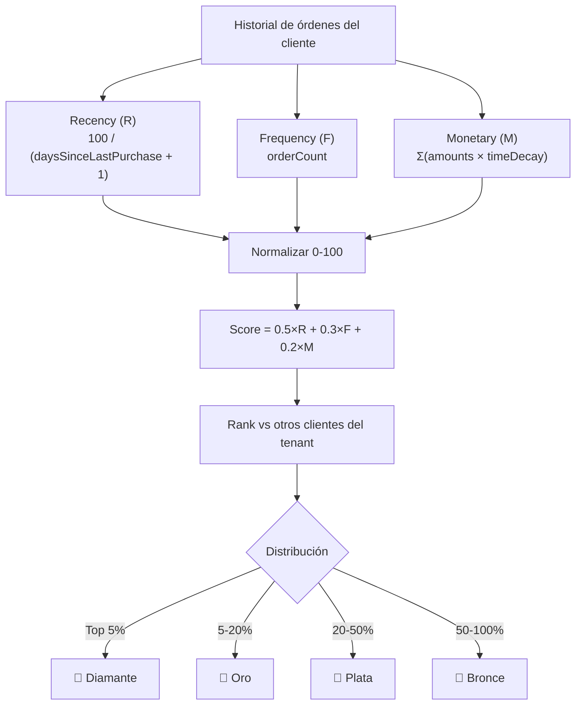

# Clientes y CRM — Modelo de Datos

> El schema Customer es el más versátil del sistema: clientes, proveedores, empleados.
> Última actualización: 2026-04-28

---

## Colección: `customers`

### Identidad

| Campo | Tipo | Requerido | Descripción |
|---|---|---|---|
| `customerNumber` | String | Sí | Único por tenant. Formato: `CLI-XXXXXX` (admin) o `C000001` (storefront) |
| `name` | String | Sí | Nombre / Nombre de contacto |
| `lastName` | String | No | Apellido |
| `companyName` | String | No | Nombre de la empresa |
| `customerType` | Enum | Sí | `individual`, `business`, `supplier`, `employee`, `admin`, `manager`, `Repartidor`, `Cajero`, `Mesonero` |
| `status` | Enum | No | `active`, `inactive`, `suspended`, `blocked`. Default: active |

### Fiscal

| Campo | Tipo | Descripción |
|---|---|---|
| `taxInfo.taxId` | String | RIF / Cédula |
| `taxInfo.taxType` | String | V, E, J, G, P, N |
| `taxInfo.taxName` | String | Nombre fiscal |
| `taxInfo.isRetentionAgent` | Boolean | Si retiene IVA |
| `taxInfo.retentionPercentage` | Number | % de retención |

### Contactos y Direcciones (arrays)

| Campo | Tipo | Descripción |
|---|---|---|
| `contacts[]` | Array | `{ type: "phone"/"email"/"whatsapp", value, isPrimary, isActive, notes }` |
| `addresses[]` | Array | `{ type: "business"/"billing"/"shipping", street, city, state, zipCode, coordinates, isDefault }` |
| `paymentMethods[]` | Array | `{ type, bank, accountNumber, cardType, isPreferred, isActive }` |

### Lealtad

| Campo | Tipo | Default | Descripción |
|---|---|---|---|
| `tier` | Enum | `"bronce"` | `bronce`, `plata`, `oro`, `diamante` |
| `loyaltyScore` | Number | 0 | Score RFM normalizado (0-100) |
| `loyaltyPoints` | Number | 0 | Puntos acumulados |
| `defaultPriceListId` | ObjectId | — | → PriceList personalizada |

### Métricas

| Campo | Tipo | Descripción |
|---|---|---|
| `metrics.totalOrders` | Number | Total de órdenes |
| `metrics.totalSpent` | Number | Total gastado |
| `metrics.totalSpentUSD` | Number | Total en USD |
| `metrics.averageOrderValue` | Number | Valor promedio de orden |
| `metrics.lastOrderDate` | Date | Última compra |
| `metrics.firstOrderDate` | Date | Primera compra |
| `metrics.daysSinceLastOrder` | Number | Días desde última compra |
| `metrics.orderFrequency` | Number | Frecuencia de compra |
| `metrics.lifetimeValue` | Number | Valor de vida del cliente |
| `metrics.returnRate` | Number | Tasa de devolución |
| `metrics.communicationTouchpoints` | Number | Interacciones registradas |
| `metrics.engagementScore` | Number | Score de engagement |
| `metrics.averageRating` | Number | Rating promedio (para suppliers, 1-5) |

### Crédito

| Campo | Tipo | Descripción |
|---|---|---|
| `creditInfo.creditLimit` | Number | Límite de crédito |
| `creditInfo.availableCredit` | Number | Crédito disponible |
| `creditInfo.paymentTerms` | Number | Días de pago |
| `creditInfo.creditRating` | String | Clasificación crediticia |
| `creditInfo.isBlocked` | Boolean | Si está bloqueado |
| `creditInfo.acceptsCredit` | Boolean | Si acepta crédito |

### WhatsApp

| Campo | Tipo | Descripción |
|---|---|---|
| `whatsappNumber` | String | Número de WhatsApp |
| `whatsappChatId` | String | Chat ID de WhatsApp |
| `isWhatsappCustomer` | Boolean | Si interactúa por WA |
| `lastWhatsappInteraction` | Date | Última interacción WA |

### Auth Storefront

| Campo | Tipo | Descripción |
|---|---|---|
| `email` | String | Email para login (unique sparse) |
| `passwordHash` | String | Hash bcrypt (select: false) |
| `hasStorefrontAccount` | Boolean | Si tiene cuenta de storefront |
| `emailVerified` | Boolean | Si verificó email |
| `lastLoginAt` | Date | Último login |

### No-Show (Hospitality)

| Campo | Tipo | Descripción |
|---|---|---|
| `noShowCount` | Number | Inasistencias |
| `lastNoShowDate` | Date | Última inasistencia |
| `requiresDeposit` | Boolean | Si se requiere depósito |
| `isBlacklisted` | Boolean | Si está bloqueado |

### Engagement

| Campo | Tipo | Descripción |
|---|---|---|
| `interactions[]` | Array | `{ type, channel, subject, description, status, handledBy }` |
| `communicationEvents[]` | Array | `{ templateId, channels[], deliveredAt, engagementDelta }` |
| `segments[]` | Array | `{ name, description, criteria, assignedAt }` |
| `lastContactDate` | Date | Última interacción |
| `nextFollowUpDate` | Date | Próximo seguimiento |

### Índices Principales

| Campos | Propósito |
|---|---|
| `{ customerNumber, tenantId }` unique | Número único |
| `{ email, tenantId }` | Login storefront |
| `{ taxInfo.taxId, tenantId }` | Búsqueda por RIF |
| `{ customerType, tenantId }` | Filtro por tipo |
| `{ tier, tenantId }` | Filtro por lealtad |
| `{ whatsappNumber, tenantId }` | Lookup WhatsApp |
| `{ name, lastName, companyName, customerNumber }` text | Full-text search |

---

## Cálculo de Tiers (Lealtad RFM)

---

## ⚠️ Gotchas

1. **`customerType` incluye roles operativos**: `Repartidor`, `Cajero`, `Mesonero` son tipos válidos — un Customer puede representar a un empleado.
2. **Auto-creación de perfiles**: Al crear un Customer con `customerType="supplier"`, se crea automáticamente un Supplier vinculado. Con `"employee"`, se crea un EmployeeProfile.
3. **`email` es sparse unique**: Puede ser null/undefined (clientes sin cuenta). La unicidad solo aplica cuando tiene valor.
4. **`passwordHash` es `select: false`**: Nunca se retorna en queries normales. Solo se accede explícitamente con `.select('+passwordHash')`.
5. **Soft delete**: No se borra físicamente. `status → "inactive"`, `inactiveReason → "Eliminado por usuario"`.
6. **Metrics se recalculan en cada `findAll()`**: El agregado une Orders, PurchaseOrders, y Appointments para calcular métricas en tiempo real.

---

*Última actualización: 2026-04-28*
*Archivo fuente: `customer.schema.ts`*
