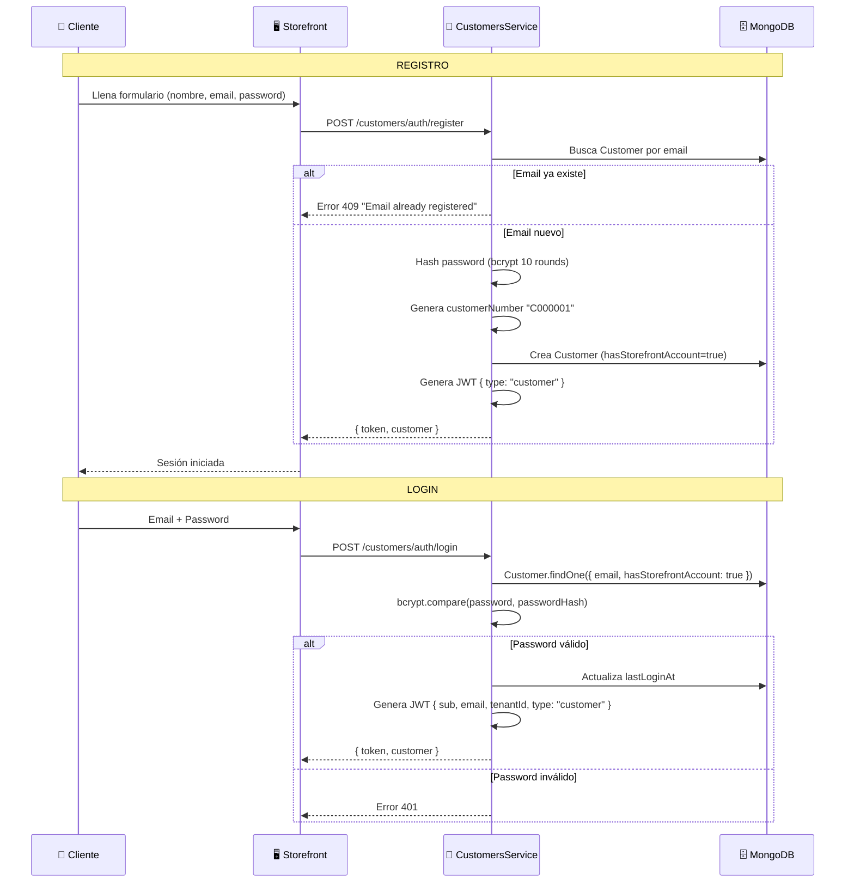
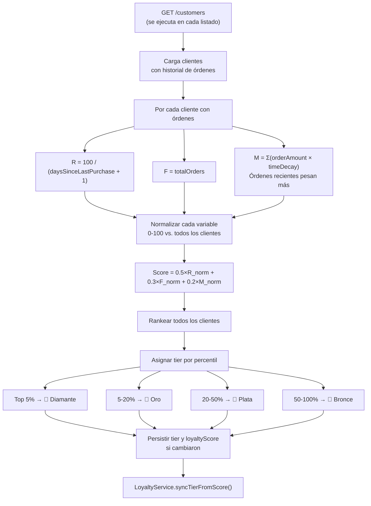
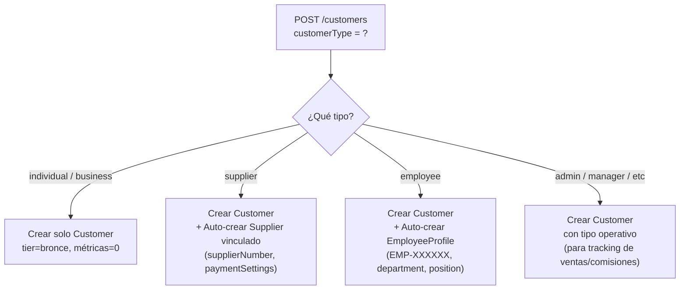
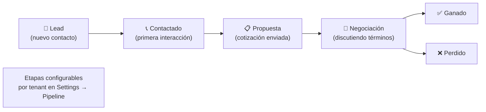

# Clientes y CRM — Flujos de Operación

> Última actualización: 2026-04-28

---

## Flujo 1: Registro y Login de Cliente (Storefront)

---

## Flujo 2: Cálculo de Lealtad RFM

---

## Flujo 3: Auto-Creación de Perfiles según Tipo

---

## Flujo 4: Pipeline de Ventas (Oportunidades)

---

*Última actualización: 2026-04-28*
