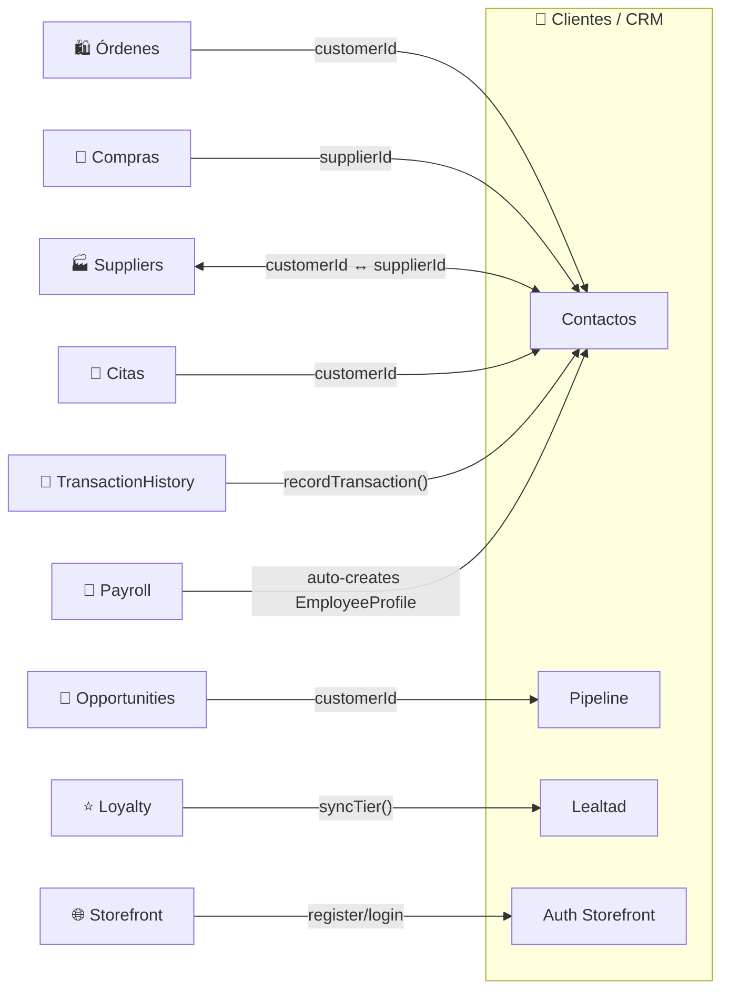

# Clientes y CRM

## ¿Qué es?

El módulo de Clientes/CRM es como la **libreta de contactos inteligente del negocio** — no solo guarda nombres y teléfonos, sino que rastrea todo lo que cada cliente ha comprado, cuánto ha gastado, su nivel de lealtad, sus preferencias de pago, y hasta cuándo fue su última interacción. Además, el mismo módulo gestiona proveedores y empleados, porque en SmartKubik un contacto puede tener múltiples roles.

Para el storefront público, el módulo también maneja la autenticación de clientes (registro, login, perfil) de forma completamente separada del login de administradores.

## ¿Para quién es?

- **Vendedor**: Gestiona su cartera de clientes, registra interacciones, da seguimiento
- **Administrador**: Ve métricas de clientes (mejor cliente, frecuencia, valor de vida), gestiona pipeline de ventas
- **Cajero**: Busca clientes por RIF o teléfono al crear una venta
- **Cliente (storefront)**: Se registra, inicia sesión, ve su historial de pedidos
- **Sistema**: Calcula lealtad (tiers), segmenta clientes, envía comunicaciones

## ¿Qué problema resuelve?

- **Sin CRM**, cada venta sería anónima — no sabrías quién compra más, quién dejó de comprar, ni a quién darle una oferta
- **Sin perfil dual**, habría que gestionar proveedores en un sistema aparte de clientes
- **Sin pipeline**, no habría forma de rastrear oportunidades de venta desde el primer contacto hasta el cierre
- **Sin lealtad automática**, habría que clasificar manualmente a los mejores clientes

## Funcionalidades principales

- **Contactos unificados**: Un solo directorio para clientes, proveedores, empleados, y contactos mixtos
- **Perfil dual**: Un contacto puede ser cliente Y proveedor simultáneamente
- **Pipeline de ventas**: Etapas configurables (lead → contactado → propuesta → negociación → cerrado)
- **Lealtad RFM**: Clasificación automática en tiers (Bronce, Plata, Oro, Diamante) basada en Recencia, Frecuencia, y Monto
- **Historial de transacciones**: Todo lo que un cliente ha comprado, con filtros por fecha, producto, y monto
- **Métricas en tiempo real**: Total gastado, valor promedio de orden, frecuencia, días desde última compra
- **Engagement tracking**: Registra interacciones por WhatsApp, email, teléfono; calcula un score de engagement
- **No-show management**: Para hospitality — rastrea inasistencias, bloquea clientes reincidentes, requiere depósito
- **Auth de storefront**: Registro/login separado para clientes del storefront (JWT independiente)
- **Crédito y pagos**: Límite de crédito, condiciones de pago, métodos preferidos
- **Segmentación automática**: VIP (score≥80), WhatsApp (interactúa por WA), Email Engaged
- **Listas de precios**: Asigna una lista de precios personalizada a cada cliente

## Cómo se conecta con otros módulos

## Ubicación en el sistema

- **En el menú**: Ventas y Marketing → CRM
- **URL**: `/crm` (tabs: `?tab=all`, `?tab=individual`, `?tab=supplier`, `?tab=pipeline`)
- **Permisos**: `customers_create`, `customers_read`, `customers_update`, `customers_delete`
- **Auth storefront**: `/api/v1/customers/auth/*` (sin autenticación admin)

---

*Última actualización: 2026-04-28*
*Archivos fuente: `food-inventory-saas/src/modules/customers/`, `food-inventory-admin/src/components/CRMManagement.jsx`*
