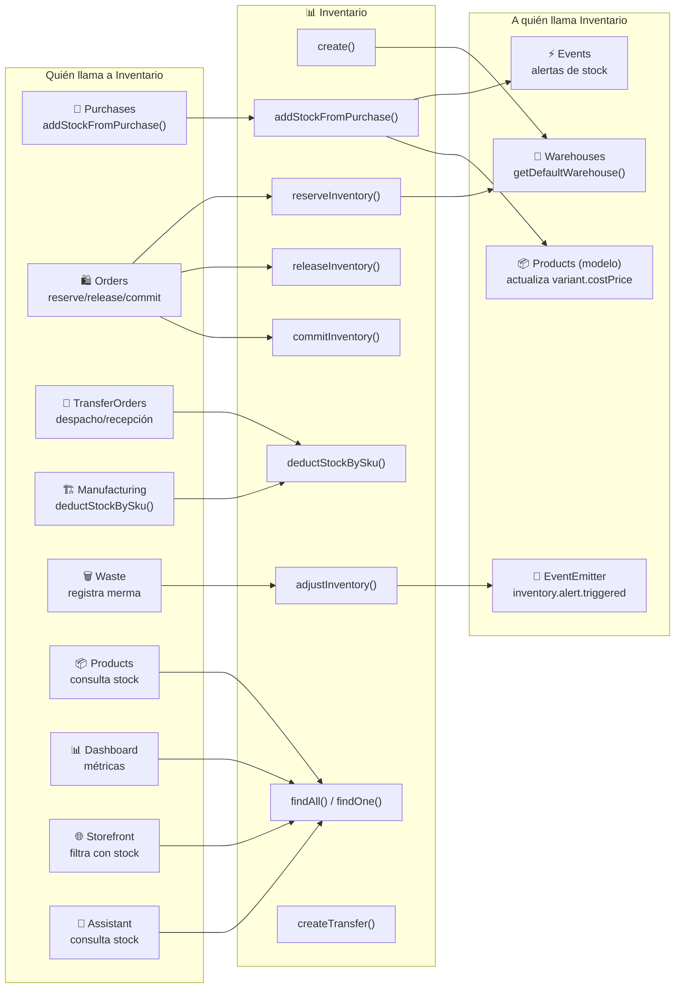

# Inventario — Mapa de Conexiones

> Cómo el módulo de Inventario se conecta con el resto del sistema.
> Última actualización: 2026-04-28

---

## Diagrama de Conexiones

---

## Conexiones de Entrada (quién me llama)

| Módulo origen | Función que llama | Función local | Contexto |
|---|---|---|---|
| **Purchases** | `receivePurchaseOrder()` | `addStockFromPurchase()` | Al recibir mercancía de una PO, incrementa stock |
| **Orders** | `createOrder()` | `reserveInventory()` | Al crear una orden, reserva stock |
| **Orders** | `cancelOrder()` | `releaseInventory()` | Al cancelar una orden, libera stock reservado |
| **Orders** | `completeOrder()` | `commitInventory()` | Al completar una orden, descuenta stock definitivamente |
| **TransferOrders** | `ship()` / `dispatch()` | `deductStockBySku()` | Al despachar una transferencia, reduce stock en origen |
| **Manufacturing** | `consumeComponents()` | `deductStockBySku()` | Al producir, consume materias primas |
| **Waste** | Registro de merma | `adjustInventory()` o movimiento OUT | Reduce stock por merma |
| **Products** | `findAll()` con `includeInventory` | `findByProductId()` | Adjunta stock a listado de productos |
| **Storefront** | `findAll()` con `minAvailableQuantity` | Query directa al modelo | Filtra productos con stock > 0 |
| **Dashboard** | KPIs | `getInventorySummary()` | Valor total, alertas activas |
| **Assistant** | Consultas de IA | `findAll()` | Responde preguntas sobre stock |
| **BOM** | Validación de componentes | `findByProductId()` | Verifica stock de materias primas |

---

## Conexiones de Salida (a quién llamo)

| Función local | Módulo destino | Función destino | Contexto |
|---|---|---|---|
| `addStockFromPurchase()` | **Products (modelo)** | `updateOne()` | Sincroniza `variant.costPrice` si cambió |
| `create()` / `addStockFromPurchase()` | **Warehouses (modelo)** | `findOne()` | Obtiene almacén por defecto si no se especifica |
| `evaluateForInventory()` | **EventsService** | `create()` | Crea tarea/evento cuando stock baja del mínimo |
| `evaluateForInventory()` | **EventEmitter2** | `emit('inventory.alert.triggered')` | Notifica al centro de notificaciones |
| `findAll()` | **Products (modelo)** | Query | Resuelve nombre/SKU del producto para búsqueda |

---

## Datos Compartidos

| Entidad | Campo | Módulos que la usan |
|---|---|---|
| `inventoryId` (ObjectId) | Referencia directa | InventoryMovements |
| `productId` (ObjectId) | En Inventory y Movements | Products, Orders, Purchases, BOM, TransferOrders |
| `productSku` (String) | Desnormalizado en Inventory | Products (cascada en update) |
| `warehouseId` (ObjectId) | Ubicación del stock | Warehouses, TransferOrders |
| `orderId` (ObjectId) | En movimientos | Orders |
| `transferId` (UUID) | Vincula pares de transferencia | InventoryMovements (interno) |
| `availableQuantity` | Stock disponible | Storefront (filtro), Orders (reserva), POS |

---

## Dependencias Circulares (forwardRef)

| Par | Razón |
|---|---|
| Inventory ↔ **Auth** | Todos los módulos necesitan auth |
| Inventory ↔ **Events** | Inventario emite alertas vía Events, Events puede consultar inventario |
| Inventory ↔ **Products** | Inventario necesita datos del producto, productos adjuntan stock |

---

*Última actualización: 2026-04-28*
*Archivo fuente: `inventory.module.ts`*
