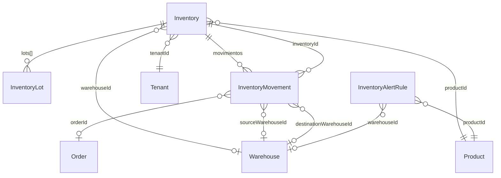
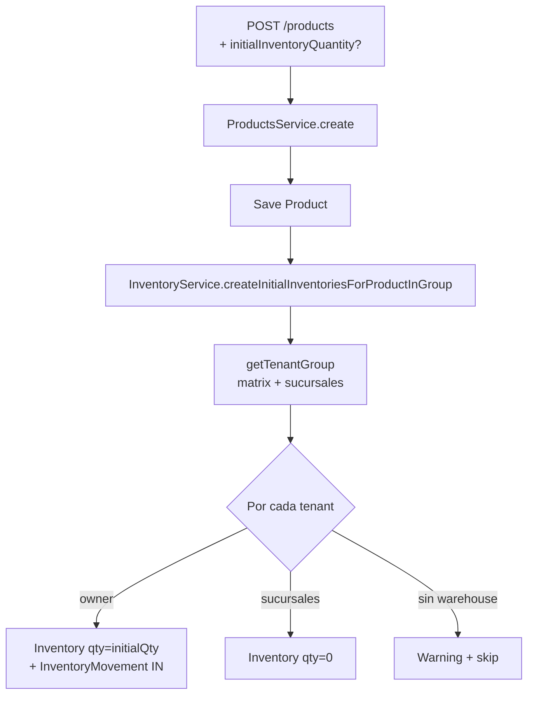

# Inventario — Modelo de Datos

> 3 schemas principales: Inventory, InventoryMovement, InventoryAlertRule.
> Última actualización: 2026-05-09

---

## Diagrama de Entidades

---

## Colección: `inventories`

### Campos principales

| Campo | Tipo | Requerido | Default | Descripción |
|---|---|---|---|---|
| `_id` | ObjectId | Auto | — | ID único |
| `productId` | ObjectId | Sí | — | → Product. Producto al que pertenece este inventario |
| `productSku` | String | Sí | — | SKU del producto (desnormalizado) |
| `productName` | String | Sí | — | Nombre del producto (desnormalizado) |
| `variantId` | ObjectId | No | — | → Product variant (si aplica) |
| `variantSku` | String | No | — | SKU de la variante |
| `warehouseId` | ObjectId | No | — | → Warehouse. ⚠️ Puede ser `undefined` en registros antiguos |
| `binLocationId` | ObjectId | No | — | → BinLocation (ubicación exacta dentro del almacén) |
| `tenantId` | ObjectId | Sí | — | → Tenant |

### Cantidades

| Campo | Tipo | Requerido | Default | Descripción |
|---|---|---|---|---|
| `totalQuantity` | Number | Sí | — | Stock total (reservado + disponible) |
| `availableQuantity` | Number | Sí | — | Stock disponible para vender |
| `reservedQuantity` | Number | Sí | — | Reservado para órdenes en proceso |
| `committedQuantity` | Number | Sí | — | Comprometido para uso futuro programado |

### Costos

| Campo | Tipo | Requerido | Default | Descripción |
|---|---|---|---|---|
| `averageCostPrice` | Number | Sí | — | Costo promedio ponderado (se recalcula en cada entrada) |
| `lastCostPrice` | Number | Sí | — | Último costo de compra registrado |

### Lotes (embedded: `lots[]`)

| Campo | Tipo | Requerido | Default | Descripción |
|---|---|---|---|---|
| `lotNumber` | String | Sí | — | Identificador del lote |
| `quantity` | Number | Sí | — | Cantidad total del lote |
| `availableQuantity` | Number | Sí | — | Disponible del lote |
| `reservedQuantity` | Number | Sí | — | Reservado del lote |
| `costPrice` | Number | Sí | — | Costo por unidad de este lote |
| `receivedDate` | Date | Sí | — | Fecha de recepción |
| `expirationDate` | Date | No | — | Fecha de vencimiento |
| `manufacturingDate` | Date | No | — | Fecha de fabricación |
| `supplierId` | ObjectId | No | — | → Customer (proveedor) |
| `supplierInvoice` | String | No | — | Número de factura del proveedor |
| `status` | String | Sí | `"available"` | Estado del lote |
| `qualityCheck` | Object | No | — | `{ checkedBy, checkedAt, temperature, humidity, visualInspection, approved, notes }` |
| `createdBy` | ObjectId | Sí | — | → User |

### Ubicación física

| Campo | Tipo | Requerido | Default | Descripción |
|---|---|---|---|---|
| `location` | Object | No | — | `{ warehouse, zone, aisle, shelf, bin }` (strings descriptivos) |

### Alertas (embedded)

| Campo | Tipo | Requerido | Default | Descripción |
|---|---|---|---|---|
| `alerts.lowStock` | Boolean | No | — | Si está en stock bajo |
| `alerts.nearExpiration` | Boolean | No | — | Si tiene lotes por vencer |
| `alerts.expired` | Boolean | No | — | Si tiene lotes vencidos |
| `alerts.overstock` | Boolean | No | — | Si excede stock máximo |
| `alerts.lastAlertSent` | Date | No | — | Última alerta enviada |

### Métricas (embedded)

| Campo | Tipo | Requerido | Default | Descripción |
|---|---|---|---|---|
| `metrics.turnoverRate` | Number | No | — | Tasa de rotación |
| `metrics.daysOnHand` | Number | No | — | Días de inventario disponible |
| `metrics.averageDailySales` | Number | No | — | Ventas diarias promedio |
| `metrics.seasonalityFactor` | Number | No | — | Factor de estacionalidad |

### Atributos y combinaciones

| Campo | Tipo | Requerido | Default | Descripción |
|---|---|---|---|---|
| `attributes` | Mixed | No | — | Atributos custom (ej: color, talla) |
| `attributeCombinations` | Array | No | — | `[{ attributes, totalQuantity, availableQuantity, reservedQuantity, committedQuantity, averageCostPrice }]` |

### Auditoría

| Campo | Tipo | Requerido | Default | Descripción |
|---|---|---|---|---|
| `isActive` | Boolean | Sí | `true` | Soft delete. ⚠️ Puede ser `undefined` en registros antiguos — usar `{ $ne: true }` para filtrar |
| `createdBy` | ObjectId | Sí | — | → User |
| `updatedBy` | ObjectId | No | — | → User |
| `importJobId` | ObjectId | No | — | Tracking de importación masiva |

### Índices

| # | Campos | Tipo | Propósito |
|---|---|---|---|
| 1 | `{ tenantId, productId }` | Unique | Un inventario por producto por tenant |
| 2 | `{ tenantId, warehouseId, productId }` | Normal | Filtro por almacén |
| 3 | `{ tenantId, productId, variantId }` | Unique | Si usa variantes |
| 4 | `{ productSku, tenantId }` | Normal | Búsqueda por SKU |
| 5 | `{ variantSku, tenantId }` | Normal | Búsqueda por variante |
| 6 | `{ availableQuantity, tenantId }` | Normal | Filtro de stock |
| 7 | `{ alerts.lowStock, tenantId }` | Normal | Alertas de stock bajo |
| 8 | `{ alerts.nearExpiration, tenantId }` | Normal | Alertas de vencimiento |
| 9 | `{ lots.expirationDate, tenantId }` | Normal | Vencimiento de lotes |
| 10 | `{ location.warehouse, tenantId }` | Normal | Filtro por almacén (text) |

---

## Colección: `inventorymovements`

Cada cambio de stock genera un movimiento. Es el registro histórico inmutable de todo lo que pasó con el inventario.

| Campo | Tipo | Requerido | Default | Descripción |
|---|---|---|---|---|
| `_id` | ObjectId | Auto | — | ID único |
| `inventoryId` | ObjectId | Sí | — | → Inventory |
| `productId` | ObjectId | Sí | — | → Product |
| `productSku` | String | Sí | — | SKU (desnormalizado) |
| `warehouseId` | ObjectId | No | — | → Warehouse donde ocurrió |
| `movementType` | Enum | Sí | — | `in`, `out`, `adjustment`, `transfer`, `reservation`, `release` |
| `quantity` | Number | Sí | — | Cantidad movida |
| `unitCost` | Number | Sí | — | Costo unitario |
| `totalCost` | Number | Sí | — | `quantity × unitCost` |
| `reason` | String | No | — | Razón (Compra, Conteo físico, Devolución, Daño, Merma, Otro) |
| `reference` | String | No | — | Referencia (número de PO, orden, etc.) |
| `orderId` | ObjectId | No | — | → Order (si es por venta) |
| `supplierId` | ObjectId | No | — | → Customer/Supplier (si es por compra) |
| `lotNumber` | String | No | — | Lote específico afectado |
| `transferId` | String (UUID) | No | — | Vincula par de movimientos de transferencia |
| `sourceWarehouseId` | ObjectId | No | — | Almacén origen (transferencias) |
| `destinationWarehouseId` | ObjectId | No | — | Almacén destino (transferencias) |
| `linkedMovementId` | ObjectId | No | — | Movimiento par (transferencias) |
| `binLocationId` | ObjectId | No | — | Ubicación bin del movimiento |
| `sourceBinLocationId` | ObjectId | No | — | Bin origen (transferencias) |
| `destinationBinLocationId` | ObjectId | No | — | Bin destino (transferencias) |
| `balanceAfter` | Object | No | — | `{ totalQuantity, availableQuantity, reservedQuantity, averageCostPrice }` |
| `receivedBy` | String | No | — | Nombre de quién recibió |
| `notes` | String | No | — | Notas/comentarios |
| `createdBy` | ObjectId | Sí | — | → User |
| `tenantId` | ObjectId | Sí | — | → Tenant |

---

## Colección: `inventoryalertrules`

Reglas configurables de alerta por producto.

| Campo | Tipo | Requerido | Default | Descripción |
|---|---|---|---|---|
| `_id` | ObjectId | Auto | — | ID único |
| `productId` | ObjectId | Sí | — | → Product |
| `warehouseId` | ObjectId | No | — | → Warehouse (null = todos los almacenes) |
| `minQuantity` | Number | Sí | — | Umbral de alerta |
| `isActive` | Boolean | Sí | `true` | Si la regla está activa |
| `isDeleted` | Boolean | Sí | `false` | Soft delete |
| `channels` | String[] | Sí | `["in-app"]` | Canales de notificación |
| `lastTriggeredAt` | Date | No | — | Última vez que se disparó (debounce 6h) |
| `tenantId` | ObjectId | Sí | — | → Tenant |
| `createdBy` | ObjectId | No | — | → User |

### Índice único
- `{ tenantId, productId, warehouseId }` (parcial: donde `isDeleted ≠ true`)

---

## ⚠️ Gotchas del Modelo

1. **`warehouseId` puede ser `undefined`**: Registros creados antes de la funcionalidad multi-almacén no tienen warehouseId. Queries deben contemplar esto.
2. **`isActive` / `isDeleted` inconsistencia**: Inventory usa `isActive`, pero puede ser `undefined` (no `false`). Usar `{ isDeleted: { $ne: true } }` en vez de `{ isActive: true }`.
3. **`productId` tipo mixto**: Puede estar guardado como String u ObjectId. Queries usan `$in: [productId, new ObjectId(productId), productId.toString()]`.
4. **Costo promedio ponderado**: Se recalcula solo en movimientos de tipo `in`. Fórmula: `(oldQty × oldAvgCost + newQty × newCost) / (oldQty + newQty)`.
5. **Reservas expiran**: Las reservas de inventario tienen un tiempo de expiración (default 30 min) pero la limpieza no es automática — depende de que la orden se cancele o se complete.
6. **Transferencias son pares**: Un movimiento de transferencia crea DOS registros vinculados por `transferId` (UUID): uno OUT en origen y uno IN en destino.
7. **Default warehouse usa `isDefault`, NO `isPrimary`**: `getDefaultWarehouse()` filtra por `isDefault: true` (corregido en commit `bb76281ce`). El campo `isPrimary` nunca existió en el schema — antes hacía fallback silencioso al "primer almacén activo".

---

## Relación Inversa: Product → Inventory (auto-creación)

Desde commit `bb76281ce` (2026-05-05), la creación de un Producto dispara la creación automática de documentos `Inventory`. La relación se ejecuta en sentido inverso al de las queries normales:

**Reglas críticas:**

| Aspecto | Comportamiento |
|---|---|
| **Scope** | Fan-out a TODO el grupo operacional (matriz + sucursales), no sólo al tenant del usuario |
| **Owner tenant** | El del JWT del usuario (`req.user.tenantId`), NO el tenant del catálogo. Es el único que recibe `initialQuantity > 0` |
| **Warehouse del owner** | Si llega `initialInventoryWarehouseId` se usa; si no, `getDefaultWarehouse(ownerTenantId)` |
| **Warehouse de sucursales** | Siempre `getDefaultWarehouse(tenantId)` por sucursal |
| **Variantes** | Si el producto tiene `variants[]`, se crea un `Inventory` por variante en cada tenant |
| **Idempotencia** | El filtro `(tenantId, productId, variantId)` se chequea antes de insertar — pre-existentes se cuentan en `skipped` |
| **Audit trail** | Si `qty > 0` en owner, se crea `InventoryMovement` tipo `IN` con `reason: "Stock inicial al crear producto"`. Si no hay `createdBy`, se omite el movement con warning |
| **Tolerancia a fallos** | Si una sucursal no tiene warehouse, registra warning y continúa con las demás. Si el helper completo falla, se loguea error pero NO aborta la creación del Product |

**Helpers en `InventoryService`:**

- `getTenantGroup(tenantId)` → resuelve matriz + sucursales (input puede ser cualquiera del grupo). Lee `Tenant.parentTenantId` y `Tenant.isSubsidiary`.
- `createInitialInventoriesForProductInGroup(product, options, session?)` → orquesta el fan-out. Soporta `ClientSession` opcional para transacciones del bulk-create.

Ver `products/functions.md` para el flujo completo y `products/api-reference.md` para el contrato HTTP.

---

*Última actualización: 2026-05-09*
*Archivos fuente: `inventory.schema.ts`, `inventory-movement.schema.ts`, `inventory-alert-rule.schema.ts`, `inventory.service.ts` (createInitialInventoriesForProductInGroup, getTenantGroup, getDefaultWarehouse)*
