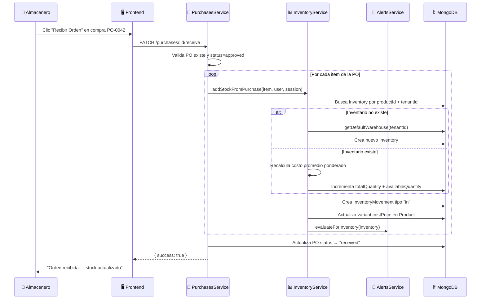
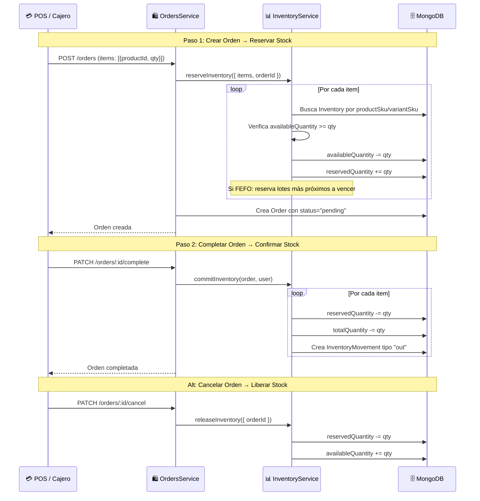
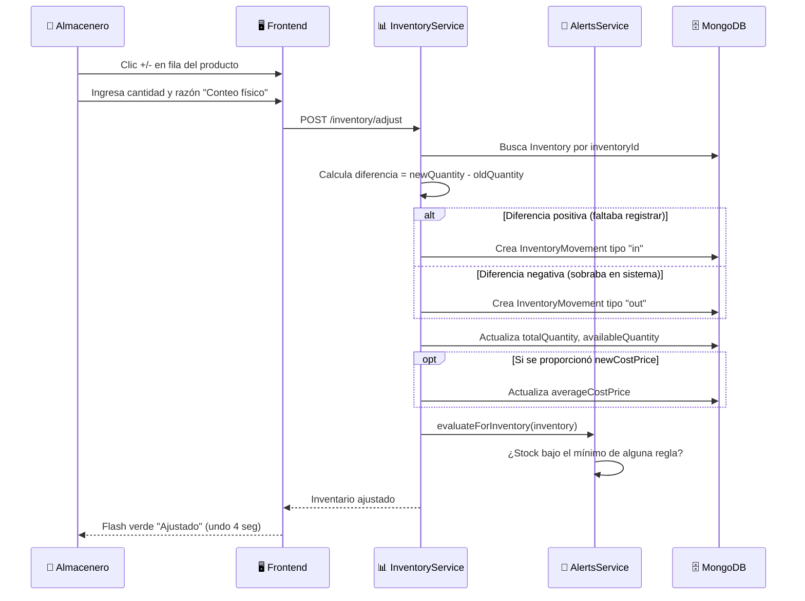
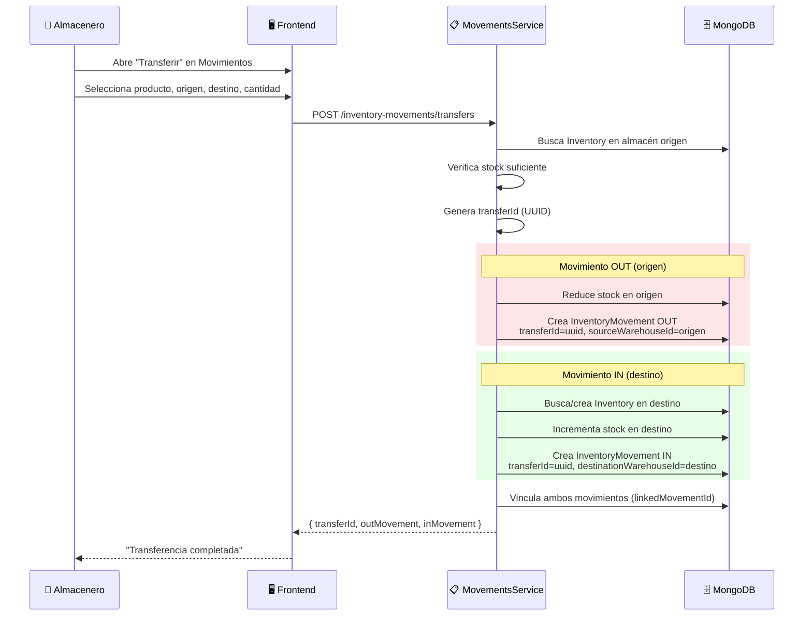
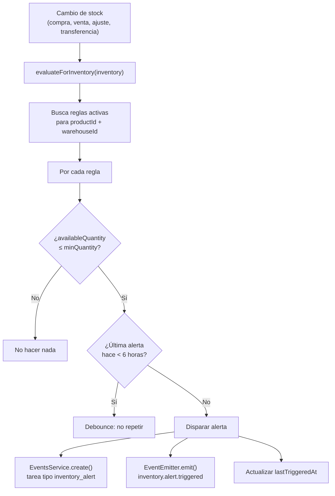
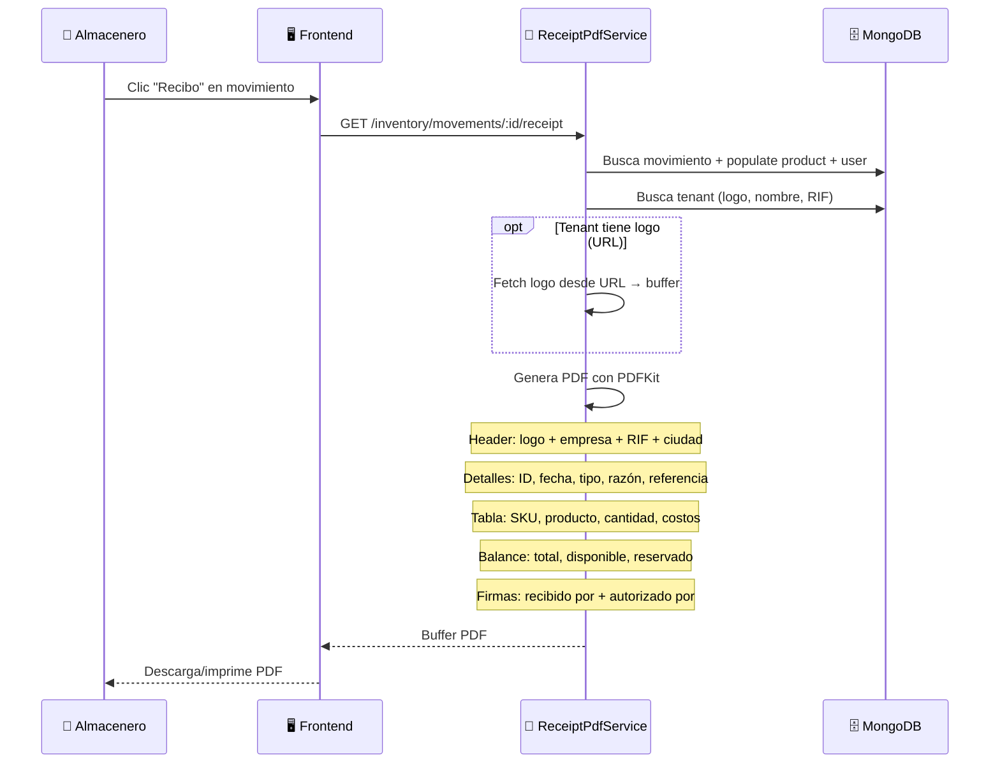

# Inventario — Flujos de Operación

> Diagramas de secuencia para los flujos principales del módulo de Inventario.
> Última actualización: 2026-04-28

---

## Flujo 1: Recepción de Mercancía (desde Compras)

### Descripción
Cuando se recibe una orden de compra, el stock se incrementa automáticamente.

### Diagrama

### Desglose

| Paso | Quién | Qué pasa |
|---|---|---|
| 1 | PurchasesService | Valida que la PO exista y esté aprobada |
| 2 | InventoryService | Busca inventario existente por `productId` (NO por SKU) |
| 3 | InventoryService | Si no existe, crea inventario con warehouse por defecto |
| 4 | InventoryService | Si existe, suma cantidad y recalcula costo promedio |
| 5 | InventoryService | Crea movimiento IN con referencia a la PO |
| 6 | InventoryService | Sincroniza costo de variante en el Product |
| 7 | AlertsService | Evalúa reglas de alerta (¿salió de stock bajo?) |

---

## Flujo 2: Reserva → Venta → Descuento (Ciclo de Orden)

### Descripción
El ciclo completo de cómo una venta afecta el inventario: reserva al crear la orden, y descuento al completarla.

### Diagrama

---

## Flujo 3: Ajuste Manual de Inventario

### Descripción
Un almacenero detecta que la cantidad real de un producto no coincide con el sistema y la corrige.

### Diagrama

---

## Flujo 4: Transferencia entre Almacenes

### Descripción
Mover stock de un almacén a otro. Crea dos movimientos vinculados.

### Diagrama

---

## Flujo 5: Evaluación de Alertas

### Descripción
Cada vez que cambia el stock, el sistema evalúa si debe disparar alguna alerta.

### Diagrama

---

## Flujo 6: Generación de Recibo PDF

### Diagrama

---

*Última actualización: 2026-04-28*
*Archivos fuente: `inventory.service.ts`, `inventory-movements.service.ts`, `inventory-alerts.service.ts`, `inventory-receipt-pdf.service.ts`*
