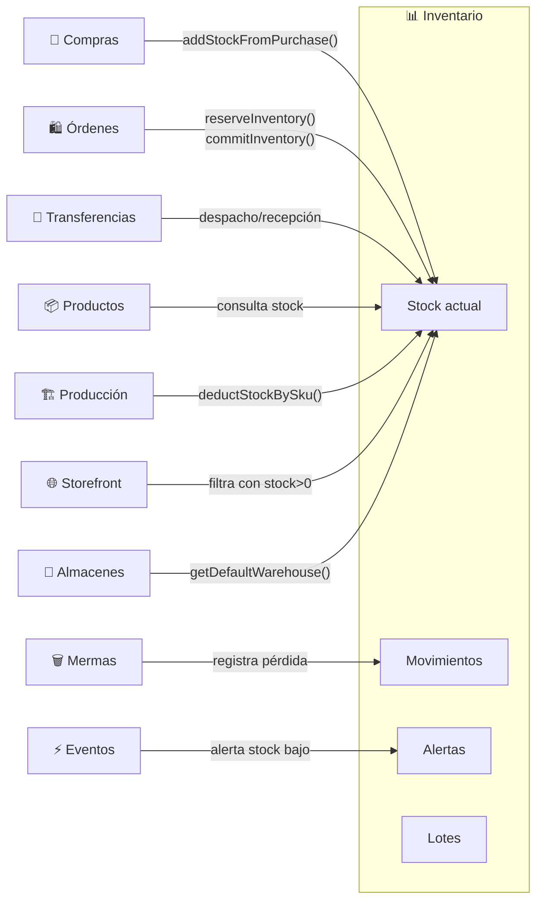

# Inventario

## ¿Qué es?

El módulo de Inventario es como el **cuaderno del almacenero** — el lugar donde se anota todo lo que entra, todo lo que sale, y cuánto queda de cada producto en cada almacén. Pero a diferencia de un cuaderno, este sistema sabe automáticamente cuándo algo se está acabando, cuándo algo está por vencerse, y cuánto vale todo lo que tienes almacenado.

Es el corazón operativo del sistema porque conecta las compras (lo que entra) con las ventas (lo que sale) y garantiza que los números cuadren.

## ¿Para quién es?

- **Almacenero**: Ve el stock actual, recibe mercancía, ajusta cantidades tras un conteo físico
- **Administrador**: Monitorea alertas de stock bajo, revisa reportes, configura reglas de alerta
- **Cajero / POS**: El sistema consulta disponibilidad antes de permitir una venta
- **Encargado de compras**: Ve qué productos necesitan reabastecimiento
- **Sistema (automático)**: Compras actualizan stock al recibir mercancía, ventas lo descuentan

## ¿Qué problema resuelve?

- **Sin control de stock**, no sabrías cuánto tienes realmente de cada producto hasta que lo cuentes a mano
- **Sin alertas**, te darías cuenta de que algo se acabó cuando un cliente lo pide y no hay
- **Sin lotes y vencimientos**, productos perecederos podrían vencerse en el almacén sin que nadie se entere
- **Sin movimientos registrados**, no podrías saber por qué desapareció mercancía (¿se vendió? ¿se dañó? ¿se transfirió?)
- **Sin reservas**, dos cajeros podrían vender el último producto simultáneamente
- **Sin multi-almacén**, negocios con varias sedes no podrían saber dónde está cada producto

## Funcionalidades principales

- **Stock en tiempo real**: Ve la cantidad disponible, reservada, y total de cada producto en cada almacén
- **Ajustes manuales**: Cuando el conteo físico no coincide con el sistema, ajusta la cantidad con una razón documentada (conteo físico, daño, merma, devolución)
- **Ajustes masivos (bulk)**: Importa un archivo Excel con las cantidades reales de muchos productos y ajusta todo de una vez
- **Lotes y vencimientos**: Para productos perecederos, rastrea cada lote con su fecha de vencimiento, fecha de manufactura, y costo individual
- **Reserva de inventario**: Cuando un cliente agrega algo al carrito o un cajero inicia una orden, el sistema reserva esa cantidad para que otro no la venda (expira en 30 minutos)
- **Alertas de stock bajo**: Configura reglas como "avísame cuando la harina baje de 10 unidades" — por producto, global o por almacén
- **Alertas de vencimiento**: El sistema detecta productos con lotes que vencen en los próximos 7 días
- **Movimientos de inventario**: Cada cambio de stock queda registrado como un movimiento (entrada, salida, ajuste, transferencia) con fecha, usuario, razón, y referencia
- **Transferencias entre almacenes**: Mueve mercancía de un almacén a otro con movimientos vinculados (salida de origen + entrada en destino)
- **Recibos PDF**: Genera comprobantes de recepción con logo del negocio, detalles del movimiento, y espacio para firma
- **Reportes y exportación**: Exporta movimientos a PDF o CSV con filtros por fecha, tipo, almacén, y producto
- **Resumen de inventario**: Dashboard con total de productos, valor del inventario, productos con stock bajo, y productos vencidos
- **Costo promedio ponderado**: El sistema calcula automáticamente el costo promedio de cada producto basado en todas las entradas

## Cómo se conecta con otros módulos

## Ubicación en el sistema

- **En el menú**: Operaciones → Inventario → Inventario (pestaña)
- **URL principal**: `/inventory-management?tab=inventory`
- **Otras pestañas**: `?tab=inventory-warehouses` (Almacenes), `?tab=inventory-movements` (Movimientos), `?tab=inventory-alerts` (Alertas), `?tab=inventory-reports` (Reportes), `?tab=transfers` (Traslados)
- **Permisos necesarios**: `inventory_create`, `inventory_read`, `inventory_update`, `inventory_delete`

---

*Última actualización: 2026-04-28*
*Archivos fuente: `food-inventory-saas/src/modules/inventory/`, `food-inventory-admin/src/components/InventoryManagement.jsx`*
