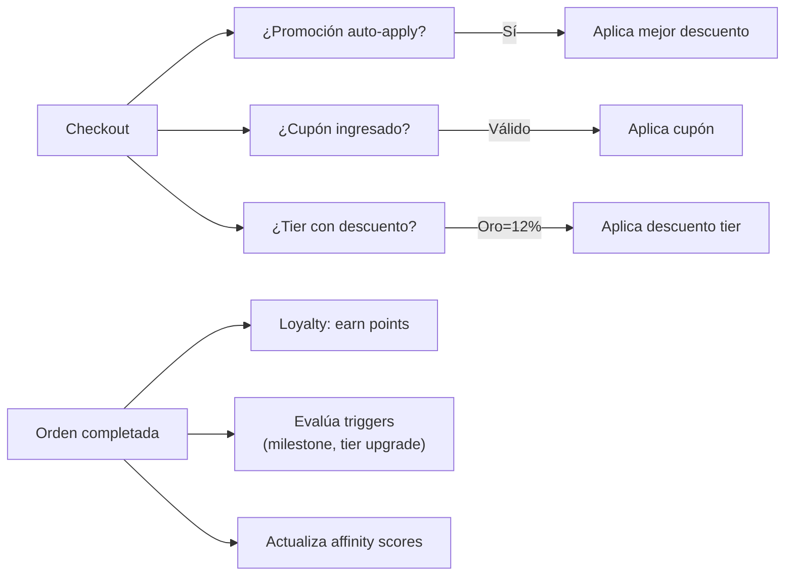

# Marketing (Módulos Agrupados)

## ¿Qué es?

El grupo de módulos de Marketing incluye todas las herramientas para atraer, retener y fidelizar clientes: campañas multi-canal (email, SMS, WhatsApp, push), automatización basada en triggers, promociones con múltiples mecánicas, cupones, programa de lealtad con tiers, análisis de afinidad producto-cliente, A/B testing, y newsletter.

## Módulos Incluidos (8)

| Módulo | Endpoints | Función Principal |
|---|---|---|
| **Marketing (Core)** | 15+ | Campañas multi-canal, segmentación avanzada, analytics (funnel, cohorts, attribution) |
| **Marketing Triggers** | 8 | Automatización: carrito abandonado, milestone de compra, upgrade de tier, cumpleaños |
| **Promotions** | 10 | Descuentos: %, fijo, buy-x-get-y, tiers por volumen, bundles |
| **Coupons** | 9 | Códigos con validación completa, uso por cliente, expiration tracking |
| **Loyalty** | 8 | Puntos, tiers (Explorador→Bronce→Plata→Oro→Diamante), beneficios por tier |
| **Product Campaign** | 20+ | Campañas dirigidas por afinidad de producto, A/B testing completo |
| **Product Affinity** | 9 | Scoring automático cliente-producto, predicción de próxima compra, cross-sell |
| **Newsletter** | 3 | Suscripción pública, gestión de suscriptores |
| **Social Links** | 6 | Bio links para redes sociales |

## Integración con Órdenes

## Tiers de Lealtad

| Tier | Score | Descuento | Ejemplo |
|---|---|---|---|
| Explorador | 0-34 | 0% | Cliente nuevo |
| Bronce | 35-54 | 3% | Compra ocasional |
| Plata | 55-69 | 7% | Cliente regular |
| Oro | 70-84 | 12% | Buen cliente |
| Diamante | 85+ | 18% | Top 5% |

## Tipos de Promociones

| Tipo | Ejemplo |
|---|---|
| percentage_discount | 20% de descuento en toda la tienda |
| fixed_amount_discount | $5 de descuento en tu próxima compra |
| buy_x_get_y | Compra 2 y lleva 1 gratis |
| tiered_pricing | 10+ unidades = 10% off, 50+ = 20% off |
| bundle_discount | Combo: Hamburguesa + Papas + Bebida por $8.99 |

## Permisos
- `marketing_read`, `marketing_write` — Para campañas y marketing

## Feature Flag
- Módulo `marketing` debe estar habilitado

---

*Última actualización: 2026-04-28*
*Archivos: `modules/marketing/`, `modules/promotions/`, `modules/coupons/`, `modules/loyalty/`, `modules/product-campaign/`, `modules/product-affinity/`, `modules/newsletter/`, `modules/social-links/`*
