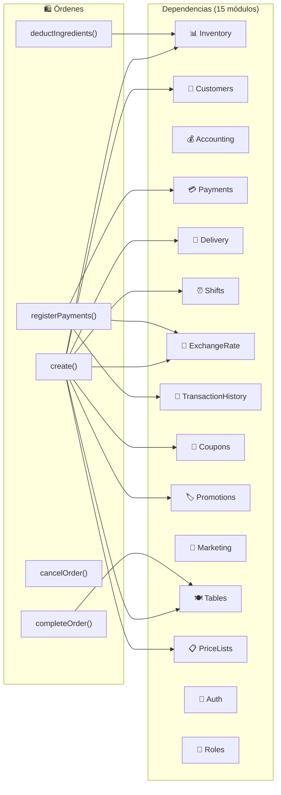

# Órdenes y Caja — Mapa de Conexiones

> El módulo con más dependencias del sistema: 15 imports directos.
> Última actualización: 2026-04-28

---

## Diagrama de Conexiones

---

## Conexiones de Entrada (quién llama a Orders)

| Módulo origen | Función que llama | Contexto |
|---|---|---|
| **Storefront** | `POST /public/orders` | Pedido online del cliente |
| **WhatsApp** | Via eventos + API | Pedidos por WhatsApp |
| **Assistant** | `findAll()`, `findOne()` | Responde consultas sobre órdenes |
| **SuperAdmin** | Múltiples | Administración global |
| **Dashboard** | `getAnalyticsBySource()` | Métricas de ventas |
| **CashRegister** | Consulta órdenes por `cashSessionId` | Totales de sesión |

---

## Conexiones de Salida — OrdersService

| Función local | Módulo destino | Función destino | Contexto |
|---|---|---|---|
| `create()` | **CustomersService** | `findOne()`, `create()` | Carga o crea cliente |
| `create()` | **DiscountService** | `calculateBestDiscount()` | Evalúa descuentos por item |
| `create()` | **CouponsService** | `validate()`, `apply()` | Valida y registra uso de cupón |
| `create()` | **PromotionsService** | `findApplicable()`, `calculateDiscount()`, `apply()` | Auto-aplica promociones |
| `create()` | **DeliveryService** | `calculateDeliveryCost()` | Calcula costo de envío |
| `create()` | **ExchangeRateService** | `getRateForCurrency()` | Obtiene tasa USD/VES |
| `create()` | **PriceListsService** | `getProductPrice()` | Precio por lista de precios |
| `create()` | **TablesService** | `findOne()`, `updateStatus()` | Vincula/limpia mesa |
| `create()` | **ShiftsService** | `findActiveShift()` | Asigna empleado activo |
| `create()` | **TransactionHistoryService** | `recordCustomerTransaction()` | Registra historial |
| `create()` | **WhatsAppNotifications** | `sendOrderConfirmation()` | Notifica al cliente |

---

## Conexiones de Salida — OrderPaymentsService

| Función local | Módulo destino | Función destino | Contexto |
|---|---|---|---|
| `registerPayments()` | **PaymentsService** | `create()` | Crea documento Payment por cada pago |
| `registerPayments()` | **ExchangeRateService** | `getRateForCurrency()` | Normaliza USD ↔ VES |

---

## Conexiones de Salida — OrderInventoryService

| Función local | Módulo destino | Función destino | Contexto |
|---|---|---|---|
| `deductIngredientsFromSale()` | **InventoryService** | `adjustInventory()` | Descuenta componentes de BOM |
| `createOutMovements()` | **InventoryMovementsService** | `create()` | Crea movimientos OUT |
| Auto-reserve en `create()` | **InventoryService** | `reserveInventory()` | Reserva stock |

---

## Conexiones de Salida — OrderFulfillmentService

| Función local | Módulo destino | Función destino | Contexto |
|---|---|---|---|
| `completeOrder()` | **TablesService** | `updateStatus('available')` | Limpia mesa al completar |
| `updateFulfillmentStatus()` | **WhatsAppNotifications** | `sendDeliveryUpdate()` | Notifica cambio de estado |

---

## Conexiones de Salida — WhatsAppNotificationsService

| Función local | Módulo destino | Función destino | Contexto |
|---|---|---|---|
| `sendOrderConfirmation()` | **StorefrontConfig (modelo)** | `findOne()` | Obtiene config WhatsApp del tenant |
| `sendDeliveryUpdate()` | **WhapiService** (via HTTP) | API WhatsApp | Envía mensajes |

---

## Eventos Emitidos

| Evento | Cuándo | Consumidores |
|---|---|---|
| `order.created` | Al crear orden | Consumables auto-deduction, Analytics |
| `order.updated` | Al actualizar items | KDS (Kitchen Display) |
| `order.paid` | Al completar pago | Inventory backflush, Billing triggers |
| `order.fulfillment.updated` | Al cambiar estado despacho | WhatsApp, Logistics |

---

## Datos Compartidos

| Entidad | Campo | Módulos que la usan |
|---|---|---|
| `orderId` (ObjectId) | En Payments, InventoryMovements, BillSplits, KitchenOrders | Payments, Inventory, Kitchen, Billing |
| `orderNumber` (String) | Referencia en movimientos, WhatsApp, tracking | Todos los módulos que referencian órdenes |
| `cashSessionId` (ObjectId) | En Order | CashRegister (para totales de sesión) |
| `tableId` (ObjectId) | En Order | Tables (estado de mesa) |
| `customerId` (ObjectId) | En Order | Customers, TransactionHistory, Loyalty |
| `billingDocumentId` (ObjectId) | En Order | Billing (facturación) |

---

## Dependencias Circulares (forwardRef)

| Par | Razón |
|---|---|
| Orders ↔ **Auth** | Autenticación |
| Orders ↔ **Customers** | Órdenes crean/cargan clientes, clientes muestran historial |
| Orders ↔ **Marketing** | Órdenes disparan campañas, marketing consulta órdenes |

---

*Última actualización: 2026-04-28*
*Archivo fuente: `orders.module.ts`*
