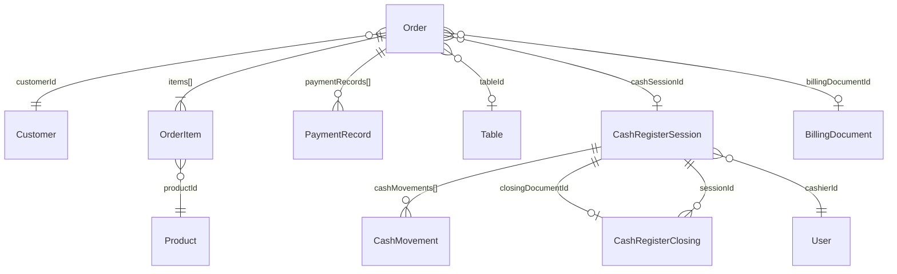

# Órdenes y Caja — Modelo de Datos

> Order (600+ líneas de schema), CashRegisterSession, CashRegisterClosing.
> Última actualización: 2026-04-28

---

## Diagrama de Entidades

---

## Colección: `orders`

### Identificación y Cliente

| Campo | Tipo | Requerido | Descripción |
|---|---|---|---|
| `orderNumber` | String | Sí | Único por tenant. Formato: `ORD-YYMMDD-HHMMSS-XXXX` |
| `customerId` | ObjectId | No | → Customer |
| `customerName` | String | No | Desnormalizado |
| `customerRif` | String | No | RIF del cliente |
| `taxType` | Enum | No | `V`, `E`, `J`, `G`, `P`, `N` (tipo de documento) |
| `customerIsSpecialTaxpayer` | Boolean | No | Si es contribuyente especial (retiene IVA) |
| `source` | Enum | No | `pos`, `storefront`, `whatsapp`, `api`, `manual` |
| `channel` | Enum | No | `online`, `phone`, `whatsapp`, `in_store`, `in_person`, `web` |
| `type` | Enum | No | `retail`, `wholesale`, `b2b` |

### Items (embedded: `items[]`)

| Campo | Tipo | Descripción |
|---|---|---|
| `productId` | ObjectId | → Product |
| `productSku`, `productName` | String | Desnormalizados |
| `variantId`, `variantSku` | ObjectId/String | Variante específica |
| `quantity` | Number | Cantidad en unidad seleccionada |
| `selectedUnit` | String | Unidad de venta (kg, g, und) |
| `conversionFactor` | Number | Factor a unidad base |
| `quantityInBaseUnit` | Number | `quantity × conversionFactor` |
| `unitPrice` | Number | Precio por unidad |
| `costPrice` | Number | Costo por unidad |
| `totalPrice` | Number | `quantity × unitPrice` |
| `discountAmount` | Number | Descuento aplicado ($) |
| `discountPercentage` | Number | % de descuento |
| `discountReason` | String | `bulk`, `promotion`, o razón manual |
| `ivaAmount` | Number | IVA calculado |
| `igtfAmount` | Number | IGTF calculado |
| `finalPrice` | Number | Precio final después de descuentos |
| `modifiers[]` | Array | Modificadores aplicados (extras, opciones) |
| `specialInstructions` | String | Instrucciones especiales |
| `removedIngredients[]` | String[] | Ingredientes removidos (excluidos del backflush) |
| `status` | Enum | `pending`, `sent_to_kitchen`, `preparing`, `ready`, `served` |
| `lots[]` | Array | Lotes asignados (para tracking) |

### Precios y Totales

| Campo | Tipo | Descripción |
|---|---|---|
| `subtotal` | Number | Suma de items antes de impuestos |
| `ivaTotal` | Number | Total IVA (16%) |
| `igtfTotal` | Number | Total IGTF (3% sobre pagos en divisas) |
| `shippingCost` | Number | Costo de envío |
| `discountAmount` | Number | Descuento a nivel de items |
| `generalDiscountPercentage` | Number | Descuento general sobre subtotal |
| `totalAmount` | Number | Total final (USD) |
| `totalAmountVes` | Number | Total en Bolívares |
| `paidAmount` | Number | Monto pagado acumulado (USD) |
| `paidAmountVes` | Number | Monto pagado en VES |

### Retención de IVA

| Campo | Tipo | Descripción |
|---|---|---|
| `ivaWithholdingPercentage` | Number | 75 o 100 (según tipo de contribuyente del tenant) |
| `ivaWithholdingAmount` | Number | Monto retenido de IVA |

### Pagos (embedded: `paymentRecords[]`)

| Campo | Tipo | Descripción |
|---|---|---|
| `method` | String | Método de pago (efectivo_usd, zelle_usd, pago_movil_ves, etc.) |
| `amount` | Number | Monto en moneda del método |
| `amountVes` | Number | Equivalente en VES |
| `exchangeRate` | Number | Tasa usada |
| `currency` | String | USD o VES |
| `reference` | String | Referencia del pago |
| `isConfirmed` | Boolean | Si fue confirmado |
| `bankAccountId` | ObjectId | → BankAccount (para transferencias) |
| `igtf` | Number | IGTF de este pago específico |
| `amountTendered` | Number | Efectivo entregado por el cliente |
| `changeGiven` | Number | Vuelto en misma moneda |
| `changeGivenBreakdown` | Object | `{ usd, ves, vesMethod }` para vuelto mixto |

### Estados

| Campo | Tipo | Valores | Descripción |
|---|---|---|---|
| `status` | Enum | `draft`, `pending`, `confirmed`, `completed`, `cancelled` | Estado general |
| `paymentStatus` | Enum | `pending`, `partial`, `paid` | Estado de pago |
| `fulfillmentStatus` | Enum | `pending`, `picking`, `packed`, `in_transit`, `delivered`, `cancelled` | Estado de despacho |
| `fulfillmentType` | Enum | `store`, `delivery_local`, `delivery_national`, `pickup` | Tipo de entrega |

### Envío (embedded: `shipping`)

| Campo | Tipo | Descripción |
|---|---|---|
| `method` | Enum | `pickup`, `delivery`, `envio_nacional`, `store` |
| `address` | String | Dirección de envío |
| `cost` | Number | Costo calculado |
| `trackingNumber` | String | Número de seguimiento |
| `courierCompany` | String | Empresa de courier |

### Marketing

| Campo | Tipo | Descripción |
|---|---|---|
| `appliedCoupon` | Object | `{ couponId, code, discountType, discountValue, discountAmount }` |
| `appliedPromotions[]` | Array | `[{ promotionId, name, type, discountAmount, productsAffected[] }]` |

### Reserva de Inventario

| Campo | Tipo | Descripción |
|---|---|---|
| `inventoryReservation.isReserved` | Boolean | Si el stock está reservado |
| `inventoryReservation.reservedAt` | Date | Cuándo se reservó |
| `inventoryReservation.expiresAt` | Date | Cuándo expira (default 30 min) |

### Restaurante / Caja

| Campo | Tipo | Descripción |
|---|---|---|
| `tableId` | ObjectId | → Table (mesa asignada) |
| `assignedTo` | ObjectId | → User (cajero/mesero) |
| `cashSessionId` | ObjectId | → CashRegisterSession |
| `cashRegisterId` | String | Nombre de la caja ("Caja 1") |
| `totalTipsAmount` | Number | Total de propinas |
| `tipsRecords[]` | Array | `[{ amount, percentage, method, employeeId }]` |

### Facturación

| Campo | Tipo | Descripción |
|---|---|---|
| `billingDocumentId` | ObjectId | → BillingDocument |
| `billingDocumentNumber` | String | Número de factura |
| `billingDocumentType` | Enum | `none`, `invoice`, `delivery_note` |

---

## Colección: `cashregistersessions`

| Campo | Tipo | Requerido | Descripción |
|---|---|---|---|
| `sessionNumber` | String | Sí | `CAJ-YYYY-NNNN`. Único por tenant |
| `registerName` | String | Sí | "Caja 1", "Caja Principal" |
| `cashierId` | ObjectId | Sí | → User |
| `cashierName` | String | Sí | Desnormalizado |
| `status` | Enum | Sí | `open`, `closing`, `closed`, `suspended` |
| `openedAt` | Date | Sí | Timestamp de apertura |
| `closedAt` | Date | No | Timestamp de cierre |
| `workShift` | String | No | `morning`, `afternoon`, `night` |
| `openingFunds[]` | CashFund[] | No | Denominaciones al abrir |
| `openingAmountUsd` | Number | No | Total USD al abrir |
| `openingAmountVes` | Number | No | Total VES al abrir |
| `closingFunds[]` | CashFund[] | No | Denominaciones al cerrar |
| `closingAmountUsd` | Number | No | Total USD declarado al cerrar |
| `closingAmountVes` | Number | No | Total VES declarado al cerrar |
| `cashMovements[]` | CashMovement[] | No | Entradas/salidas de efectivo |
| `servicePayments[]` | Array | No | Pagos de servicios (beauty/appointments) |
| `totalTransactions` | Number | No | Contador de transacciones |
| `totalSalesUsd` | Number | No | Ventas totales USD |
| `totalSalesVes` | Number | No | Ventas totales VES |
| `closingDocumentId` | ObjectId | No | → CashRegisterClosing |

### CashMovement (embedded)

| Campo | Tipo | Descripción |
|---|---|---|
| `type` | Enum | `in`, `out` |
| `amount` | Number | Monto |
| `currency` | String | `USD`, `VES` |
| `reason` | String | change_request, petty_cash, bank_deposit, expense, correction, other |
| `description` | String | Detalle opcional |
| `reference` | String | Referencia opcional |
| `authorizedBy` | ObjectId | → User |
| `timestamp` | Date | Cuándo ocurrió |

### CashFund — Denominaciones

| Campo | Tipo | Descripción |
|---|---|---|
| `currency` | String | `USD` o `VES` |
| `amount` | Number | Total verificado |
| `denominations` | Object | `{ d_500, d_200, d_100, d_50, d_20, d_10, d_5, d_2, d_1, coins }` |

---

## Colección: `cashregisterclosings`

Documento inmutable generado al cerrar una caja o al hacer cierre global.

| Campo | Tipo | Descripción |
|---|---|---|
| `closingNumber` | String | `CIE-YYYY-NNNN`. Único |
| `closingType` | Enum | `individual`, `consolidated` |
| `sessionId` | ObjectId | → CashRegisterSession (individual) |
| `includedSessions[]` | ObjectId[] | → CashRegisterSession[] (consolidated) |
| `status` | Enum | `draft`, `pending_approval`, `approved`, `rejected` |
| `totalTransactions` | Number | Total de transacciones |
| `totalGrossSalesUsd/Ves` | Number | Ventas brutas |
| `totalNetSalesUsd/Ves` | Number | Ventas netas (después de descuentos) |
| `paymentMethodSummary[]` | Array | Desglose por método de pago |
| `cashDifferences[]` | Array | `[{ currency, expectedAmount, declaredAmount, difference, status }]` |
| `hasDifferences` | Boolean | Flag rápido |
| `taxSummary[]` | Array | `[{ taxType, rate, baseAmount, taxAmount }]` |
| `exchangeRate` | Number | Tasa usada |
| `approvedBy` | ObjectId | → User |

---

## ⚠️ Gotchas

1. **`paymentRecords[]` vs `payments[]`**: La orden tiene ambos. `paymentRecords` son datos embebidos (inline), `payments` son ObjectIds a documentos Payment separados. El cálculo de totales usa `paymentRecords`.
2. **`changeGivenBreakdown`**: Vuelto mixto USD+VES. El campo `changeGiven` es vuelto simple (misma moneda). Ambos pueden existir en el mismo registro.
3. **IGTF solo en divisas**: Solo aplica a métodos de pago que contienen `_usd` en el ID. No aplica a bolívares.
4. **`delivery_note` elimina impuestos**: Si el documento es nota de entrega, el total efectivo = subtotal + envío (sin IVA ni IGTF).
5. **Fulfillment strategy del tenant**: El comportamiento del `complete()` depende de `tenant.settings.fulfillmentStrategy` (immediate/counter/logistics/hybrid).
6. **Backflush de ingredientes**: Para productos con BOM (recetas), al pagar la orden se descuentan los ingredientes del inventario, NO el producto terminado. Se excluyen los `removedIngredients[]`.

---

*Última actualización: 2026-04-28*
*Archivos fuente: `order.schema.ts`, `cash-register-session.schema.ts`, `cash-register-closing.schema.ts`*
