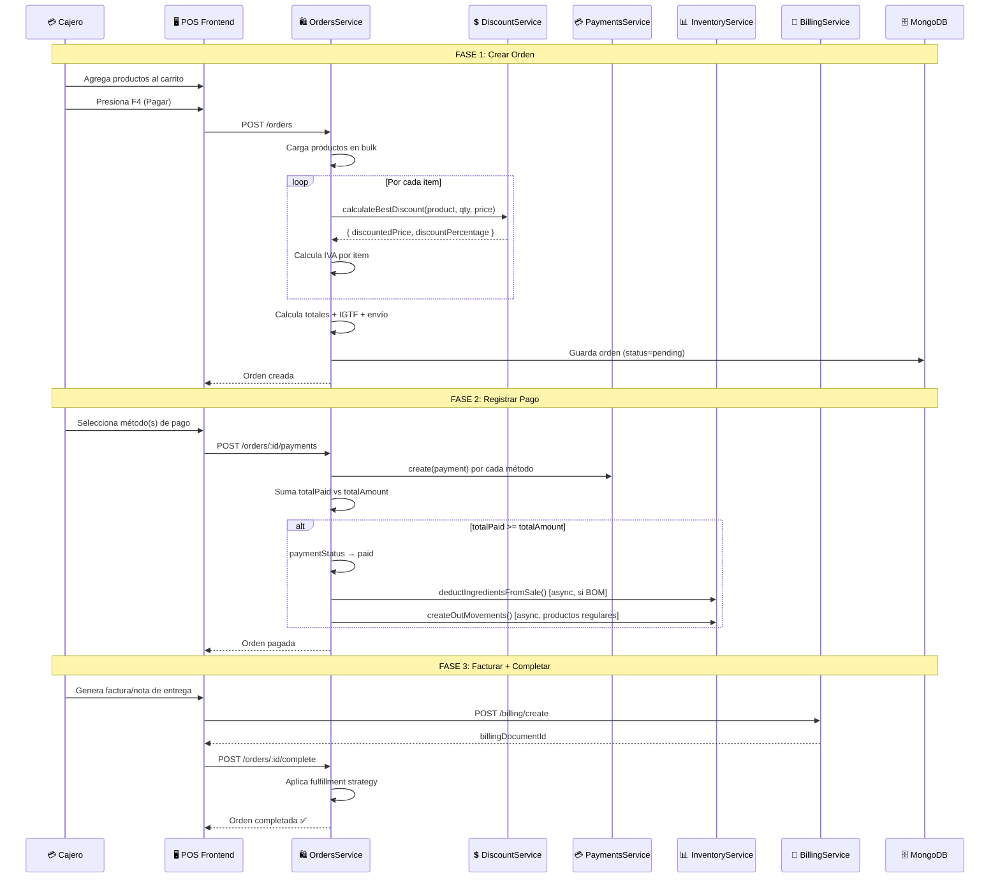
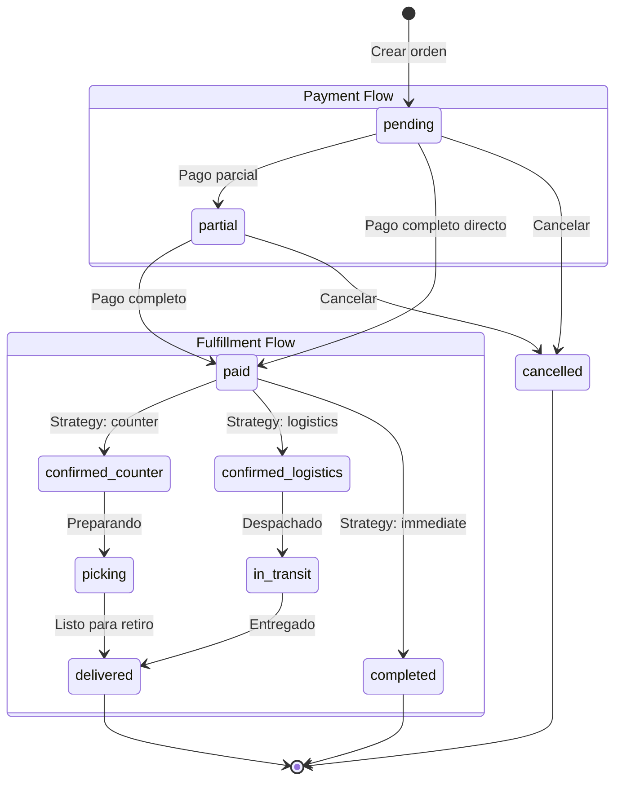
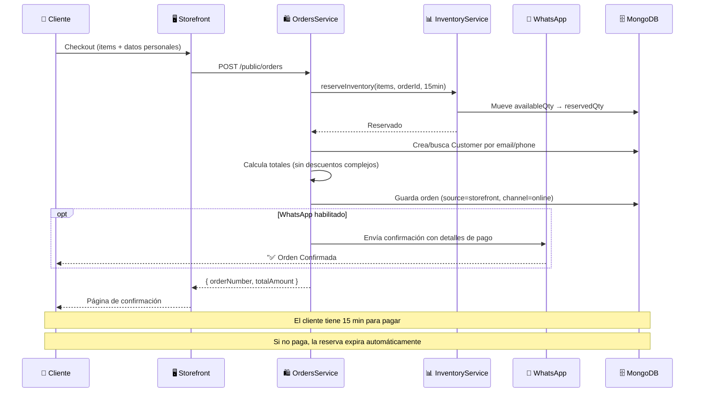
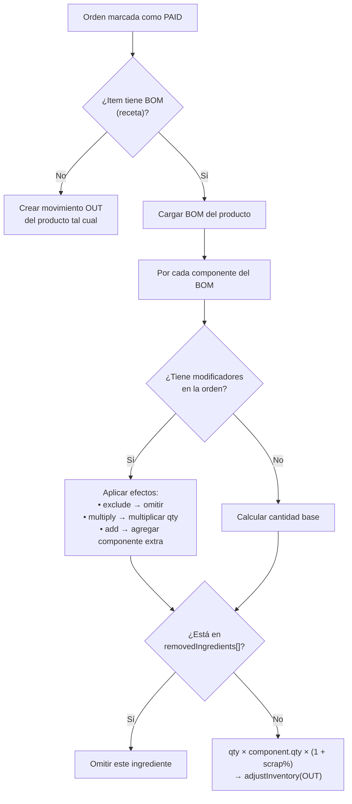
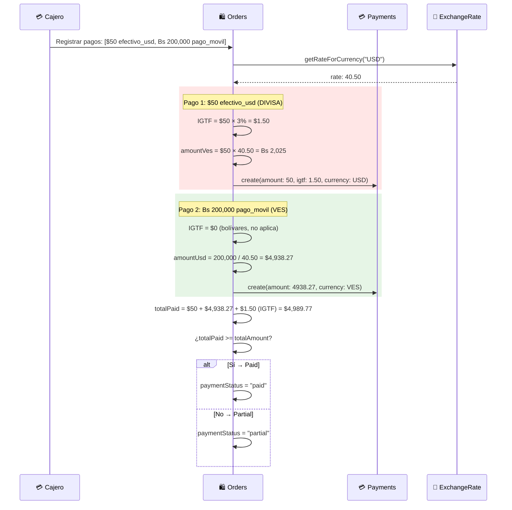
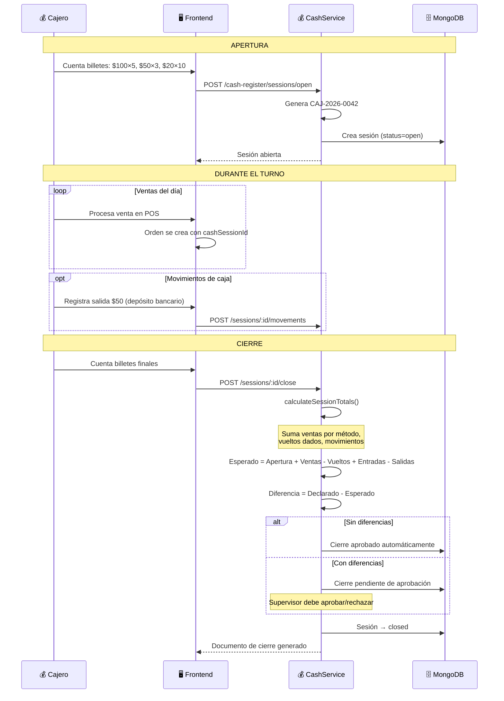
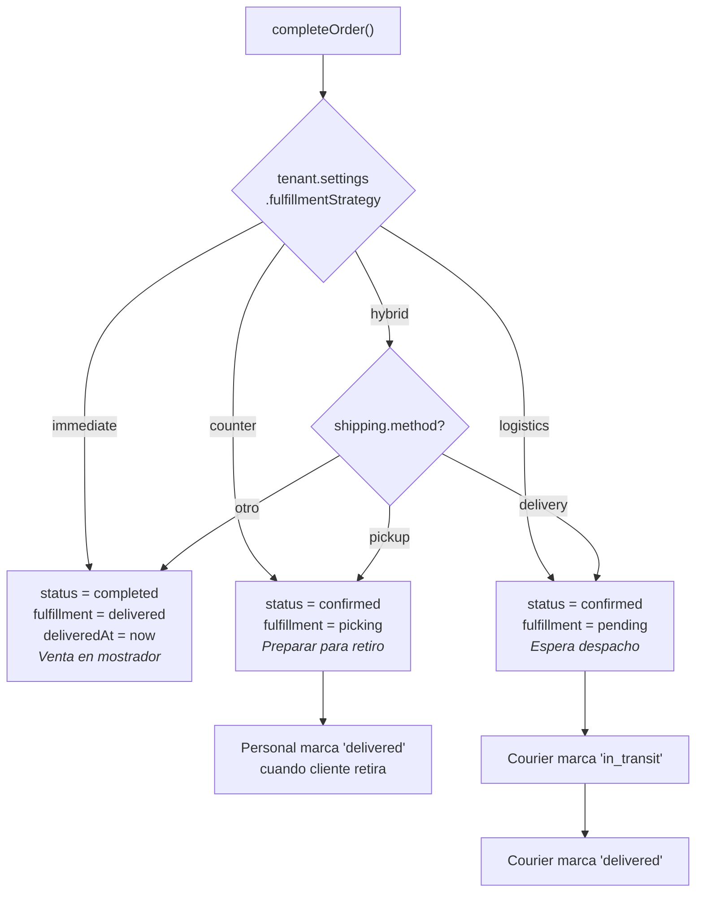

# Órdenes y Caja — Flujos de Operación

> Diagramas de los flujos principales.
> Última actualización: 2026-04-28

---

## Flujo 1: Venta Completa (POS → Pago → Factura → Inventario)

### Diagrama

---

## Flujo 2: Ciclo de Estados de una Orden

---

## Flujo 3: Pedido desde Storefront

---

## Flujo 4: Backflush de Ingredientes (Productos con BOM)

---

## Flujo 5: Multi-Pago con IGTF

---

## Flujo 6: Ciclo de Caja Registradora

---

## Flujo 7: Estrategias de Fulfillment

---

*Última actualización: 2026-04-28*
*Archivos fuente: `orders.service.ts`, `order-fulfillment.service.ts`, `order-inventory.service.ts`, `order-payments.service.ts`, `cash-register.service.ts`*
