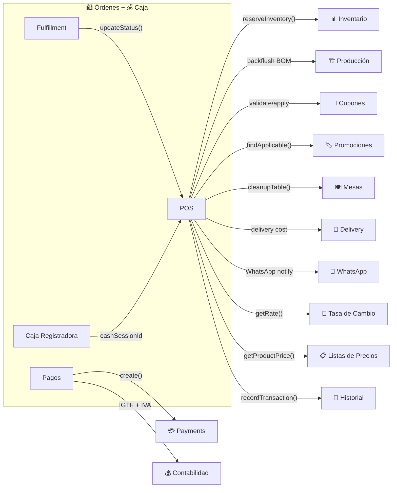

# Órdenes y Caja Registradora

## ¿Qué es?

El módulo de Órdenes es como la **caja y el sistema de pedidos de un negocio** — es donde se registra cada venta, desde que el cliente elige sus productos hasta que paga y recibe su mercancía. Incluye un POS (punto de venta) completo para ventas presenciales, recepción de pedidos del storefront online y WhatsApp, procesamiento de múltiples métodos de pago, generación de facturas, y seguimiento del despacho.

La Caja Registradora complementa al módulo de Órdenes como el **cuadre de caja** — controla cuánto dinero hay en cada caja, registra entradas y salidas de efectivo, y al final del turno genera un cierre con el detalle de cada denominación de billetes.

Es el módulo más complejo del sistema (7 sub-servicios, ~50 endpoints, 15 dependencias).

## ¿Para quién es?

- **Cajero**: Crea ventas en el POS, cobra, gestiona la caja registradora
- **Mesero**: Toma pedidos vinculados a mesas, envía a cocina
- **Administrador**: Aprueba cierres de caja, revisa reportes de ventas, gestiona el fulfillment
- **Repartidor**: Ve las órdenes asignadas para despacho
- **Cliente online**: Hace pedidos desde el storefront o WhatsApp
- **Sistema**: Calcula impuestos, descuentos, reserva inventario, notifica por WhatsApp

## ¿Qué problema resuelve?

- **Sin POS integrado**, habría que registrar ventas manualmente y luego actualizar inventario aparte
- **Sin multi-pago**, no podrías cobrar parte en efectivo y parte con tarjeta
- **Sin caja registradora**, no habría control de cuánto dinero hay en cada caja ni cuadre al final del turno
- **Sin fulfillment**, no podrías rastrear si un pedido fue empacado, enviado, o entregado
- **Sin facturación integrada**, habría que generar facturas en otro sistema
- **Sin descuentos automáticos**, habría que calcular manualmente descuentos por volumen y promociones

## Funcionalidades principales

### Órdenes / POS
- **Punto de Venta (POS)**: Interfaz optimizada para venta rápida con búsqueda de productos, escaneo de códigos de barras, y atajos de teclado (F2=buscar, F4=pagar, Esc=limpiar)
- **Tipos de orden**: En tienda (inmediato), retiro (pickup), delivery local, envío nacional
- **Multi-pago**: Acepta múltiples métodos de pago en la misma orden (efectivo + tarjeta + transferencia)
- **Multi-moneda**: USD y VES con tasa de cambio en tiempo real. Calcula IGTF (3%) automáticamente para pagos en divisas
- **Descuentos automáticos**: Descuentos por volumen, promociones activas, cupones — el sistema aplica el mejor descuento para el cliente
- **Listas de precios**: Precios diferenciados por cliente o por orden
- **Unidades de venta múltiples**: Vende en kg cuando el producto está inventariado en sacos
- **Modificadores**: Extras, opciones, ingredientes removidos (para restaurantes)
- **Propinas**: Porcentajes predefinidos (10%, 15%, 18%, 20%) o monto personalizado, asignadas a empleado
- **Retención de IVA**: Cálculo automático para contribuyentes especiales (75% o 100%)
- **Facturación**: Genera factura fiscal o nota de entrega directamente desde la orden
- **WhatsApp**: Envía confirmación de orden y actualizaciones de delivery por WhatsApp
- **Pedidos públicos**: Recibe órdenes del storefront con reserva de inventario (15 min)

### Caja Registradora
- **Apertura de caja**: Registra fondos iniciales con conteo de denominaciones (billetes/monedas) en USD y VES
- **Movimientos de caja**: Entradas y salidas de efectivo con razón documentada (cambio, gasto, depósito bancario)
- **Cierre de caja individual**: Declara montos finales, el sistema calcula diferencias (faltante/sobrante) automáticamente
- **Cierre global**: Consolida múltiples cajas en un solo reporte (para supervisores)
- **Flujo de aprobación**: Los cierres con diferencias quedan pendientes de aprobación del supervisor
- **Reportes**: Análisis de vueltos, flujo de denominaciones, resumen por período
- **Exportación**: PDF formato recibo (80mm) para impresora de tickets

### Fulfillment
- **Vista Kanban**: Panel con columnas por estado (Pendiente → Preparando → Empacado → En Tránsito → Entregado)
- **Filtros por tipo**: Delivery, Pickup, Envío Nacional, POS
- **Auto-refresh**: Se actualiza cada 30 segundos

## Cómo se conecta con otros módulos

## Ubicación en el sistema

### Órdenes
- **POS**: Operaciones → Órdenes → Nueva Orden (`/orders/new`)
- **Historial**: Operaciones → Órdenes → Historial (`/orders/history`)
- **Fulfillment**: Operaciones → Entregas (`/fulfillment`)
- **Permisos**: `orders_create`, `orders_read`, `orders_update`

### Caja Registradora
- **En el menú**: Finanzas → Cierre de Caja (`/cash-register`)
- **Permisos**: `cash_register_open`, `cash_register_read`, `cash_register_write`, `cash_register_close`, `cash_register_admin`, `cash_register_approve`, `cash_register_reports`, `cash_register_export`

---

*Última actualización: 2026-04-28*
*Archivos fuente: `food-inventory-saas/src/modules/orders/`, `food-inventory-saas/src/modules/cash-register/`, `food-inventory-admin/src/components/orders/v2/`*
