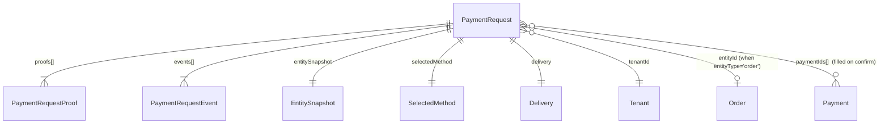

# Payment Requests — Modelo de Datos

> Estructura del schema `PaymentRequest` y los campos añadidos a `TenantPaymentConfig`.
> Última actualización: 2026-05-13

---

## Colección: `paymentrequests`

### Diagrama



---

## Documento principal

| Campo | Tipo | Requerido | Default | Descripción |
|---|---|---|---|---|
| `_id` | ObjectId | — | auto | — |
| `tenantId` | ObjectId | ✓ | — | Tenant dueño. **Toda query filtra por aquí.** |
| `entityType` | string enum | ✓ | — | `order` \| `appointment` \| `invoice`. PR1 implementa `order`. |
| `entityId` | ObjectId | ✓ | — | Id del documento referenciado |
| `entitySnapshot` | sub-doc | ✓ | — | Snapshot congelado en `create()` (ver más abajo) |
| `amountDue` | number | ✓ | — | Monto esperado, en `currency` |
| `currency` | enum | ✓ | — | `USD` \| `VES` |
| `exchangeRateSnapshot` | number | — | — | Tasa congelada en cross-currency |
| `selectedMethod` | sub-doc | ✓ | — | Método pre-elegido — copia del `TenantPaymentConfig.paymentMethods[]` |
| `allowMethodOverride` | boolean | ✓ | `false` | Si el cliente puede cambiar el método en el portal |
| `allowPartialPayments` | boolean | ✓ | `false` | Copia de `TenantPaymentConfig.allowPartialPayments` |
| `expiresAt` | Date | ✓ | now + N días | N = `TenantPaymentConfig.paymentRequestExpiryDays` (1-30) |
| `token` | string (JWT) | ✓ | — | Firmado con `JWT_SECRET`, claim `scope: 'payment_portal'`, unique index |
| `tokenIssuedAt` | Date | — | now | — |
| `delivery` | sub-doc | — | `{ channel: 'pending_manual' }` | Detalles del envío del enlace |
| `status` | enum | ✓ | `pending` | 9 estados — ver § Estados |
| `proofs` | sub-doc[] | — | `[]` | Cada comprobante subido |
| `events` | sub-doc[] | — | `[]` | Audit trail append-only |
| `paymentIds` | ObjectId[] | — | `[]` | `Payment` generados al confirmar |
| `isDeleted` | boolean | ✓ | `false` | Soft-delete (convención del proyecto) |
| `deletedAt` | Date | — | — | — |
| `createdBy` | ObjectId (User) | — | — | Quién lo creó (null cuando es el listener) |
| `createdAt`, `updatedAt` | Date | — | auto | timestamps |

### Estados (state machine)

```
pending ──(customer submits)──► submitted
   │                                │
   │                                ▼  (tenant reviews)
   ▼                       ┌────────┼────────────────────┐
expired (cron)             ▼        ▼                    ▼
                       confirmed   info_mismatch   awaiting_settlement
                       (paymentIds proof_unclear         │
                       generated)  partial              (auto-recheck en Phase 2)
                                   │                     │
                                   │ (customer fixes)    ▼
                                   └─► submitted     confirmed | rejected_final

                       rejected_final = terminal (fraude / devolución)
```

Transiciones legales por actor:

| From | → To | Actor |
|---|---|---|
| `pending` | `submitted` | customer |
| `pending` | `expired` | system (cron) |
| `submitted` | `confirmed` \| `info_mismatch` \| `proof_unclear` \| `partial` \| `awaiting_settlement` \| `rejected_final` | tenant |
| `info_mismatch` \| `proof_unclear` \| `partial` | `submitted` | customer |
| `awaiting_settlement` | `confirmed` \| `rejected_final` | tenant |

Toda transición ilegal lanza `ConflictException (409)`. La fuente de verdad está en `payment-requests.service.ts → isLegalTransition()`.

### Sub-doc `entitySnapshot`

```ts
{
  items: [{ name?, qty, unitPrice, total }],
  subtotal: number,
  tax: number,
  total: number,
  customerName?: string,
  customerPhone?: string,
  createdAt?: Date,
}
```

Para `Order`: `name = OrderItem.productName`, `qty = OrderItem.quantity`, `unitPrice = OrderItem.unitPrice`, `total = OrderItem.totalPrice`, `tax = order.ivaTotal`.

### Sub-doc `selectedMethod`

Copia verbatim del método activo de `TenantPaymentConfig` al momento de crear el PR. Sobrevive si el tenant edita o desactiva el método después.

```ts
{
  type: "transfer" | "pago_movil" | "zelle" | "cash" | "card",
  accountDetails: { ...el shape de TenantPaymentConfig.paymentMethods[].accountDetails },
  label: string,           // "Banesco - Cuenta corriente"
  methodId?: string,       // "transferencia_usd" — clave del config original
}
```

### Sub-doc `delivery`

```ts
{
  channel: "whatsapp" | "manual" | "pending_manual",
  deliveredTo?: string,         // teléfono normalizado, ej "584121234567"
  deliveredAt?: Date,
  deliveryAttempts: number,     // ≥ 1 en cada intento de envío
  lastError?: string,           // p.ej. "phone_invalid: 0412..."
}
```

- `whatsapp` → enlace enviado con éxito vía Whapi
- `manual` → el tenant pidió no enviar por WhatsApp (copia el link)
- `pending_manual` → fallback automático cuando no había teléfono válido o Whapi falló

### Sub-doc `proofs[]` (un elemento por comprobante)

| Campo | Tipo | Notas |
|---|---|---|
| `_id` | ObjectId | Pre-minteado por el service para que el storage tenga un path determinístico |
| `submittedAt` | Date | — |
| `amount` | number | En `currency` |
| `currency` | enum | `USD` \| `VES` |
| `method` | enum | `transfer` \| `pago_movil` \| `zelle` \| `cash` \| `card` |
| `originBank`, `payerIdNumber`, `payerPhone`, `referenceNumber` | string | Datos sanitizados (`SanitizeString`) |
| `imageUrl` | string | URL relativa servida estática, `/uploads/payment-proofs/...` |
| `imageHash` | string | SHA-256 hex del webp optimizado (PR1). En follow-up: perceptual hash. |
| `ocrExtracted?` | sub-doc | Stub para Phase 2 (`amount?, reference?, date?, confidence`) |
| `reviewStatus` | enum | `pending` \| `accepted` \| `rejected` |
| `reviewedAt`, `reviewedBy`, `reviewNote` | — | Cuando el tenant revisa |

### Sub-doc `events[]` (audit trail — nunca se borra)

```ts
{
  at: Date,
  actor: "customer" | "tenant" | "system",
  actorId?: ObjectId,             // user id cuando actor='tenant'
  type: string,                   // "created", "proof.submitted", "proof.accepted", "proof.rejected",
                                  // "confirmed", "awaiting_settlement", "expired",
                                  // "delivery.sent", "delivery.failed", "delivery.skipped", "delivery.retried"
  payload: Record<string, any>,
}
```

### Índices

```js
{ tenantId: 1, status: 1, createdAt: -1 }    // listas filtradas en el admin
{ token: 1 }                                  // unique — verify del portal
{ tenantId: 1, entityType: 1, entityId: 1 }  // "¿esta orden ya tiene PR?"
{ tenantId: 1, "proofs.imageHash": 1 }       // detección de duplicados (phase 2)
{ expiresAt: 1 }                              // consumido por el cron diario
```

---

## Campos añadidos a `TenantPaymentConfig`

Migración: `POST /api/v1/migrations/extend-tenant-payment-config-for-payment-requests`

| Campo | Tipo | Default | Rango | Uso |
|---|---|---|---|---|
| `requirePaymentProof` | boolean | `false` | — | Activa el listener `order.created` para auto-emitir PR en órdenes del storefront |
| `allowPartialPayments` | boolean | `false` | — | Si el portal permite "abono" — copiado al PR al crearlo |
| `paymentRequestExpiryDays` | number | `7` | 1-30 | Determina `PaymentRequest.expiresAt = now + N días` y el `exp` del JWT |

---

## Catálogo de permisos

Migración: `POST /api/v1/migrations/seed-payment-requests-review-permission`

| Permiso | Otorgado por defecto a |
|---|---|
| `payment_requests_review` | `admin` (vía `getAllPermissionIds`), `employee` (cashier-equivalent del taxonomía actual) |

Los tenants pueden otorgarlo a roles personalizados con la UI existente de roles.

---

## Tipos de notificación (extensión)

`NOTIFICATION_TYPES` en `src/schemas/notification.schema.ts`:

```ts
PAYMENT_REQUEST_SUBMITTED:        "payment-request.submitted"
PAYMENT_REQUEST_CONFIRMED:        "payment-request.confirmed"
PAYMENT_REQUEST_STATUS_CHANGED:   "payment-request.status-changed"
```

Todas se emiten bajo `category: 'finance'` por el socket `notification` ya existente del `notification-center` — el admin filtra por `type` en cliente.
