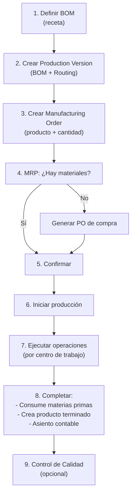

# Producción y Manufactura (Módulos Agrupados)

## ¿Qué es?

El grupo de módulos de Producción incluye todo lo necesario para fabricar productos a partir de materias primas: listas de materiales (BOM/recetas), órdenes de manufactura con ciclo completo, planificación de materiales (MRP), centros de trabajo con costeo, rutas de producción, versiones de producción, control de calidad, y gestión de mermas.

## Módulos Incluidos (7)

| Módulo | Endpoints | Función Principal |
|---|---|---|
| **Bill of Materials (BOM)** | 9 | Recetas/listas de componentes con explosión multinivel |
| **Manufacturing Orders** | 20+ | Órdenes de producción: draft→confirmed→in_progress→completed, consume materiales y produce terminados |
| **MRP** | 4 | Cálculo de requerimientos de materiales, detección de faltantes, sugerencias de compra |
| **Work Centers** | 5 | Máquinas/estaciones con costo/hora, capacidad, eficiencia |
| **Routing** | 5 | Secuencias de operaciones con tiempos estándar |
| **Production Versions** | 6 | Vincula Producto → BOM → Routing como versiones (v1, v2) |
| **Quality Control** | 10+ | Planes QC, inspecciones por checkpoint, no-conformidades, certificados |
| **Waste** | 6 | Registro de mermas con costo, integración inventario+contabilidad, prevención IA |

## Ciclo Completo de Producción

## Integración con Inventario
- **Al completar**: Descuenta materias primas, crea producto terminado con costo calculado
- **Costo**: `(materialCost + laborCost + overheadCost) / quantityProduced`
- **Asiento contable**: DR Inventario Terminado, CR Materias Primas, CR Mano de Obra

## Dashboards
- **Eficiencia (OEE)**: Disponibilidad × Rendimiento × Calidad
- **Costos**: Planeado vs. Real (varianzas)
- **Utilización**: % de uso de cada centro de trabajo
- **Tendencias**: Desviaciones de tiempo y costo por producto

## Permisos
- `inventory_read` — Para producción (comparte con inventario)

## Feature Flags / Verticales
- Módulo `production` debe estar habilitado
- Vertical `MANUFACTURING` o `FOOD_SERVICE` habilita el acceso

---

*Última actualización: 2026-04-28*
*Archivos: `modules/production/` (6 sub-módulos), `modules/waste/`*
