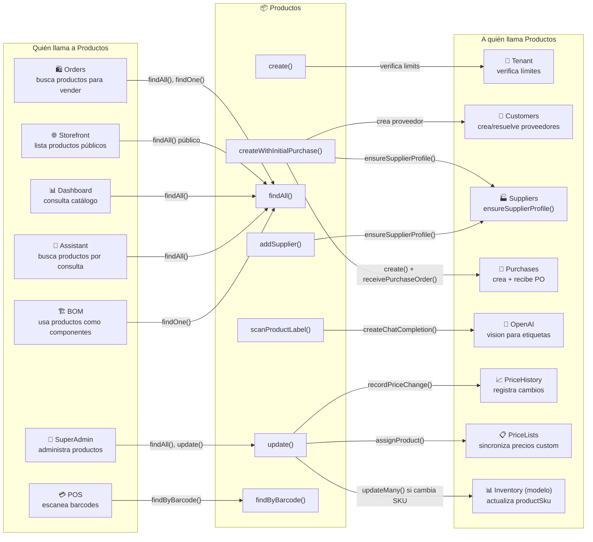

# Productos — Mapa de Conexiones

> Cómo el módulo de Productos se conecta con el resto del sistema.
> Última actualización: 2026-04-28

---

## Diagrama de Conexiones

---

## Conexiones de Entrada (quién me llama)

| Módulo origen | Cómo llama | Función local | Contexto |
|---|---|---|---|
| **Orders** | `@Inject(ProductsService)` vía forwardRef | `findAll()`, `findOne()` | Busca productos al crear una orden, valida que el producto existe |
| **POS (Frontend)** | `GET /products/lookup/barcode/:barcode` | `findByBarcode()` | Escanea código de barras para agregar producto a la orden |
| **Storefront** | `GET /public/products` | `findAll()` (con filtros públicos) | Lista productos con stock en la tienda online |
| **Dashboard** | `@Inject(ProductsService)` | `findAll()` | Muestra métricas de catálogo |
| **Assistant** | `@Inject(ProductsService)` vía forwardRef | `findAll()`, `findOne()` | Responde preguntas sobre productos del catálogo |
| **BOM (Producción)** | `@Inject(ProductsService)` | `findOne()` | Consulta productos que son componentes de una lista de materiales |
| **SuperAdmin** | `@Inject(ProductsService)` | Múltiples | Administración global de productos |
| **Purchases** | `@Inject(ProductsService)` vía forwardRef | `findOne()` | Valida productos al crear órdenes de compra |
| **Inventory** | `@Inject(ProductsService)` vía forwardRef | `findOne()` | Valida que el producto existe al crear inventario |

---

## Conexiones de Salida (a quién llamo)

| Función local | Módulo destino | Función destino | Contexto |
|---|---|---|---|
| `create()` | **Tenant (modelo)** | `findById()`, `updateOne()` | Verifica límites del plan y actualiza usage (products + storage) |
| `createWithInitialPurchase()` | **CustomersService** | `findOne()`, `create()` | Resuelve o crea el proveedor como Customer |
| `createWithInitialPurchase()` | **SuppliersService** | `ensureSupplierProfile()` | Asegura que el Customer tenga perfil de Supplier |
| `createWithInitialPurchase()` | **PurchasesService** | `create()`, `receivePurchaseOrder()` | Crea la orden de compra y la recibe automáticamente |
| `addSupplier()` | **SuppliersService** | `ensureSupplierProfile()` | Resuelve el proveedor al vincularlo |
| `update()` | **PriceHistoryService** | `recordPriceChange()` | Registra cada cambio de precio para auditoría |
| `update()` | **PriceListsService** | `assignProduct()` | Sincroniza precios custom a listas de precios |
| `update()` | **Inventory (modelo)** | `updateMany()` | Si cambia el SKU, actualiza `productSku` en inventarios |
| `update()` | **InventoryMovement (modelo)** | `updateMany()` | Si cambia el SKU, actualiza `productSku` en movimientos |
| `scanProductLabel()` | **OpenaiService** | `createChatCompletion()` | Usa GPT-4o-mini para extraer datos de fotos de etiquetas |

---

## Datos Compartidos

| Entidad | Cómo se comparte | Módulos que la usan |
|---|---|---|
| `productId` (ObjectId) | Referencia directa | Orders, Inventory, InventoryMovements, Purchases, BOM, Promotions, Coupons, TransferOrders, KitchenOrders, MarketingCampaigns, CustomerAffinity |
| `variants[].sku` | String denormalizado | Inventory (`productSku`), InventoryMovement (`productSku`), PurchaseOrder items |
| `variants[].barcode` | Lookup directo | POS (búsqueda rápida) |
| `suppliers[].supplierId` | Referencia a Customer | Suppliers, Purchases |
| `category` | Filtro/agrupación | Analytics, Storefront, Dashboard, Marketing |

---

## Dependencias Circulares (forwardRef)

| Par | Razón |
|---|---|
| Products ↔ **Auth** | Todos los módulos necesitan auth |
| Products ↔ **Inventory** | Productos consultan stock, inventario necesita datos de producto |
| Products ↔ **Purchases** | Productos crean compras, compras referencian productos |
| Products ↔ **Customers** | Productos vinculan proveedores (que son Customers) |
| Products ↔ **Suppliers** | Productos llaman ensureSupplierProfile() |
| Products ↔ **OpenAI** | Productos usan IA para escaneo de etiquetas |

---

*Última actualización: 2026-04-28*
*Archivo fuente: `products.module.ts`*
