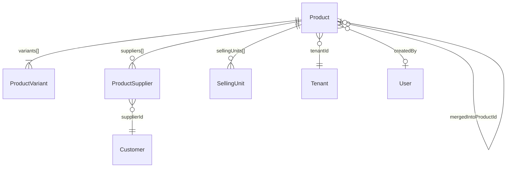

# Productos — Modelo de Datos

> Estructura completa del schema `Product` en MongoDB.
> Última actualización: 2026-04-28

---

## Colección: `products`

### Diagrama de Entidad

---

## Campos del Documento Principal

### Identificación

| Campo | Tipo | Requerido | Default | Descripción |
|---|---|---|---|---|
| `_id` | ObjectId | Auto | — | ID único del producto |
| `sku` | String | Sí | — | Código único del producto. Índice compuesto con `tenantId`. Auto-generado si no se proporciona (patrón: `{PREFIX}-{NNNN}`, ej: "TIE-0042") |
| `name` | String | Sí | — | Nombre del producto |
| `productType` | Enum | No | `"simple"` | Tipo: `simple`, `consumable`, `supply`, `raw_material` |
| `typeConfigId` | ObjectId | No | — | Referencia a ProductConsumableConfig o ProductSupplyConfig |
| `tenantId` | ObjectId | Sí | — | Tenant al que pertenece. **Índice en múltiples combinaciones** |
| `isActive` | Boolean | No | `true` | Soft-delete flag |

### Información Básica

| Campo | Tipo | Requerido | Default | Descripción |
|---|---|---|---|---|
| `brand` | String | Sí | — | Marca del producto |
| `category` | String[] | Sí | — | Categorías (array). Primer elemento = categoría principal |
| `subcategory` | String[] | Sí | — | Subcategorías |
| `origin` | String | No | — | País/lugar de origen |
| `description` | String | No | — | Descripción del producto |
| `ingredients` | String | No | — | Lista de ingredientes (para alimentos) |
| `tags` | String[] | No | — | Etiquetas para búsqueda |
| `attributes` | Mixed | No | `{}` | Atributos personalizados key-value |
| `taxCategory` | String | Sí | — | Categoría fiscal |

### Unidades de Medida

| Campo | Tipo | Requerido | Default | Descripción |
|---|---|---|---|---|
| `unitOfMeasure` | String | No | `"unidad"` | Unidad base de inventario (kg, litro, unidad, saco, etc.) |
| `isSoldByWeight` | Boolean | No | `false` | Si se vende por peso (activa báscula en POS) |
| `hasMultipleSellingUnits` | Boolean | No | `false` | Si tiene múltiples unidades de venta |
| `sellingUnits` | SellingUnit[] | No | `[]` | Configuración de unidades de venta adicionales |

### Información Perecedera (Alimentos)

| Campo | Tipo | Requerido | Default | Descripción |
|---|---|---|---|---|
| `isPerishable` | Boolean | Sí | — | Si es perecedero |
| `shelfLifeDays` | Number | No | — | Vida útil en la unidad indicada |
| `shelfLifeUnit` | Enum | No | `"days"` | Unidad: `days`, `months`, `years` |
| `storageTemperature` | Enum | No | — | `ambiente`, `refrigerado`, `congelado` |
| `storageHumidity` | Enum | No | — | `baja`, `media`, `alta` |
| `allergens` | String[] | No | — | Lista de alérgenos |
| `nutritionalInfo` | Object | No | — | `{ calories, protein, carbs, fat, fiber, sodium }` |

### Fiscal

| Campo | Tipo | Requerido | Default | Descripción |
|---|---|---|---|---|
| `ivaApplicable` | Boolean | No | `true` | Si aplica IVA |
| `ivaRate` | Number | No | `0` | Tasa IVA: `0`, `8`, o `16` (%) |
| `igtfExempt` | Boolean | No | `false` | Si está exento de IGTF |

### Configuración de Precios

| Campo | Tipo | Requerido | Default | Descripción |
|---|---|---|---|---|
| `pricingRules` | Object | Sí | — | Reglas de precios globales del producto |
| `.cashDiscount` | Number | — | — | Descuento por pago en efectivo (%) |
| `.cardSurcharge` | Number | — | — | Recargo por tarjeta (%) |
| `.usdPrice` | Number | — | — | Precio fijo en USD (opcional) |
| `.minimumMargin` | Number | — | — | Margen mínimo permitido (%) |
| `.maximumDiscount` | Number | — | — | Descuento máximo permitido (%) |
| `.bulkDiscountEnabled` | Boolean | — | — | Descuentos por volumen habilitados |
| `.bulkDiscountRules` | Array | — | — | Reglas de descuento por volumen |
| `.wholesaleEnabled` | Boolean | — | — | Precios mayoristas habilitados |
| `.wholesaleMinQuantity` | Number | — | — | Cantidad mínima para precio mayorista |

### Configuración de Inventario

| Campo | Tipo | Requerido | Default | Descripción |
|---|---|---|---|---|
| `inventoryConfig` | Object | Sí | — | Configuración de control de stock |
| `.trackLots` | Boolean | — | — | Rastrear lotes |
| `.trackExpiration` | Boolean | — | — | Rastrear vencimiento |
| `.minimumStock` | Number | — | — | Stock mínimo para alerta |
| `.maximumStock` | Number | — | — | Stock máximo |
| `.reorderPoint` | Number | — | — | Punto de reorden (dispara alerta) |
| `.reorderQuantity` | Number | — | — | Cantidad sugerida de reorden |
| `.fefoEnabled` | Boolean | — | — | FEFO: First-Expired-First-Out |

### Promoción

| Campo | Tipo | Requerido | Default | Descripción |
|---|---|---|---|---|
| `hasActivePromotion` | Boolean | No | `false` | Si tiene promoción activa |
| `promotion` | Object | No | — | Datos de la promoción |
| `.discountPercentage` | Number | — | — | Porcentaje de descuento |
| `.reason` | String | — | — | Razón de la promoción |
| `.startDate` | Date | — | — | Inicio |
| `.endDate` | Date | — | — | Fin |
| `.isActive` | Boolean | — | — | Si está activa |
| `.autoDeactivate` | Boolean | — | — | Se desactiva automáticamente al vencer |

### Restaurante

| Campo | Tipo | Requerido | Default | Descripción |
|---|---|---|---|---|
| `sendToKitchen` | Boolean | No | `true` | Si se envía a la pantalla de cocina (KDS) al incluir en una orden |

### Auditoría y Tracking

| Campo | Tipo | Requerido | Default | Descripción |
|---|---|---|---|---|
| `createdBy` | ObjectId | No | — | Usuario que creó el producto → User |
| `updatedBy` | ObjectId | No | — | Último usuario que actualizó → User |
| `importJobId` | ObjectId | No | — | Job de importación masiva |
| `importedAt` | Date | No | — | Fecha de importación |
| `mergedIntoProductId` | ObjectId | No | — | Si fue fusionado, a qué producto → Product |
| `mergedAt` | Date | No | — | Fecha de fusión |
| `mergeJobId` | ObjectId | No | — | Job de fusión/deduplicación |
| `createdAt` | Date | Auto | — | Timestamp de creación (Mongoose) |
| `updatedAt` | Date | Auto | — | Timestamp de última actualización (Mongoose) |

---

## Sub-documento: ProductVariant

Cada producto tiene **al menos 1 variante**. La primera variante es la "principal".

| Campo | Tipo | Requerido | Default | Descripción |
|---|---|---|---|---|
| `_id` | ObjectId | Auto | — | ID de la variante |
| `name` | String | Sí | — | Nombre (ej: "500g", "1kg", "Principal") |
| `sku` | String | Sí | — | SKU de la variante. Variante 0 = SKU del producto, demás = `{SKU}-VAR{N}` |
| `barcode` | String | No | — | Código de barras. **Único por tenant** (índice parcial) |
| `unit` | String | Sí | — | Unidad (kg, L, und, etc.) |
| `unitSize` | Number | Sí | — | Tamaño en esa unidad (ej: 0.5 para 500g) |
| `basePrice` | Number | Sí | — | Precio de venta |
| `costPrice` | Number | Sí | — | Precio de costo |
| `wholesalePrice` | Number | No | — | Precio mayorista |
| `isActive` | Boolean | No | `true` | Activa/Inactiva |
| `description` | String | No | — | Descripción específica de la variante |
| `images` | String[] | No | — | Imágenes en base64 |
| `dimensions` | Object | No | — | `{ length, width, height, weight }` |
| `attributes` | Mixed | No | `{}` | Atributos personalizados de la variante |
| `pricingStrategy` | Object | No | — | Estrategia de precio |
| `.mode` | Enum | — | — | `manual`, `markup`, `margin` |
| `.markupPercentage` | Number | — | — | % de markup sobre costo |
| `.marginPercentage` | Number | — | — | % de margen deseado |
| `.autoCalculate` | Boolean | — | — | Si calcula precio automáticamente |
| `.lastManualPrice` | Number | — | — | Último precio manual establecido |
| `.psychologicalRounding` | Enum | — | — | `none`, `0.99`, `0.95`, `0.90`, `round_up`, `round_down` |
| `locationPricing` | Array | No | `[]` | Precios por ubicación |
| `[].locationId` | String | — | — | ID de la sede/local |
| `[].customPrice` | Number | — | — | Precio especial para esa sede |
| `[].isActive` | Boolean | — | — | Si el precio está activo |
| `[].notes` | String | — | — | Notas |
| `volumeDiscounts` | Array | No | `[]` | Descuentos por volumen |
| `[].minQuantity` | Number | — | — | Cantidad mínima |
| `[].discountPercentage` | Number | — | — | % de descuento |
| `[].fixedPrice` | Number | — | — | Precio fijo (alternativa a %) |

---

## Sub-documento: ProductSupplier

| Campo | Tipo | Requerido | Default | Descripción |
|---|---|---|---|---|
| `supplierId` | ObjectId | Sí | — | → Customer (con customerType=supplier) |
| `supplierName` | String | Sí | — | Nombre desnormalizado del proveedor |
| `supplierSku` | String | Sí | — | SKU del proveedor para este producto |
| `costPrice` | Number | Sí | — | Costo del proveedor |
| `leadTimeDays` | Number | Sí | — | Tiempo de entrega en días |
| `minimumOrderQuantity` | Number | Sí | — | Cantidad mínima de pedido (MOQ) |
| `isPreferred` | Boolean | No | `true` | Si es el proveedor preferido |
| `lastUpdated` | Date | No | `now()` | Última actualización |
| `paymentCurrency` | String | No | `"USD"` | Moneda de pago |
| `preferredPaymentMethod` | String | No | — | Método preferido: zelle, efectivo_usd, transferencia_ves, etc. |
| `acceptedPaymentMethods` | String[] | No | `[]` | Métodos aceptados |
| `usesParallelRate` | Boolean | No | `false` | Si usa tasa paralela |
| `paymentConfigSyncedAt` | Date | No | — | Última sincronización desde perfil del proveedor |

---

## Sub-documento: SellingUnit

| Campo | Tipo | Requerido | Default | Descripción |
|---|---|---|---|---|
| `name` | String | Sí | — | Nombre de la unidad (ej: "Kilogramos") |
| `abbreviation` | String | Sí | — | Abreviatura (ej: "kg") |
| `conversionFactor` | Number | Sí | — | Factor de conversión a unidad base. Ej: 1 saco = 25 kg → factor = 0.04 |
| `pricePerUnit` | Number | Sí | — | Precio de venta por esta unidad |
| `costPerUnit` | Number | Sí | — | Costo por esta unidad |
| `isActive` | Boolean | No | `true` | Si está activa |
| `isDefault` | Boolean | No | `false` | Si es la unidad de venta por defecto |
| `minimumQuantity` | Number | No | — | Cantidad mínima de venta (ej: 100g mínimo) |
| `incrementStep` | Number | No | — | Incremento permitido (ej: de 100g en 100g) |
| `isSoldByWeight` | Boolean | No | `false` | Si esta unidad se vende por peso |

---

## Índices

| # | Campos | Tipo | Propósito |
|---|---|---|---|
| 1 | `{ sku, tenantId }` | Unique | SKU único por tenant |
| 2 | `{ name, description, tags }` | Text | Búsqueda full-text |
| 3 | `{ brand, tenantId }` | Normal | Filtro por marca |
| 4 | `{ isActive, tenantId }` | Normal | Filtro por estado |
| 5 | `{ "variants.sku", tenantId }` | Normal | Búsqueda por SKU de variante |
| 6 | `{ "variants.barcode", tenantId }` | Unique (parcial) | Barcode único por tenant (solo no-vacíos) |
| 7 | `{ isPerishable, tenantId }` | Normal | Filtro de perecederos |
| 8 | `{ createdAt: -1, tenantId }` | Normal | Ordenar por recientes |
| 9 | `{ tenantId, category }` | Normal | Filtro por categoría |
| 10 | `{ tenantId, isActive, createdAt: -1 }` | Compuesto | Productos activos recientes |
| 11 | `{ tenantId, subcategory }` | Normal | Filtro por subcategoría |
| 12 | `{ tenantId, productType }` | Normal | Filtro por tipo |
| 13-16 | `{ "suppliers.*", tenantId }` | Normal | Filtros de proveedor (paymentCurrency, usesParallelRate, preferredPaymentMethod, supplierId) |
| 17 | `{ mergedIntoProductId, tenantId }` | Normal | Tracking de productos fusionados |

---

## ⚠️ Gotchas

1. **`suppliers[].supplierId`** puede estar guardado como String o como ObjectId dependiendo de cuándo se creó. El backend hace query con ambos tipos: `$in: [supplierId, new ObjectId(supplierId)]`
2. **La variante principal** (índice 0) usa el SKU del producto. Las demás usan `{SKU}-VAR{N}`. Si el frontend envía SKU vacío, el backend genera `-VAR1` (bug histórico ya corregido)
3. **Imágenes en base64** — Las imágenes se almacenan como strings base64 directamente en el documento. El tamaño se trackea en `tenant.usage.currentStorage`
4. **`category` y `subcategory` son arrays**, pero la UI trata el primer elemento como "la categoría principal"
5. **Soft delete inconsistente**: Este módulo usa `isActive: false` para soft delete, pero el método `remove()` en realidad hace **hard delete** y decrementa el usage del tenant

---

*Última actualización: 2026-04-28*
*Archivo fuente: `food-inventory-saas/src/modules/products/schemas/product.schema.ts`*
