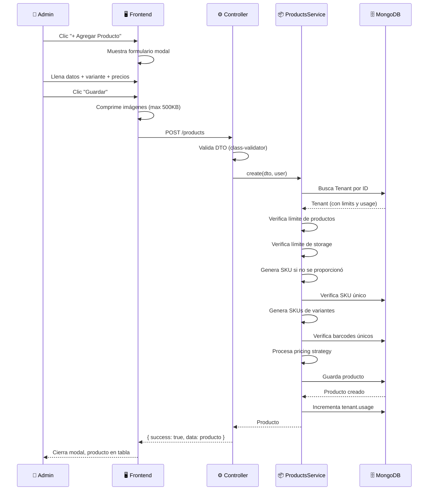
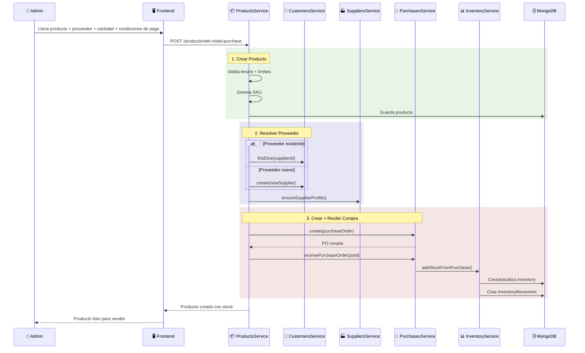
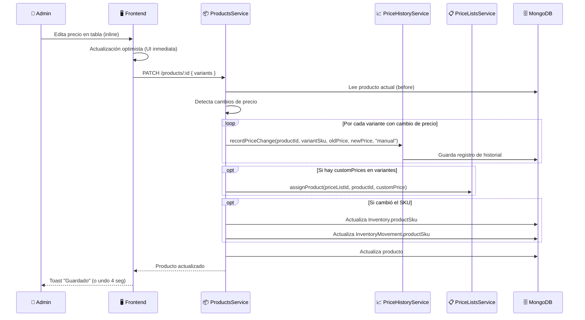
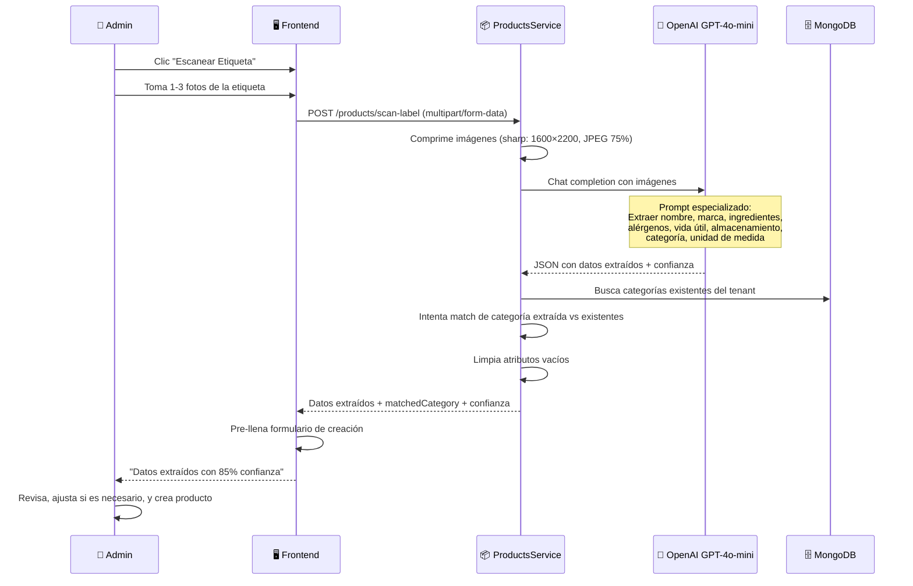
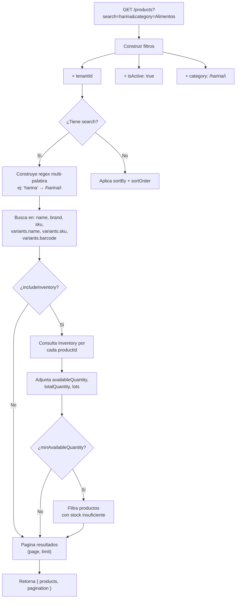
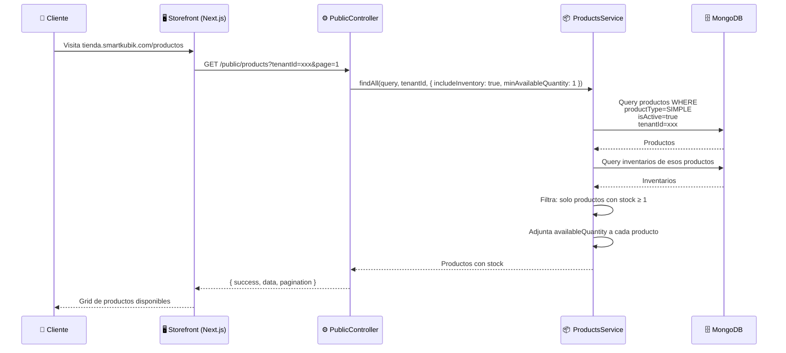

# Productos — Flujos de Operación

> Diagramas de secuencia para los flujos principales del módulo de Productos.
> Última actualización: 2026-04-28

---

## Flujo 1: Crear Producto Simple

### Descripción
El flujo más básico: un administrador crea un nuevo producto en el catálogo con al menos una variante.

### Diagrama

### Desglose paso a paso

| Paso | Quién | Qué pasa | Archivo fuente |
|---|---|---|---|
| 1 | Usuario | Abre formulario de creación | ProductsManagement.jsx |
| 2 | Frontend | Comprime imágenes con sharp | ProductsManagement.jsx |
| 3 | Frontend | Envía POST /products | api.js |
| 4 | Controller | Valida DTO y permisos | products.controller.ts |
| 5 | Servicio | Busca tenant, verifica límites | products.service.ts → create() |
| 6 | Servicio | Genera SKU: `{PREFIX}-{NNNN}` | products.service.ts → generateSku() |
| 7 | Servicio | Verifica unicidad de SKU y barcodes | products.service.ts |
| 8 | Servicio | Calcula precios (markup/margin) | products.service.ts → processVariantPricing() |
| 9 | Servicio | Guarda en BD + incrementa usage | products.service.ts |

### Qué puede salir mal
- **Límite de productos excedido**: El plan del tenant no permite más productos → Error 400
- **SKU duplicado**: Otro producto ya tiene ese SKU → Se regenera automáticamente si fue auto-generado
- **Barcode duplicado**: Otro producto en el mismo tenant tiene ese barcode → Error 400
- **Storage excedido**: Las imágenes exceden el límite de almacenamiento del plan → Error 400

---

## Flujo 2: Crear Producto con Compra Inicial (Todo-en-Uno)

### Descripción
El flujo más completo: crea producto, vincula proveedor, genera orden de compra, y recibe la mercancía — todo de un solo formulario.

### Diagrama

### Desglose paso a paso

| Paso | Quién | Qué pasa |
|---|---|---|
| 1 | ProductsService | Valida tenant, genera SKU, guarda producto |
| 2 | ProductsService | Resuelve o crea proveedor (Customer + Supplier profile) |
| 3 | ProductsService | Vincula proveedor al producto (suppliers[]) |
| 4 | PurchasesService | Crea orden de compra con el producto y cantidades |
| 5 | PurchasesService | Recibe la orden automáticamente (status → received) |
| 6 | InventoryService | Crea registro de inventario con stock y warehouseId |
| 7 | InventoryService | Crea movimiento de inventario tipo "purchase" |

### Qué puede salir mal
- **Proveedor nuevo sin datos completos**: Si se elige "nuevo proveedor" pero falta nombre o RIF → Error 400
- **Fallo en recepción**: Si la recepción de la compra falla, el producto queda creado pero sin stock

---

## Flujo 3: Actualizar Precios (con Cascada)

### Descripción
Cuando se actualiza el precio de un producto, el cambio se propaga a historial de precios y listas de precios. Si cambia el SKU, se propaga a inventario y movimientos.

### Diagrama

---

## Flujo 4: Escaneo de Etiqueta con IA

### Descripción
El usuario toma fotos de la etiqueta de un producto y la IA extrae la información automáticamente.

### Diagrama

---

## Flujo 5: Búsqueda de Productos (con Stock)

### Descripción
La búsqueda de productos puede incluir opcionalmente información de stock, útil para el POS y el storefront.

### Diagrama

---

## Flujo 6: Producto en Storefront Público

### Descripción
El storefront solo muestra productos tipo "simple" que tengan stock disponible.

### Diagrama

---

*Última actualización: 2026-04-28*
*Archivos fuente: `products.controller.ts`, `products-public.controller.ts`, `products.service.ts`, `ProductsManagement.jsx`*
