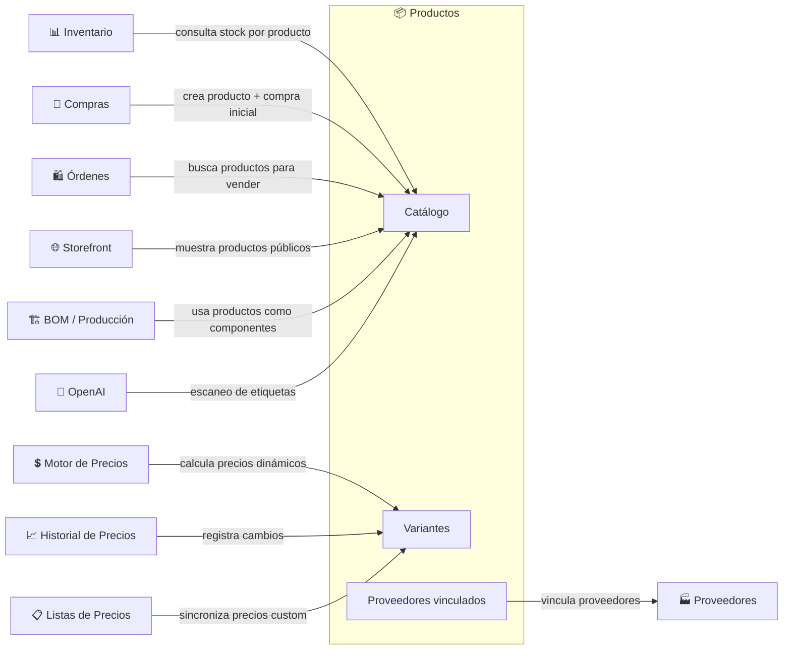

# Productos

## ¿Qué es?

El módulo de Productos es como el **catálogo maestro de una tienda** — es el libro donde están registrados absolutamente todos los artículos que el negocio maneja: qué son, cuánto cuestan, de dónde vienen, y en qué presentaciones se venden. Es la pieza central del sistema porque todo lo demás (ventas, compras, inventario, producción) depende de que los productos estén correctamente definidos aquí.

Sin este módulo, el sistema no sabría qué se está vendiendo, qué se está comprando, ni qué hay en el almacén.

## ¿Para quién es?

- **Administrador del negocio**: Crea y configura el catálogo completo de productos
- **Almacenero**: Consulta información de productos al recibir mercancía
- **Vendedor / Cajero**: Ve productos en el POS con precios y variantes
- **Encargado de compras**: Consulta proveedores y costos por producto
- **Sistema (automático)**: Otros módulos consultan productos para inventario, órdenes, producción

## ¿Qué problema resuelve?

- **Sin catálogo centralizado**, cada área del negocio tendría su propia lista de productos (el almacén una, ventas otra, compras otra) con información que no coincide
- **Sin variantes**, no podrías vender el mismo producto en diferentes presentaciones (ej: Harina 1kg y Harina 5kg) con precios distintos
- **Sin multi-unidad**, no podrías comprar en sacos y vender en kilos
- **Sin vinculación con proveedores**, no sabrías a qué precio cada proveedor te vende cada producto
- **Sin escaneo de etiquetas**, cargar productos nuevos sería 100% manual

## Funcionalidades principales

- **Crear producto completo**: Registra un producto con nombre, marca, categoría, variantes, precios, imágenes, configuración de inventario, información fiscal, y opcionalmente lo vincula a un proveedor y crea una compra inicial en un solo paso
- **Variantes y presentaciones**: Un producto puede tener múltiples variantes (ej: "500g", "1kg", "5kg"), cada una con su propio SKU, código de barras, precio de venta, precio de costo, y precio mayorista
- **Unidades de venta múltiples**: Permite comprar en una unidad (sacos) y vender en otra (kilos) con factor de conversión configurable
- **Estrategia de precios automática**: Define precios por markup (margen sobre costo) o por margen (porcentaje de ganancia), con redondeo psicológico ($9.99, $9.95)
- **Precios por ubicación**: Diferente precio para cada sede o local del negocio
- **Descuentos por volumen**: Precios especiales automáticos al comprar más cantidad
- **Escaneo inteligente de etiquetas**: Toma fotos de la etiqueta de un producto y la IA extrae nombre, marca, ingredientes, alérgenos, temperatura de almacenamiento, y categoría
- **Búsqueda por código de barras**: Escanea un código de barras para encontrar instantáneamente el producto y su variante
- **Importación masiva**: Carga decenas de productos de una vez desde un archivo Excel
- **Tipos de producto**: Clasifica como Mercancía (venta directa), Materia Prima, Consumible, o Suministro — cada tipo muestra campos diferentes en la interfaz
- **Catálogo público (Storefront)**: Los productos tipo "simple" con stock disponible se publican automáticamente en la tienda online del negocio
- **Historial de precios**: Cada cambio de precio queda registrado para auditoría

## Cómo se conecta con otros módulos

## Ubicación en el sistema

- **En el menú**: Operaciones → Inventario → Productos (pestaña "Mercancía")
- **URL**: `/inventory-management?tab=products`
- **Otras pestañas de productos**: `?tab=raw-materials` (Materias Primas), `?tab=consumables` (Consumibles), `?tab=supplies` (Suministros), `?tab=pricing-engine` (Motor de Precios)
- **Permisos necesarios**: `products_create`, `products_read`, `products_update`, `products_delete`

---

*Última actualización: 2026-04-28*
*Archivos fuente: `food-inventory-saas/src/modules/products/`, `food-inventory-admin/src/components/ProductsManagement.jsx`*
