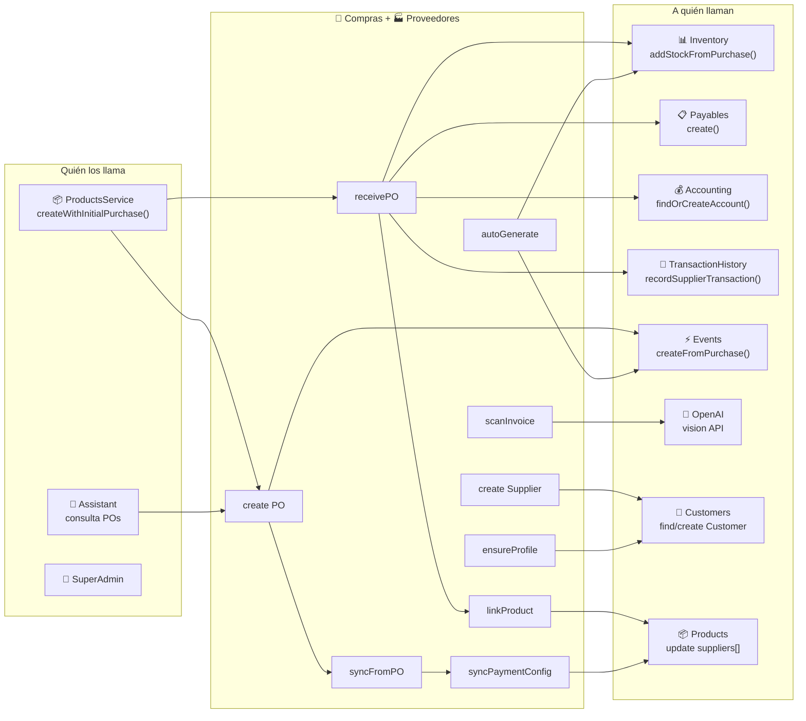

# Compras y Proveedores — Mapa de Conexiones

> Conexiones de los módulos Purchases y Suppliers con el resto del sistema.
> Última actualización: 2026-04-28

---

## Diagrama de Conexiones

---

## Conexiones de Entrada

| Módulo origen | Función que llama | Función local | Contexto |
|---|---|---|---|
| **Products** | `createWithInitialPurchase()` | `purchases.create()` + `purchases.receivePurchaseOrder()` | Crea producto + compra + recibe todo en un paso |
| **Products** | `addSupplier()` | `suppliers.ensureSupplierProfile()` | Asegura perfil Supplier al vincular proveedor a producto |
| **Assistant** | Consultas de IA | `purchases.findAll()` | Responde sobre historial de compras |
| **SuperAdmin** | Gestión global | Múltiples métodos | Administración de POs y proveedores |

---

## Conexiones de Salida — Purchases

| Función local | Módulo destino | Función destino | Contexto |
|---|---|---|---|
| `receivePurchaseOrder()` | **InventoryService** | `addStockFromPurchase()` | Incrementa stock por cada item de la PO |
| `receivePurchaseOrder()` | **PayablesService** | `create()` | Crea 1 o 2 payables (adelanto + saldo) |
| `receivePurchaseOrder()` | **AccountingService** | `findOrCreateAccount()` | Obtiene cuenta "1103 Inventario" |
| `receivePurchaseOrder()` | **SuppliersService** | `linkProductToSupplier()` | Vincula cada producto al proveedor |
| `receivePurchaseOrder()` | **TransactionHistoryService** | `recordSupplierTransaction()` | Registra la transacción |
| `create()` | **SuppliersService** | `syncFromPurchaseOrder()` | Actualiza métricas del proveedor |
| `create()` | **EventsService** | `createFromPurchase()` | Crea evento si hay fecha de pago |
| `approve()` / `reject()` | **EventsService** | `create()` | Notificación de aprobación/rechazo |
| `scanInvoiceImage()` | **OpenaiService** | `createChatCompletion()` | GPT-4o-mini Vision para OCR |
| `autoGeneratePOs()` | **InventoryService** | `getLowStockAlerts()` | Obtiene productos con stock bajo |

---

## Conexiones de Salida — Suppliers

| Función local | Módulo destino | Función destino | Contexto |
|---|---|---|---|
| `create()` | **Customer (modelo)** | `create()` / `findOne()` | Busca o crea perfil Customer vinculado |
| `update()` | **Customer (modelo)** | `updateOne()` | Sincroniza cambios (nombre, RIF, contacto, dirección) |
| `update()` | **Product (modelo)** | `updateMany()` con arrayFilters | Sync config de pago a Product.suppliers[] |
| `ensureSupplierProfile()` | **Customer (modelo)** | `findOne()` | Busca Customer para crear Supplier profile |
| `linkProductToSupplier()` | **Product (modelo)** | `findOne()` + `save()` | Agrega/actualiza entrada en Product.suppliers[] |
| `syncPaymentConfigToProducts()` | **Product (modelo)** | `updateMany()` | Propaga paymentCurrency, methods, parallelRate |
| `delete()` | **Product (modelo)** | `updateMany()` | Remueve supplierId de Product.suppliers[] |
| `delete()` | **Customer (modelo)** | `deleteOne()` | Elimina Customer vinculado |

---

## Datos Compartidos

| Entidad | Campo | Módulos que la usan |
|---|---|---|
| `supplierId` (ObjectId) | En PO y Product.suppliers[] | Purchases, Products, Payables, TransactionHistory |
| `poNumber` (String) | Referencia en movimientos | Inventory (reference), Payables (description) |
| `Product.suppliers[]` | Array de proveedores | Products, Suppliers (sync), Pricing Engine |
| `Customer._id` | Identidad dual | Customers, Suppliers (customerId) |
| `paymentCurrency` | Moneda inferida | Products, Suppliers, Pricing Engine |

---

## Dependencias Circulares (forwardRef)

### Purchases
| Par | Razón |
|---|---|
| Purchases ↔ **Auth** | Autenticación |
| Purchases ↔ **Customers** | Resuelve proveedor como Customer |
| Purchases ↔ **Products** | Busca productos para PO |
| Purchases ↔ **Inventory** | addStockFromPurchase al recibir |
| Purchases ↔ **Accounting** | findOrCreateAccount para payables |
| Purchases ↔ **Payables** | Crea cuentas por pagar |
| Purchases ↔ **Events** | Crea notificaciones |
| Purchases ↔ **TransactionHistory** | Registra historial |
| Purchases ↔ **Suppliers** | Sync y vinculación |
| Purchases ↔ **OpenAI** | Escaneo de facturas |

### Suppliers
| Par | Razón |
|---|---|
| Suppliers ↔ **Auth** | Autenticación |

---

*Última actualización: 2026-04-28*
*Archivos fuente: `purchases.module.ts`, `suppliers.module.ts`*
