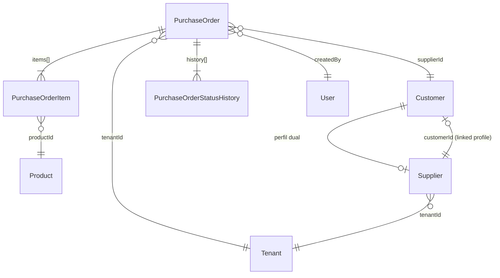
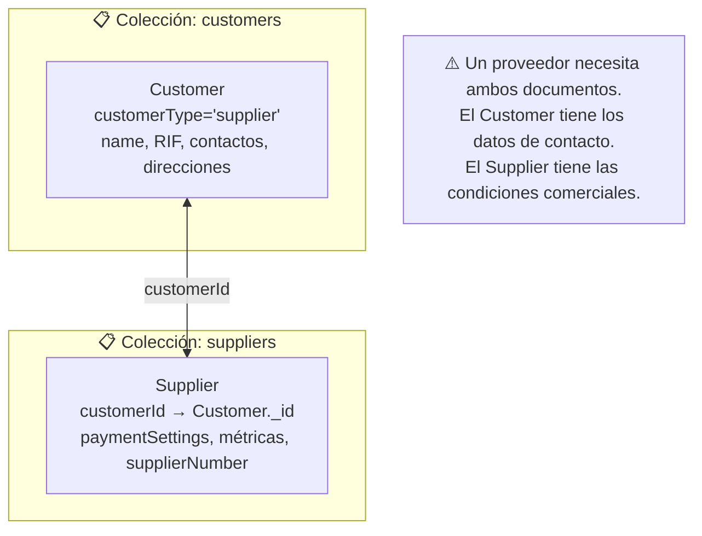

# Compras y Proveedores — Modelo de Datos

> Schemas: PurchaseOrder, Supplier. El proveedor también vive en la colección `customers` con perfil dual.
> Última actualización: 2026-04-28

---

## Diagrama de Entidades

---

## Colección: `purchaseorders`

### Campos principales

| Campo | Tipo | Requerido | Default | Descripción |
|---|---|---|---|---|
| `poNumber` | String | Sí | Auto | Número único. Formato: `OC-YYMMDD-HHMMSS-XXXXXX` |
| `supplierId` | ObjectId | Sí | — | → Customer (con customerType=supplier) |
| `supplierName` | String | Sí | — | Nombre desnormalizado del proveedor |
| `purchaseDate` | Date | Sí | — | Fecha de la compra |
| `expectedDeliveryDate` | Date | No | — | Fecha estimada de entrega |
| `status` | String | Sí | `"pending"` | `pending`, `draft`, `approved`, `rejected`, `received`, `cancelled` |
| `autoGenerated` | Boolean | No | `false` | Si fue generada automáticamente por el sistema |
| `tenantId` | ObjectId | Sí | — | → Tenant |
| `createdBy` | ObjectId | Sí | — | → User |

### Items (embedded: `items[]`)

| Campo | Tipo | Requerido | Descripción |
|---|---|---|---|
| `productId` | ObjectId | Sí | → Product |
| `productName` | String | Sí | Nombre desnormalizado |
| `productSku` | String | Sí | SKU desnormalizado |
| `variantId` | ObjectId | No | → Product.variants._id |
| `variantName` | String | No | Nombre de la variante |
| `variantSku` | String | No | SKU de la variante |
| `quantity` | Number | Sí | Cantidad (> 0) |
| `costPrice` | Number | Sí | Precio unitario (> 0) |
| `discount` | Number | No | Porcentaje de descuento (0-100). Default: 0 |
| `totalCost` | Number | Sí | `quantity × costPrice × (1 - discount/100)` |
| `lotNumber` | String | No | Número de lote (perecederos) |
| `expirationDate` | Date | No | Fecha de vencimiento (perecederos) |

### Totales y Moneda

| Campo | Tipo | Requerido | Descripción |
|---|---|---|---|
| `subtotal` | Number | No | Subtotal antes de impuestos |
| `ivaTotal` | Number | No | Total de IVA. Default: 0 |
| `igtfTotal` | Number | No | Total de IGTF. Default: 0 |
| `totalAmount` | Number | Sí | Monto total de la orden |
| `exchangeRateSnapshot` | Number | No | Tasa USD→VES al momento de la compra |
| `eurExchangeRateSnapshot` | Number | No | Tasa EUR→VES al momento |
| `totalAmountVes` | Number | No | Total en Bolívares |
| `actualPaymentMethod` | String | No | Método usado: efectivo_usd, zelle, bolivares_bcv, euro_bcv, etc. |

### Condiciones de Pago (embedded: `paymentTerms`)

| Campo | Tipo | Requerido | Descripción |
|---|---|---|---|
| `isCredit` | Boolean | Sí | Si es a crédito |
| `creditDays` | Number | Sí | Días de crédito (calculado desde dueDate - purchaseDate) |
| `paymentMethods` | String[] | Sí | Métodos aceptados. Mín 1 |
| `expectedCurrency` | Enum | Sí | `USD`, `VES`, `EUR`, `USD_BCV`, `EUR_BCV` |
| `paymentDueDate` | Date | No | Fecha de vencimiento del pago |
| `requiresAdvancePayment` | Boolean | Sí | Si requiere adelanto |
| `advancePaymentPercentage` | Number | No | % del adelanto (0-100) |
| `advancePaymentAmount` | Number | No | Monto del adelanto en $ |
| `remainingBalance` | Number | No | Saldo restante después del adelanto |

### Flujo de Aprobación

| Campo | Tipo | Descripción |
|---|---|---|
| `approvedBy` | ObjectId | → User que aprobó |
| `approvedAt` | Date | Fecha de aprobación |
| `approvalNotes` | String | Notas de aprobación |
| `rejectedBy` | ObjectId | → User que rechazó |
| `rejectedAt` | Date | Fecha de rechazo |
| `rejectionReason` | String | Razón del rechazo |

### Recepción

| Campo | Tipo | Descripción |
|---|---|---|
| `receivedDate` | Date | Fecha de recepción |
| `receivedBy` | String | Nombre de quién recibió |
| `invoiceDate` | Date | Fecha de la factura |
| `invoiceNumber` | String | Número de factura |
| `documentType` | Enum | `nota_entrega`, `factura_fiscal`. Default: `factura_fiscal` |

### Historial de Estados (embedded: `history[]`)

| Campo | Tipo | Descripción |
|---|---|---|
| `status` | String | Estado al que cambió |
| `changedAt` | Date | Cuándo cambió |
| `changedBy` | ObjectId | → User que hizo el cambio |
| `notes` | String | Notas del cambio |

### Índices

| Campos | Tipo | Propósito |
|---|---|---|
| `{ poNumber, tenantId }` | Unique | Número de PO único por tenant |
| `{ supplierId, createdAt: -1, tenantId }` | Normal | POs por proveedor |
| `{ status, createdAt: -1, tenantId }` | Normal | POs por estado |
| `{ purchaseDate: -1, tenantId }` | Normal | Ordenar por fecha |
| `{ expectedDeliveryDate, tenantId }` | Normal | Entregas pendientes |
| `{ createdBy, tenantId }` | Normal | POs por usuario |
| `{ poNumber, supplierName, invoiceNumber }` | Text | Búsqueda full-text |

---

## Colección: `suppliers`

El Supplier es un perfil especializado que **complementa** al Customer. Un proveedor tiene DOS documentos: uno en `customers` (datos de contacto, RIF) y uno en `suppliers` (condiciones comerciales, métricas).

### Campos principales

| Campo | Tipo | Requerido | Default | Descripción |
|---|---|---|---|---|
| `supplierNumber` | String | Sí | Auto | Formato: `PROV-000001`. Único por tenant |
| `customerId` | ObjectId | No | — | → Customer (el perfil vinculado). **Campo clave del patrón dual** |
| `name` | String | Sí | — | Nombre del proveedor (desnormalizado) |
| `tradeName` | String | No | — | Nombre comercial |
| `supplierType` | String | No | `"distributor"` | Tipo de proveedor |
| `status` | String | No | `"active"` | `active`, `inactive`, `suspended` |
| `tenantId` | String | Sí | — | → Tenant (como String, no ObjectId) |
| `createdBy` | ObjectId | No | — | → User |

### Configuración de Pago (embedded: `paymentSettings`)

| Campo | Tipo | Default | Descripción |
|---|---|---|---|
| `acceptsCredit` | Boolean | — | Si acepta crédito |
| `defaultCreditDays` | Number | — | Días de crédito por defecto |
| `creditLimit` | Number | — | Límite de crédito |
| `acceptedPaymentMethods` | String[] | — | Métodos que acepta |
| `customPaymentMethods` | String[] | — | Métodos personalizados |
| `preferredPaymentMethod` | String | — | Método preferido |
| `requiresAdvancePayment` | Boolean | — | Si requiere adelanto |
| `advancePaymentPercentage` | Number | — | % de adelanto |
| `paymentNotes` | String | — | Notas de pago |

### Métricas (embedded: `metrics`)

| Campo | Tipo | Descripción |
|---|---|---|
| `totalOrders` | Number | Total de POs |
| `totalPurchased` | Number | Total comprado ($) |
| `averageOrderValue` | Number | Valor promedio por orden |
| `lastOrderDate` | Date | Última compra |
| `onTimeDeliveryRate` | Number | % de entregas a tiempo |

### Campos Legacy (deprecated — usar Customer vinculado)

- `taxInfo` — Usar `Customer.taxInfo.taxId` (RIF)
- `address` — Usar `Customer.addresses[]`
- `contacts` — Usar `Customer.contacts[]`

### Índices

| Campos | Tipo | Propósito |
|---|---|---|
| `{ supplierNumber, tenantId }` | Unique | Número único |
| `{ "taxInfo.rif", tenantId }` | Normal | Búsqueda por RIF |
| `{ status, tenantId }` | Normal | Filtro por estado |
| `{ name, tradeName, supplierNumber, "taxInfo.rif" }` | Text | Búsqueda |

---

## Patrón Dual: Customer ↔ Supplier

**Proveedores virtuales**: Un Customer con `customerType='supplier'` que NO tiene Supplier vinculado. Se crea automáticamente el perfil Supplier al usar `ensureSupplierProfile()`.

---

## ⚠️ Gotchas

1. **`supplierId` en PurchaseOrder** apunta a la colección `customers` (no `suppliers`). Es el `customerId` del proveedor.
2. **Supplier.tenantId es String**, no ObjectId. El servicio usa `tenantFilter()` que busca ambos tipos.
3. **`supplierNumber` race condition**: La generación usa MAX+1 (busca el mayor y suma 1). Dos requests simultáneos pueden generar el mismo número. El índice unique lo previene pero genera error 409.
4. **Customer.contacts** usa formato `{ name, type: "email"|"phone", value }`, mientras que la API de Supplier devuelve `{ name, email, phone }` — hay una capa de transformación `mergeCustomerContacts()`.
5. **RIF normalización**: El sistema normaliza RIFs a formato `X-123456789`. Pero la búsqueda de duplicados usa regex con los dígitos, lo que puede generar falsos positivos.
6. **Sync bidireccional**: Al actualizar un Supplier, se sincroniza a Customer Y a Product.suppliers[]. La sync a Products es background (no bloqueante).

---

*Última actualización: 2026-04-28*
*Archivos fuente: `purchase-order.schema.ts`, `supplier.schema.ts`, `customer.schema.ts`*
