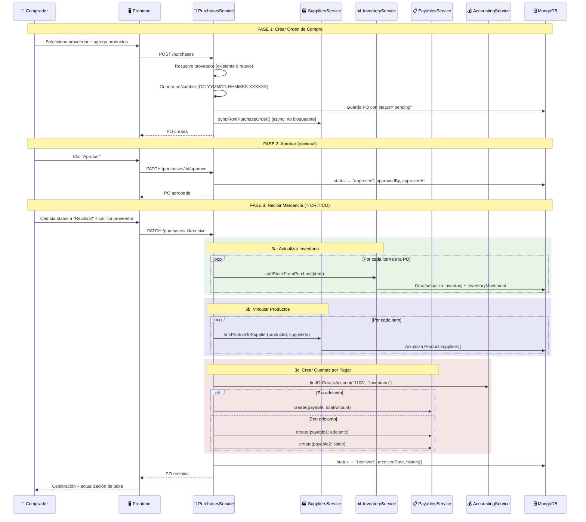
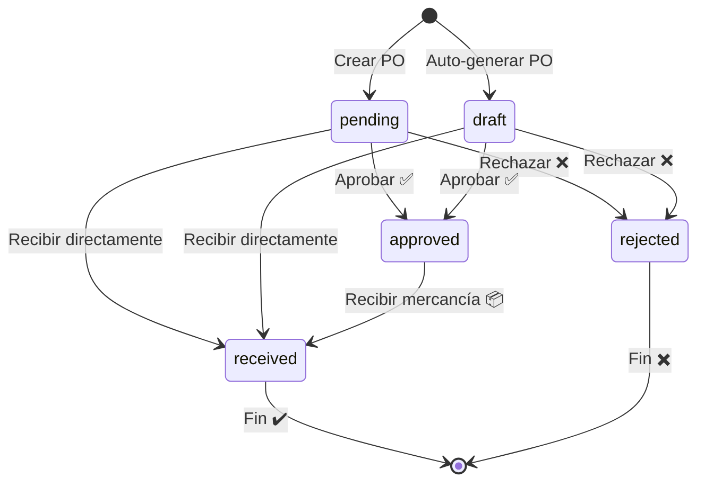
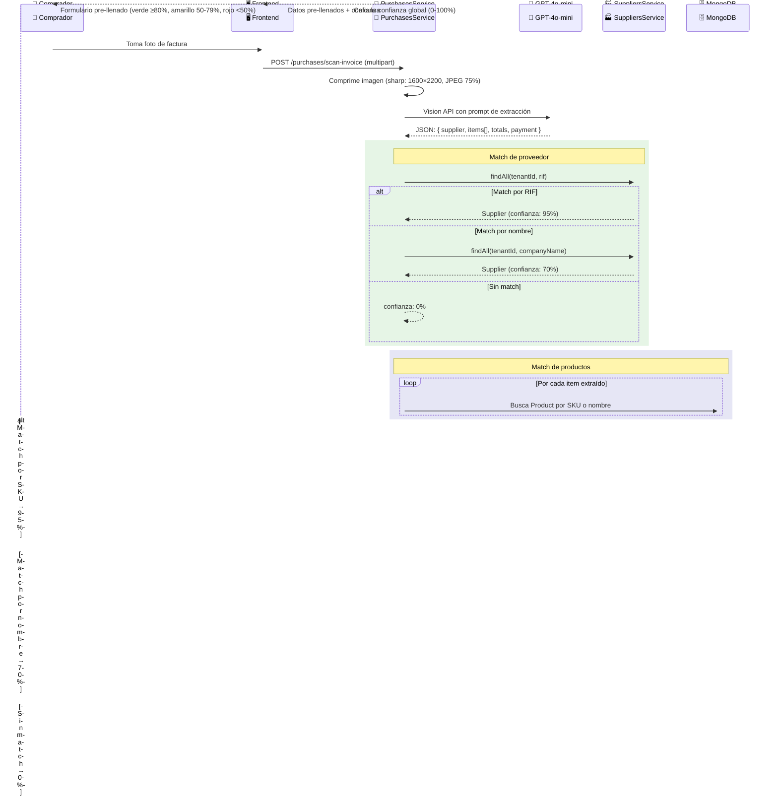
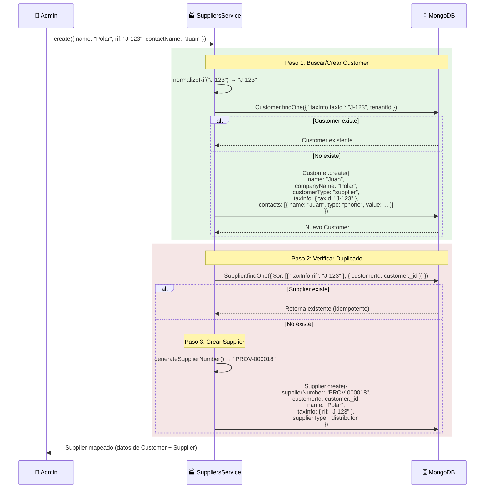
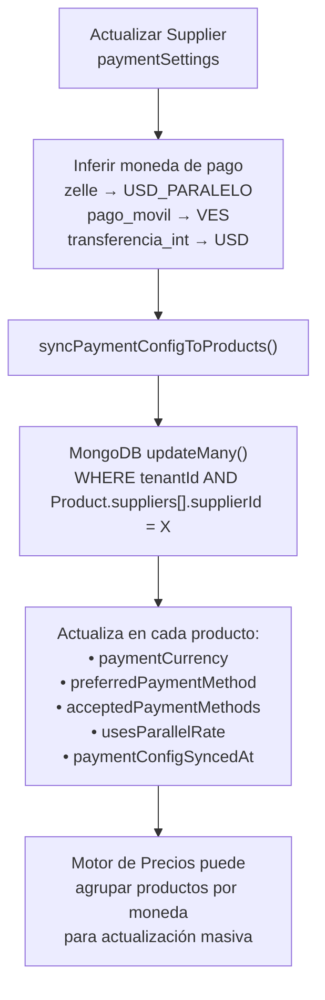
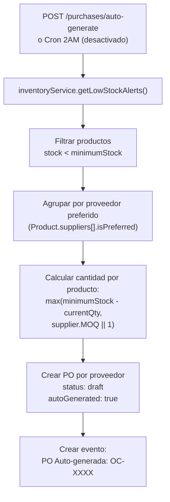

# Compras y Proveedores — Flujos de Operación

> Diagramas de los flujos principales del ciclo de compras.
> Última actualización: 2026-04-28

---

## Flujo 1: Ciclo Completo de una Orden de Compra

### Descripción
El flujo más importante del módulo: desde que se crea la PO hasta que la mercancía se recibe y el inventario se actualiza.

### Diagrama

---

## Flujo 2: Transiciones de Estado de una PO

**Notas**:
- Una PO puede ir directamente de `pending` a `received` (sin pasar por `approved`)
- `rejected` es un estado final — no se puede revertir
- `cancelled` existe en el schema pero no tiene implementación de transición

---

## Flujo 3: Escaneo de Factura con IA

---

## Flujo 4: Patrón Dual Customer ↔ Supplier

### Descripción
Cómo funciona la creación de un proveedor con sus dos perfiles vinculados.

---

## Flujo 5: Sincronización de Config de Pago

### Descripción
Cuando se actualizan las condiciones de pago de un proveedor, los cambios se propagan a todos los productos vinculados.

---

## Flujo 6: Auto-Generación de POs

---

*Última actualización: 2026-04-28*
*Archivos fuente: `purchases.service.ts`, `suppliers.service.ts`*
