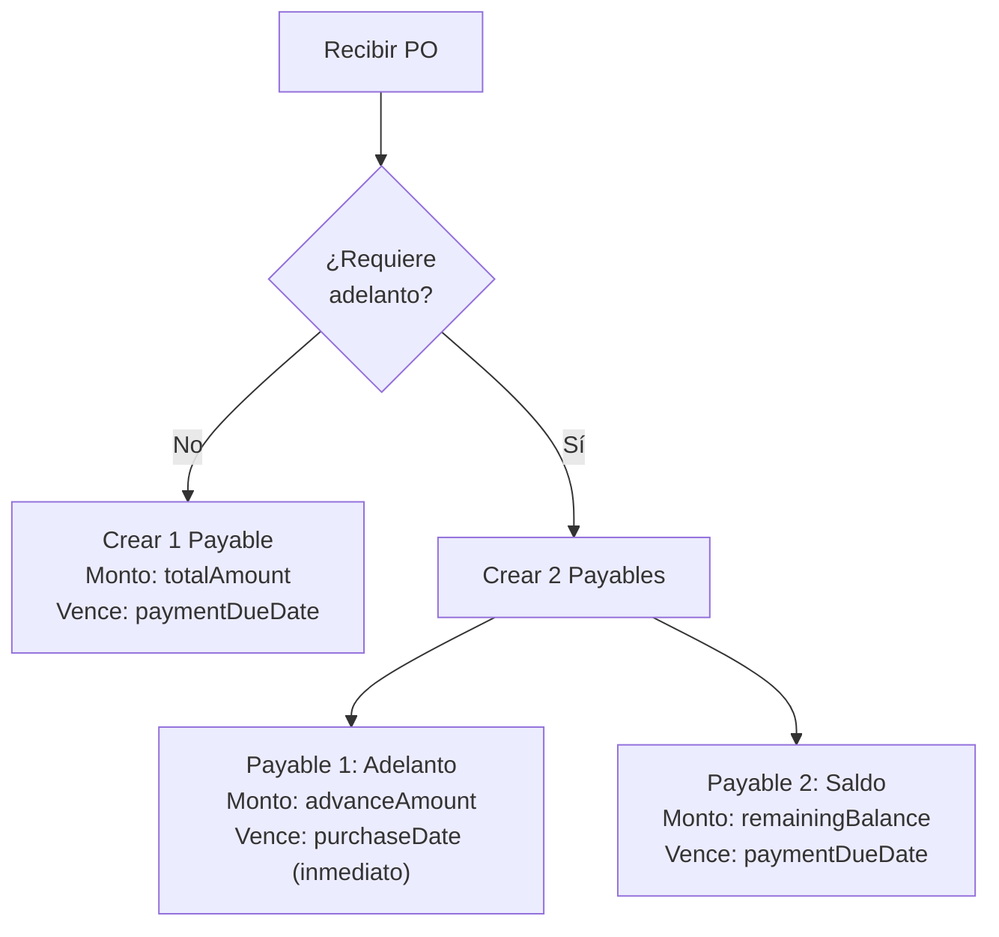

# Compras y Proveedores — Catálogo de Funciones

> Funciones de ambos módulos: Purchases (órdenes de compra) y Suppliers (proveedores).
> Última actualización: 2026-04-28

---

## Resumen — Compras

| Función | Descripción | Quién la usa | Módulos relacionados |
|---|---|---|---|
| Crear orden de compra | Registra una PO con proveedor, items, y condiciones | Comprador | Suppliers, Events |
| Listar POs | Busca POs con filtros y paginación | Todos | — |
| Aprobar PO | Cambia status pending → approved | Admin | Events |
| Rechazar PO | Cambia status pending → rejected con razón | Admin | Events |
| Recibir mercancía | Actualiza inventario, crea payables, vincula productos | Almacenero | Inventory, Payables, Accounting, Suppliers, TransactionHistory |
| Escanear factura (IA) | Extrae datos de factura desde foto | Comprador | OpenAI |
| Auto-generar POs | Crea POs automáticas para productos con stock bajo | Sistema | Inventory, Events |
| Reconciliar POs | Sincroniza proveedores y productos de POs recibidas | Admin | Suppliers |
| POs pendientes | Lista POs esperando aprobación | Admin | — |

## Resumen — Proveedores

| Función | Descripción | Quién la usa | Módulos relacionados |
|---|---|---|---|
| Crear proveedor | Crea perfil dual Customer + Supplier | Admin | Customers |
| Listar proveedores | Lista combinada de Suppliers + Customers virtuales | Todos | Customers |
| Actualizar proveedor | Edita datos y sincroniza a Customer + Products | Admin | Customers, Products |
| Eliminar proveedor | Elimina y desvincula de todos los productos | Admin | Products, Customers |
| Asegurar perfil | Crea Supplier si solo existe como Customer virtual | Sistema | Customers |
| Vincular producto | Agrega proveedor a Product.suppliers[] | Sistema | Products |
| Sync desde PO | Actualiza métricas y condiciones desde una compra | Sistema | Products |
| Sync config a productos | Propaga condiciones de pago a productos vinculados | Sistema | Products |
| Proveedores por moneda | Agrupa proveedores por moneda inferida | Motor de precios | Products |

---

## Crear Orden de Compra

### ¿Qué hace?
Registra una orden de compra con proveedor (existente o nuevo), lista de productos con cantidades y precios, y condiciones de pago (contado/crédito, moneda, adelanto).

### ¿Cuándo se usa?
Cuando el negocio necesita reabastecerse de un proveedor. El comprador crea la PO, que luego pasa por aprobación antes de recibirse.

### Paso a paso
1. El usuario abre "Añadir Inventario" en la pantalla de Compras
2. Selecciona proveedor existente (por RIF o nombre con búsqueda async) o crea uno nuevo
3. Agrega productos buscando por nombre/SKU. Si el producto tiene variantes, abre selector de variantes
4. Para cada item: especifica cantidad, precio de costo, descuento %, lote y vencimiento (si perecedero)
5. Configura condiciones de pago: moneda, crédito, adelanto, métodos
6. El sistema calcula subtotal, IVA (16%), IGTF (3% si aplica), total
7. Se genera número de PO automático: `OC-YYMMDD-HHMMSS-XXXXXX`
8. Si es proveedor nuevo, normaliza el RIF y verifica que no exista ya

### Lo que pasa por detrás (técnico)
- **Endpoint**: `POST /api/v1/purchases`
- **Servicio**: `purchases.service.ts → create()`
- **Resolución de proveedor**: XOR — o `supplierId` existente, o campos `newSupplier*`. Si es nuevo, normaliza RIF (`J413164663` → `J-413164663`), busca duplicados por RIF, y crea vía SuppliersService
- **Post-creación** (no bloqueante): `suppliersService.syncFromPurchaseOrder()` actualiza métricas del proveedor. Si hay `paymentDueDate`, crea un evento/tarea en el calendario

---

## Recibir Mercancía

### ¿Qué hace?
Marca una orden de compra como recibida y dispara una cadena de acciones: actualiza inventario, crea cuentas por pagar, vincula productos al proveedor, y registra el historial.

### ¿Cuándo se usa?
Cuando la mercancía llega físicamente al almacén y el almacenero verifica que coincide con la orden.

### Paso a paso
1. En el historial de compras, el almacenero cambia el status de "Pendiente" a "Recibido"
2. Se abre un modal para: fecha de factura, nombre de quién recibió, calificación del proveedor (1-5 estrellas)
3. Al confirmar, el sistema ejecuta en cadena:
   - **Inventario**: Por cada item, llama `addStockFromPurchase()` que crea/actualiza stock
   - **Vinculación**: Por cada item, vincula el producto al proveedor en `Product.suppliers[]`
   - **Cuentas por pagar**: Crea payable(s) en contabilidad
   - **Historial**: Registra la transacción del proveedor
4. El estado cambia a "received" con timestamp y usuario

### Lo que pasa por detrás (técnico)
- **Endpoint**: `PATCH /api/v1/purchases/:id/receive`
- **Servicio**: `purchases.service.ts → receivePurchaseOrder()`
- **Validación**: PO debe estar en status `pending` o `approved`
- **Efectos secundarios críticos**:
  1. `inventoryService.addStockFromPurchase()` — Crea/actualiza inventario + movimiento
  2. `suppliersService.linkProductToSupplier()` — Vincula producto ↔ proveedor
  3. `payablesService.create()` — Crea cuenta(s) por pagar:
     - **Sin adelanto**: 1 payable por el total
     - **Con adelanto**: 2 payables (adelanto inmediato + saldo con vencimiento)
  4. `accountingService.findOrCreateAccount("1103", "Inventario", "Activo")` — Cuenta contable
  5. `transactionHistoryService.recordSupplierTransaction()` — Historial

### Lógica de Payables (Cuentas por Pagar)

---

## Escanear Factura con IA

### ¿Qué hace?
Toma una foto de una factura de proveedor y usa GPT-4o-mini Vision para extraer automáticamente: proveedor, items, montos, y condiciones de pago. Luego intenta hacer match con proveedores y productos existentes.

### ¿Cuándo se usa?
Para agilizar la carga de compras — en vez de tipear toda la factura, se toma una foto y el sistema la interpreta.

### Paso a paso
1. El usuario toma foto de la factura (max 5MB, JPEG/PNG/WebP/HEIC)
2. El sistema comprime la imagen (1600×2200, JPEG 75%)
3. Envía a GPT-4o-mini con prompt especializado para facturas venezolanas
4. La IA extrae: nombre proveedor, RIF, items (nombre, SKU, cantidad, precio), totales, moneda
5. El sistema intenta match de proveedor por RIF (95% confianza) o por nombre (70%)
6. Para cada item, intenta match de producto por SKU (95%) o por nombre (70%)
7. Retorna datos pre-llenados con score de confianza (0-100%)
8. El usuario revisa, corrige, y crea la PO con los datos pre-llenados

### Lo que pasa por detrás (técnico)
- **Endpoint**: `POST /api/v1/purchases/scan-invoice`
- **Content-Type**: `multipart/form-data`
- **IA**: OpenAI GPT-4o-mini, temperature 0.1, timeout 60s, max 2000 tokens
- **Matching**: RIF match → 95% confianza. Nombre match → 70%. Sin match → 0%
- **Moneda**: USD (default), VES/BS/BOLIVARES → VES, EUR → EUR

---

## Auto-Generar Órdenes de Compra

### ¿Qué hace?
Analiza el inventario, identifica productos con stock bajo, y genera automáticamente órdenes de compra borrador agrupadas por proveedor preferido.

### ¿Cuándo se usa?
Manualmente vía endpoint o automáticamente por cron job (desactivado por defecto para evitar POs sin consentimiento).

### Lo que pasa por detrás (técnico)
- **Endpoint**: `POST /api/v1/purchases/auto-generate`
- **Lógica**:
  1. Obtiene productos con stock bajo vía `inventoryService.getLowStockAlerts()`
  2. Para cada producto: busca proveedor preferido en `Product.suppliers[]`
  3. Calcula cantidad a pedir: `max(minimumStock - currentQty, supplier.MOQ)`
  4. Agrupa items por proveedor
  5. Crea POs en status `draft` con `autoGenerated: true`
- **Cron**: Configurado para 2AM diario pero **desactivado** en módulo (comentado)

---

## Crear Proveedor

### ¿Qué hace?
Crea un perfil dual: un Customer (datos de contacto, RIF) y un Supplier vinculado (condiciones comerciales, métricas).

### Lo que pasa por detrás (técnico)
- **Endpoint**: `POST /api/v1/suppliers`
- **Servicio**: `suppliers.service.ts → create()`
- **Pasos**:
  1. Normaliza RIF
  2. Busca Customer existente por RIF (exacto + fallback por dígitos)
  3. Si no existe, crea Customer con `customerType: "supplier"`
  4. Verifica que no exista ya un Supplier para este Customer
  5. Si existe: retorna el existente (idempotente)
  6. Genera `supplierNumber`: `PROV-{MAX+1}` (⚠️ race condition posible)
  7. Crea Supplier con `customerId` apuntando al Customer

---

## Asegurar Perfil de Proveedor (`ensureSupplierProfile`)

### ¿Qué hace?
Garantiza que existe un documento Supplier para un ID dado. Si solo existe el Customer (proveedor virtual), crea automáticamente el perfil Supplier.

### ¿Cuándo se usa?
Llamado por Products (`addSupplier()`) y Purchases (al crear POs). Es el método que convierte un Customer virtual en un Supplier completo.

### Lo que pasa por detrás (técnico)
- **Método**: `suppliers.service.ts → ensureSupplierProfile(id, user)`
- **Flujo**:
  1. Busca en colección Supplier por `_id`
  2. Si no encuentra, busca en Customer por `_id`
  3. Verifica que no exista ya un Supplier con `customerId` = ese Customer (previene race condition)
  4. Si no existe, crea Supplier con supplierNumber, customerId, contactos del Customer

---

## Sincronizar desde Orden de Compra (`syncFromPurchaseOrder`)

### ¿Qué hace?
Actualiza el perfil del proveedor con información extraída de una orden de compra: métricas (total comprado, promedio, frecuencia) y condiciones de pago (crédito, métodos, adelanto).

### ¿Cuándo se usa?
Llamado automáticamente al crear una PO y al recibirla. No bloqueante — errores se registran pero no fallan la operación principal.

### Lo que pasa por detrás (técnico)
- **Método**: `suppliers.service.ts → syncFromPurchaseOrder(supplierId, data, user)`
- **Actualiza métricas**: `totalOrders++`, `totalPurchased += amount`, `averageOrderValue`, `lastOrderDate`
- **Sincroniza condiciones**: `acceptsCredit`, `defaultCreditDays`, merge de `acceptedPaymentMethods` (agrega, no reemplaza), `preferredPaymentMethod` (solo si no estaba definido)
- **Post-sync**: Propaga config de pago a Product.suppliers[] vinculados (background)

---

## Vincular Producto a Proveedor (`linkProductToSupplier`)

### ¿Qué hace?
Agrega o actualiza la entrada de un proveedor en el array `Product.suppliers[]`, incluyendo costo, SKU, y config de pago.

### Lo que pasa por detrás (técnico)
- **Método**: `suppliers.service.ts → linkProductToSupplier(productId, supplierId, tenantId, costData)`
- **Si el link ya existe**: Actualiza costPrice, lastUpdated, sincroniza config de pago
- **Si es nuevo**: Crea entrada con `{ supplierId, supplierName, supplierSku, costPrice, isPreferred }` + config de pago
- **Sanitiza entradas legacy**: Rellena campos faltantes (`supplierSku → '-'`, `leadTimeDays → 1`, `minimumOrderQuantity → 1`)

---

## Sincronizar Config de Pago a Productos (`syncPaymentConfigToProducts`)

### ¿Qué hace?
Propaga las condiciones de pago de un proveedor a todos sus productos vinculados en `Product.suppliers[]`.

### ¿Cuándo se usa?
- Automáticamente al actualizar un proveedor
- Automáticamente al recibir una PO
- Manualmente vía el endpoint de pricing sync

### Lo que pasa por detrás (técnico)
- **Método**: `suppliers.service.ts → syncPaymentConfigToProducts(supplierId, tenantId, config)`
- **MongoDB**: `updateMany()` con `arrayFilters: [{ 'elem.supplierId': ObjectId }]`
- **Campos sincronizados**: `paymentCurrency`, `preferredPaymentMethod`, `acceptedPaymentMethods`, `usesParallelRate`, `paymentConfigSyncedAt`

---

*Última actualización: 2026-04-28*
*Archivos fuente: `purchases.service.ts`, `suppliers.service.ts`, `purchases.controller.ts`, `suppliers.controller.ts`*
