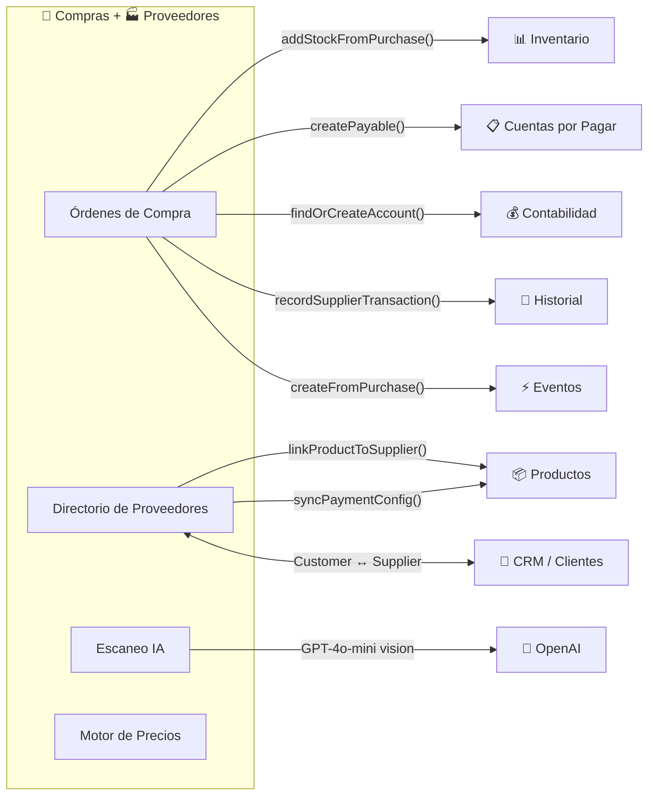

# Compras y Proveedores

## ¿Qué es?

El módulo de Compras y Proveedores es como la **oficina de adquisiciones** de un negocio — es donde se gestionan todas las compras a proveedores, desde crear la orden, aprobarla, hasta recibir la mercancía y registrar la deuda. Además, mantiene un directorio completo de proveedores con sus condiciones comerciales, métodos de pago, historial de compras, y calificaciones.

Cuando recibes mercancía, este módulo se encarga de que el inventario se actualice, que la contabilidad registre la deuda, y que el proveedor quede vinculado a los productos que suministra.

## ¿Para quién es?

- **Encargado de compras**: Crea órdenes de compra, negocia condiciones con proveedores
- **Administrador**: Aprueba o rechaza órdenes de compra, gestiona proveedores
- **Almacenero**: Recibe la mercancía y califica al proveedor
- **Contador**: Consulta las cuentas por pagar generadas
- **Sistema (automático)**: Genera órdenes de compra automáticas cuando hay stock bajo

## ¿Qué problema resuelve?

- **Sin órdenes de compra**, no habría registro de qué se pidió, a quién, a qué precio, y si ya se recibió
- **Sin flujo de aprobación**, cualquiera podría comprar sin autorización
- **Sin vinculación proveedor-producto**, no sabrías quién te vende cada producto ni a qué precio
- **Sin recepción formal**, no habría forma de verificar que lo que llegó coincide con lo que se pidió
- **Sin cuentas por pagar automáticas**, habría que crear manualmente cada deuda en contabilidad
- **Sin historial de compras por proveedor**, no podrías evaluar si un proveedor cumple o no

## Funcionalidades principales

### Compras
- **Crear orden de compra**: Selecciona proveedor (existente o nuevo), agrega productos con cantidades y precios, configura condiciones de pago (contado/crédito, moneda, adelanto)
- **Crear producto con compra inicial**: En un solo formulario crea el producto nuevo Y genera la orden de compra con recepción inmediata
- **Escaneo de factura con IA**: Toma foto de una factura del proveedor y la IA extrae proveedor, productos, montos, y condiciones de pago
- **Flujo de aprobación**: Las órdenes pasan por pendiente → aprobada → recibida (o rechazada con razón)
- **Recepción de mercancía**: Al marcar como recibida, automáticamente actualiza inventario, crea cuentas por pagar, y vincula productos al proveedor
- **Auto-generación de POs**: El sistema puede generar automáticamente órdenes de compra para productos con stock bajo, agrupadas por proveedor preferido
- **Soporte multi-moneda**: Captura tasa de cambio USD/VES y EUR/VES al momento de la compra, calcula IVA e IGTF según el método de pago
- **Historial y calificación**: Al recibir mercancía, el almacenero califica al proveedor (1-5 estrellas) con razón opcional

### Proveedores
- **Directorio de proveedores**: Lista completa con nombre, RIF, contacto, ciudad, calificación
- **Perfil dual Customer/Supplier**: Un proveedor puede ser también un cliente en el CRM — el sistema sincroniza datos entre ambos perfiles
- **Condiciones de pago**: Configura crédito, métodos de pago aceptados, método preferido, adelanto requerido
- **Vinculación con productos**: Ve qué productos suministra cada proveedor, con costo y condiciones
- **Sincronización de precios**: Cuando cambias las condiciones de pago de un proveedor, se propaga automáticamente a todos sus productos vinculados
- **Motor de precios por proveedor**: Agrupa proveedores por moneda de pago para actualización masiva de precios

## Cómo se conecta con otros módulos

## Ubicación en el sistema

### Compras
- **En el menú**: Operaciones → Compras
- **URL**: `/purchases`
- **También en**: Inventario → Compras (`/inventory-management?tab=purchases`)
- **Permisos**: `purchases_read`, `purchases_create`, `purchases_update`

### Proveedores
- **En el menú**: Dentro de CRM → Proveedores, o Inventario → Proveedores
- **URL**: `/inventory-management?tab=suppliers`
- **Permisos**: Hereda permisos de customers/suppliers

---

*Última actualización: 2026-04-28*
*Archivos fuente: `food-inventory-saas/src/modules/purchases/`, `food-inventory-saas/src/modules/suppliers/`, `food-inventory-admin/src/components/ComprasManagement.jsx`, `food-inventory-admin/src/components/SuppliersManagement.jsx`*
