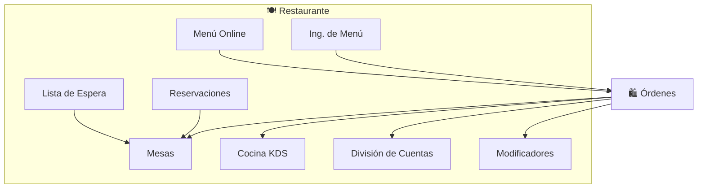

# Restaurante (Módulos Agrupados)

## ¿Qué es?

El grupo de módulos de Restaurante incluye todas las funcionalidades específicas para restaurantes, cafeterías, food trucks y servicios de alimentos: gestión de mesas y plano de planta, sistema de cocina (KDS), reservaciones, ingeniería de menú con IA, división de cuentas, modificadores de productos, lista de espera, y menú online.

## Módulos Incluidos (9)

| Módulo | Endpoints | Función Principal |
|---|---|---|
| **Tables** | 12 | Plano de planta, secciones, estado de mesas, combinar mesas |
| **Kitchen Display (KDS)** | 11 | Pantalla de cocina: tracking de items por estado, asignación de cocineros, tiempos de preparación |
| **Reservations** | 12 | Reservaciones con disponibilidad, confirmación, no-show, settings por horario |
| **Menu Engineering** | 4 | Análisis BCG de menú, forecast de demanda con IA, optimización de precios |
| **Bill Splits** | 9 | División de cuentas: igual, por items, o custom |
| **Modifier Groups** | 11 | Modificadores de productos (extras, opciones, toppings) |
| **Wait List** | 10 | Cola de espera con estimación de tiempo y notificaciones |
| **Restaurant Storefront** | 8 | Menú online público, pedidos web |
| **BOM/Recipes** | 9 | Recetas con ingredientes, costos, y explosión multinivel (compartido con Production) |

## Conexiones Clave

## Permisos
- `restaurant_read`, `restaurant_write` — Para mesas, KDS, reservaciones, menú engineering
- `orders_read`, `orders_write` — Para bill splits (comparte con órdenes)

## Feature Flags
- `restaurant` — Habilita todo el grupo
- `tables`, `kitchenDisplay`, `menuEngineering` — Habilitan módulos individuales

---

*Última actualización: 2026-04-28*
*Archivos: `modules/tables/`, `modules/kitchen-display/`, `modules/reservations/`, `modules/menu-engineering/`, `modules/bill-splits/`, `modules/modifier-groups/`, `modules/wait-list/`, `modules/restaurant-storefront/`*
