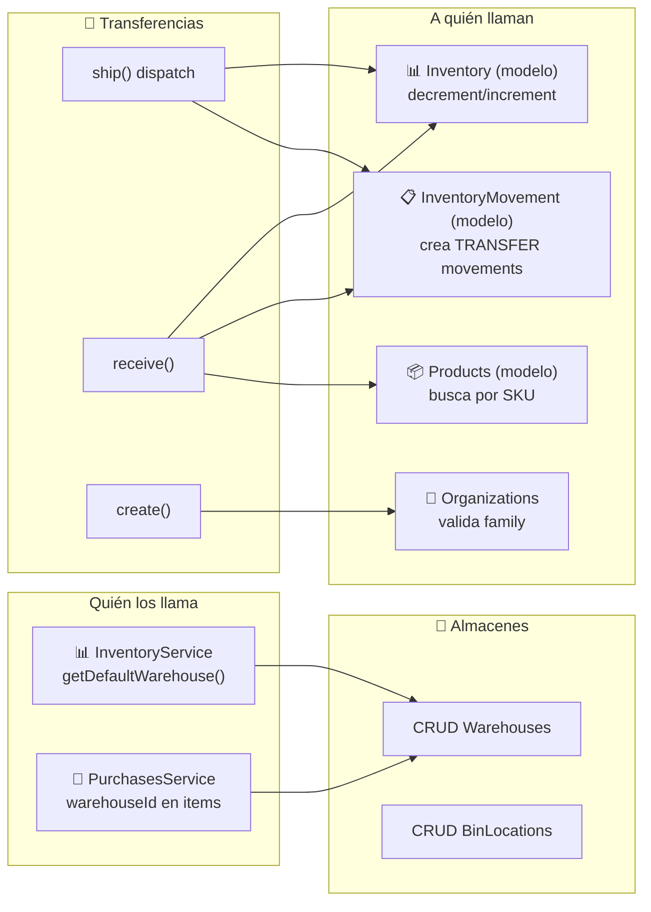

# Transferencias y Almacenes — Mapa de Conexiones

> Última actualización: 2026-04-28

---

## Diagrama de Conexiones

---

## Conexiones de Entrada

| Módulo origen | Función que llama | Contexto |
|---|---|---|
| **Inventory** | `getDefaultWarehouse()` | Obtiene almacén por defecto al crear inventario |
| **Purchases** | `addStockFromPurchase()` | Usa warehouseId del item o el default |
| **Frontend** | Todos los endpoints | Gestión de transferencias y almacenes |

---

## Conexiones de Salida — Transfer Orders

| Función local | Módulo destino | Función destino | Contexto |
|---|---|---|---|
| `ship()` | **Inventory (modelo)** | `findOne()` + `save()` | Decrementa stock origen |
| `ship()` | **InventoryMovement (modelo)** | `create()` | Crea movimiento TRANSFER OUT |
| `receive()` | **Inventory (modelo)** | `findOne()` + `save()` o `create()` | Incrementa stock destino (o crea) |
| `receive()` | **InventoryMovement (modelo)** | `create()` | Crea movimiento TRANSFER IN |
| `receive()` | **Product (modelo)** | `findOne({ sku })` | Cross-tenant: busca producto por SKU |
| `create()` | **Organizations (modelo)** | `findOne()` | Valida que tenants sean de la misma familia |
| `create()` / `update()` | **Warehouse (modelo)** | `findById()` | Valida que almacenes existan |

---

## Conexiones de Salida — Warehouses

| Función local | Módulo destino | Contexto |
|---|---|---|
| `create()` / `update()` | Solo modelos internos | Auto-gestión de isDefault |

---

## Datos Compartidos

| Entidad | Campo | Módulos que la usan |
|---|---|---|
| `warehouseId` (ObjectId) | En Inventory, InventoryMovements, TransferOrders | Inventory, Movements, Transfers |
| `transferId` (UUID) | Vincula OUT + IN movements | InventoryMovements |
| `productId` (ObjectId) | En transfer items y inventory | Products, Inventory |
| `binLocationId` (ObjectId) | En inventory y movements | Inventory, BinLocations |
| `organizationId` | Para validar family cross-tenant | Organizations |

---

## Dependencias Circulares

| Par | Razón |
|---|---|
| TransferOrders → **Organizations** | Valida relación entre tenants para cross-tenant |

**Nota**: Transfer Orders y Warehouses operan directamente sobre los modelos Mongoose de Inventory y InventoryMovement sin pasar por los servicios. Esto evita dependencias circulares pero significa que la lógica de alertas y eventos del InventoryService NO se ejecuta durante transferencias.

---

*Última actualización: 2026-04-28*
*Archivos fuente: `transfer-orders.module.ts`, `warehouses.module.ts`*
