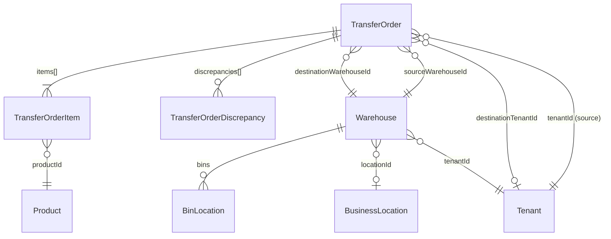
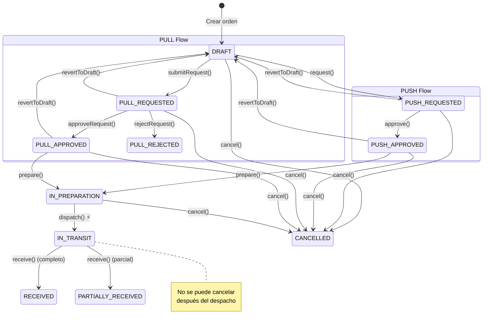

# Transferencias y Almacenes — Modelo de Datos

> TransferOrder, Warehouse, BinLocation.
> Última actualización: 2026-04-28

---

## Diagrama de Entidades

---

## Colección: `transferorders`

### Identificación

| Campo | Tipo | Requerido | Descripción |
|---|---|---|---|
| `orderNumber` | String | Sí | Único por tenant. Secuencial. Ej: `TO-0001` |
| `type` | Enum | Sí | `push` (origen envía) o `pull` (destino solicita) |
| `status` | Enum | Sí | Ver máquina de estados abajo |
| `tenantId` | ObjectId | Sí | Tenant de origen |
| `destinationTenantId` | ObjectId | No | Tenant de destino (si cross-tenant) |

### Almacenes y Ubicaciones

| Campo | Tipo | Requerido | Descripción |
|---|---|---|---|
| `sourceWarehouseId` | ObjectId | Sí | → Warehouse de origen |
| `destinationWarehouseId` | ObjectId | Sí | → Warehouse de destino |
| `sourceLocationId` | ObjectId | No | → BusinessLocation de origen |
| `destinationLocationId` | ObjectId | No | → BusinessLocation de destino |

### Items (embedded: `items[]`)

| Campo | Tipo | Requerido | Descripción |
|---|---|---|---|
| `productId` | ObjectId | Sí | → Product |
| `productSku` | String | No | SKU desnormalizado |
| `productName` | String | No | Nombre desnormalizado |
| `variantId` | ObjectId | No | → Product.variants._id |
| `variantSku` | String | No | SKU de la variante |
| `requestedQuantity` | Number | Sí | Cantidad solicitada (en unidad seleccionada) |
| `approvedQuantity` | Number | No | Cantidad aprobada (puede ser menor) |
| `shippedQuantity` | Number | No | Cantidad despachada |
| `receivedQuantity` | Number | No | Cantidad recibida |
| `selectedUnit` | String | No | Unidad seleccionada por el usuario (kg, cajas) |
| `conversionFactor` | Number | No | Factor a unidad base. ⚠️ Puede ser `undefined` en órdenes antiguas |
| `unitOfMeasure` | String | No | Unidad base del producto |
| `unitCost` | Number | No | Costo unitario |
| `notes` | String | No | Notas por item |
| `lotNumber` | String | No | Lote específico |

### Tracking de Estados

| Campo | Tipo | Descripción |
|---|---|---|
| `requestedBy/At` | ObjectId/Date | Quién/cuándo solicitó |
| `approvedBy/At` | ObjectId/Date | Quién/cuándo aprobó |
| `inPreparationBy/At` | ObjectId/Date | Quién/cuándo comenzó preparación |
| `shippedBy/At` | ObjectId/Date | Quién/cuándo despachó |
| `receivedBy/At` | ObjectId/Date | Quién/cuándo recibió |
| `cancelledBy/At` | ObjectId/Date | Quién/cuándo canceló |
| `cancelReason` | String | Razón de cancelación |

### Tracking de Envío

| Campo | Tipo | Descripción |
|---|---|---|
| `trackingNumber` | String | Número de seguimiento |
| `carrier` | String | Transportista |
| `estimatedArrival` | Date | Fecha estimada de llegada |

### Discrepancias (embedded: `discrepancies[]`)

| Campo | Tipo | Descripción |
|---|---|---|
| `productId` | ObjectId | → Product |
| `variantId` | ObjectId | → Variante |
| `expectedQuantity` | Number | Cantidad esperada |
| `receivedQuantity` | Number | Cantidad recibida |
| `reason` | String | Auto-generado: "Faltante: X unidades" |
| `images` | String[] | Fotos de evidencia |

| `hasDiscrepancies` | Boolean | Flag rápido |
| `isDeleted` | Boolean | Soft delete |

---

## Máquina de Estados

**Nota**: El dispatch (`ship()`) es el punto de no retorno — descuenta inventario del origen.

---

## Colección: `warehouses`

| Campo | Tipo | Requerido | Default | Descripción |
|---|---|---|---|---|
| `name` | String | Sí | — | Nombre del almacén |
| `code` | String | Sí | — | Código único por tenant (max 20 chars) |
| `location` | Object | No | — | `{ address, city, state, country, lat, lng }` |
| `locationId` | ObjectId | No | — | → BusinessLocation |
| `isActive` | Boolean | No | `true` | Activo |
| `isDefault` | Boolean | No | `false` | Almacén por defecto (uno por tenant) |
| `isDeleted` | Boolean | No | `false` | Soft delete |
| `tenantId` | ObjectId | Sí | — | → Tenant |
| `createdBy` | ObjectId | No | — | → User |

**Índices**: `{ tenantId, code }` unique (parcial: isDeleted=false)

---

## Colección: `binlocations`

| Campo | Tipo | Requerido | Default | Descripción |
|---|---|---|---|---|
| `warehouseId` | ObjectId | Sí | — | → Warehouse |
| `code` | String | Sí | — | Código único dentro del almacén |
| `zone` | String | No | — | Zona (ej: "A", "Refrigeración") |
| `aisle` | String | No | — | Pasillo |
| `shelf` | String | No | — | Estante |
| `bin` | String | No | — | Posición |
| `description` | String | No | — | Descripción |
| `locationType` | Enum | No | `"picking"` | `picking`, `bulk`, `receiving`, `shipping`, `quarantine` |
| `maxCapacity` | Number | No | — | Capacidad máxima (unidades) |
| `currentOccupancy` | Number | No | `0` | Ocupación actual |
| `isActive` | Boolean | No | `true` | Activo |
| `isDeleted` | Boolean | No | `false` | Soft delete |
| `tenantId` | ObjectId | Sí | — | → Tenant |

**Índices**: `{ tenantId, warehouseId, code }` unique (parcial: isDeleted=false)

---

## ⚠️ Gotchas

1. **`conversionFactor` puede ser `undefined`** en órdenes creadas antes del fix multi-unidad (2026-04-06). El sistema trata `undefined` como factor=1 (sin conversión).
2. **`productId` tipo mixto**: En el dispatch, el query usa `$in: [item.productId, new ObjectId(id), id.toString()]` para manejar String vs ObjectId.
3. **`isDeleted: { $ne: true }`**: El filtro de soft delete usa `$ne: true` en vez de `=== false` porque registros antiguos tienen `undefined`.
4. **Cross-tenant**: La función `isCrossTenant()` compara `destinationTenantId` con `tenantId`. Si son diferentes, la recepción busca productos por SKU en el tenant destino (porque los ObjectIds difieren).
5. **Dispatch es irreversible**: Una vez despachado (`IN_TRANSIT`), no se puede cancelar ni revertir. El inventario ya fue descontado.
6. **Recepción parcial**: Si `receivedQuantity < shippedQuantity`, el estado final es `PARTIALLY_RECEIVED` y se auto-genera una discrepancia.

---

*Última actualización: 2026-04-28*
*Archivos fuente: `transfer-order.schema.ts`, `warehouse.schema.ts`*
