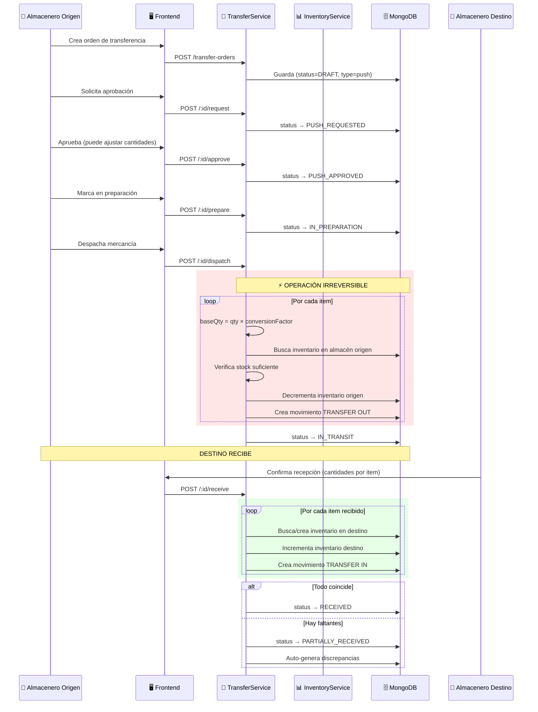
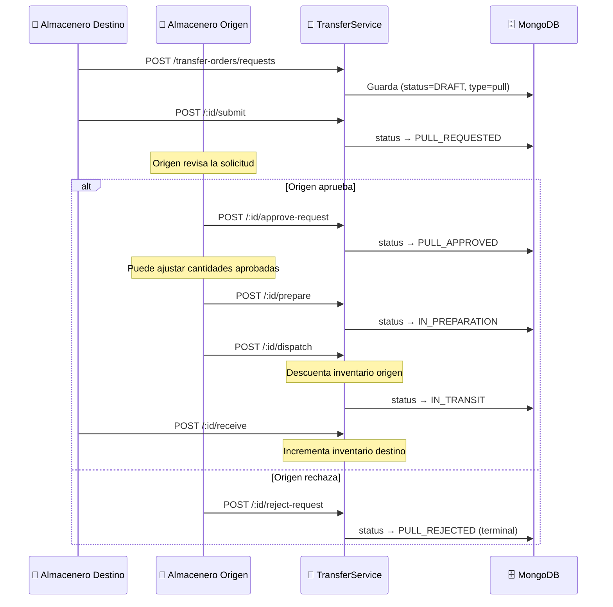
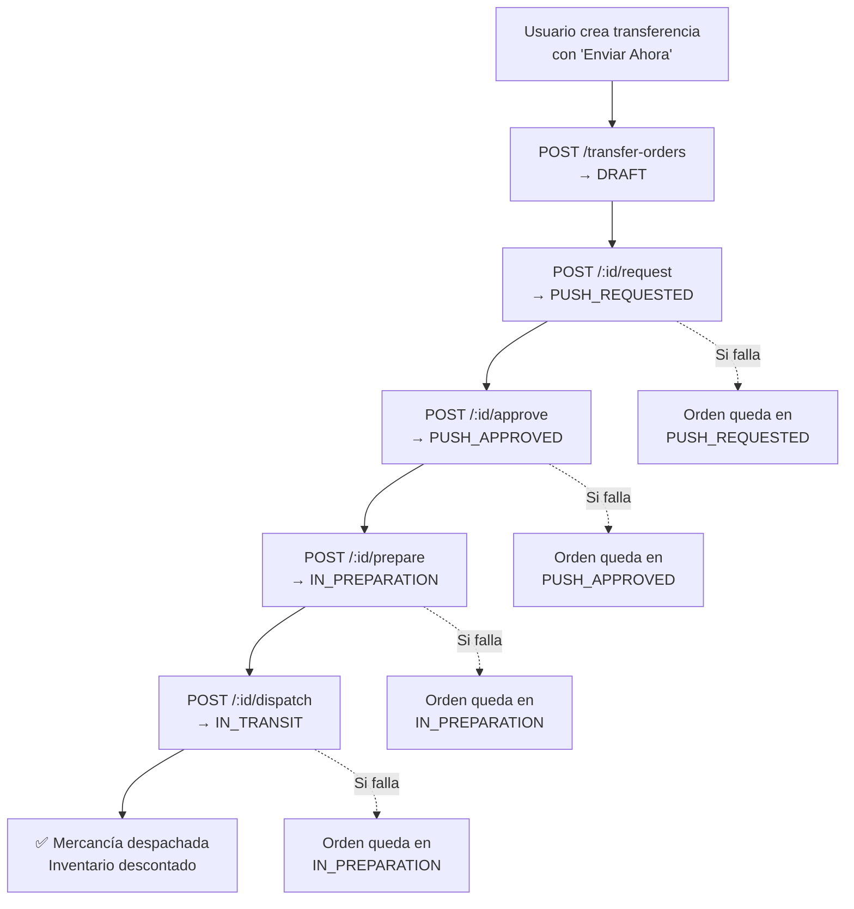
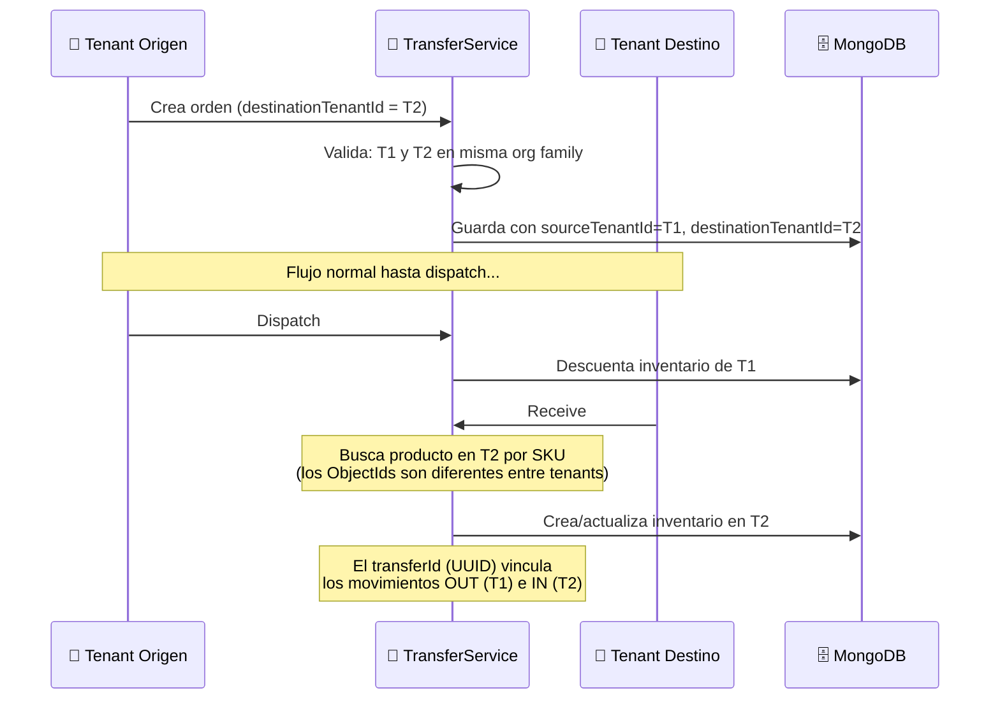
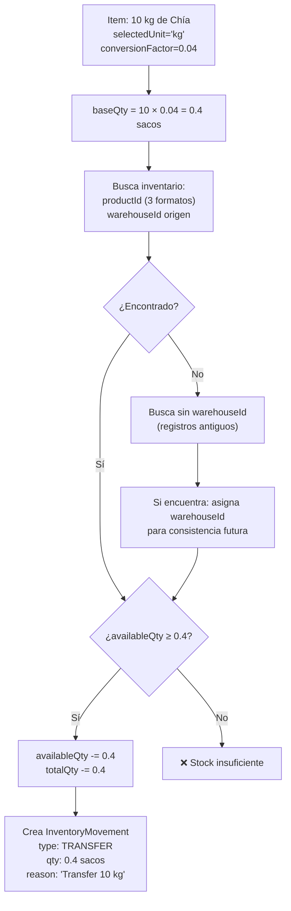
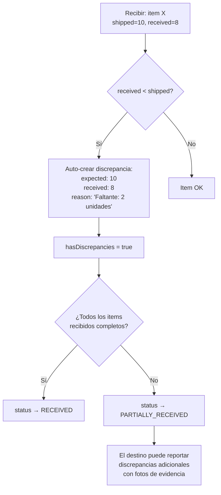

# Transferencias y Almacenes — Flujos de Operación

> Diagramas de los flujos PUSH, PULL, Express y Cross-Tenant.
> Última actualización: 2026-04-28

---

## Flujo 1: Transferencia PUSH Completa

### Descripción
El almacén de origen inicia y gestiona todo el proceso.

---

## Flujo 2: Transferencia PULL (Destino Solicita)

---

## Flujo 3: Despacho Express

---

## Flujo 4: Transferencia Cross-Tenant

### Descripción
Dos sedes que son tenants diferentes en la misma organización.

---

## Flujo 5: Conversión Multi-Unidad en Dispatch

---

## Flujo 6: Detección Automática de Discrepancias

---

*Última actualización: 2026-04-28*
*Archivos fuente: `transfer-orders.service.ts`, `transfer-orders.controller.ts`*
