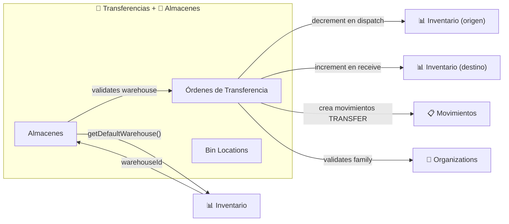

# Transferencias y Almacenes

## ¿Qué es?

El módulo de Transferencias es como el **sistema de logística interna de una cadena de tiendas** — es donde se organizan los envíos de mercancía entre almacenes o entre sedes del negocio. Si una sede tiene exceso de un producto y otra necesita, aquí se crea la orden, se aprueba, se despacha, y se confirma la recepción.

El módulo de Almacenes complementa gestionando los **espacios físicos** donde se guarda la mercancía: almacenes con código y nombre, y dentro de cada uno, ubicaciones específicas (bin locations) organizadas por zona, pasillo, estante y posición.

## ¿Para quién es?

- **Encargado de almacén origen**: Prepara y despacha la mercancía
- **Encargado de almacén destino**: Solicita mercancía (modo PULL) y confirma recepción
- **Administrador**: Aprueba transferencias, gestiona almacenes, revisa discrepancias
- **Sistema**: Descuenta stock del origen y lo agrega al destino automáticamente

## ¿Qué problema resuelve?

- **Sin transferencias**, habría que hacer ajustes manuales en dos almacenes para mover mercancía (error-prone)
- **Sin flujo de aprobación**, cualquiera podría mover mercancía sin autorización
- **Sin cross-tenant**, sedes independientes no podrían intercambiar inventario
- **Sin multi-unidad**, no podrías transferir 10 kg si el inventario está en sacos
- **Sin discrepancias**, no habría forma de registrar cuando lo que llega no coincide con lo que se envió

## Funcionalidades principales

### Transferencias
- **Dos modos de transferencia**:
  - **PUSH** (origen envía): El almacén de origen inicia la transferencia
  - **PULL** (destino solicita): El almacén de destino pide mercancía, el origen aprueba
- **Flujo completo**: Borrador → Solicitado → Aprobado → En Preparación → En Tránsito → Recibido
- **Cross-tenant**: Transferir entre sedes que son tenants diferentes pero de la misma organización
- **Multi-unidad**: Selecciona la unidad (kg, cajas, sacos) y el sistema convierte a unidad base
- **Despacho Express**: Crea, solicita, aprueba, prepara y despacha en un solo clic
- **Recepción parcial**: Confirma solo parte de los items y el sistema detecta la diferencia automáticamente
- **Detección de discrepancias**: Si la cantidad recibida ≠ enviada, se registra automáticamente con razón
- **Revertir a borrador**: Puede deshacer solicitudes/aprobaciones antes del despacho
- **Tracking**: Número de seguimiento, transportista, fecha estimada de llegada

### Almacenes
- **CRUD de almacenes**: Código, nombre, ubicación (dirección, ciudad, coordenadas)
- **Almacén por defecto**: Uno por tenant, auto-asignado cuando no se especifica warehouse
- **Bin Locations**: Ubicaciones granulares dentro del almacén (zona/pasillo/estante/posición)
- **Tipos de ubicación**: picking, bulk, receiving, shipping, quarantine
- **Capacidad**: Tracking de ocupación por ubicación

## Cómo se conecta con otros módulos

## Ubicación en el sistema

### Transferencias
- **En el menú**: Operaciones → Inventario → Traslados
- **URL**: `/inventory-management?tab=transfers`
- **Feature flag**: `MULTI_LOCATION`
- **Permisos**: `inventory_write` (crear/despachar/recibir)

### Almacenes
- **En el menú**: Operaciones → Inventario → Almacenes
- **URL**: `/inventory-management?tab=inventory-warehouses`
- **Feature flag**: `MULTI_WAREHOUSE`
- **Permisos**: Hereda de inventory

---

*Última actualización: 2026-04-28*
*Archivos fuente: `food-inventory-saas/src/modules/transfer-orders/`, `food-inventory-saas/src/modules/warehouses/`*
